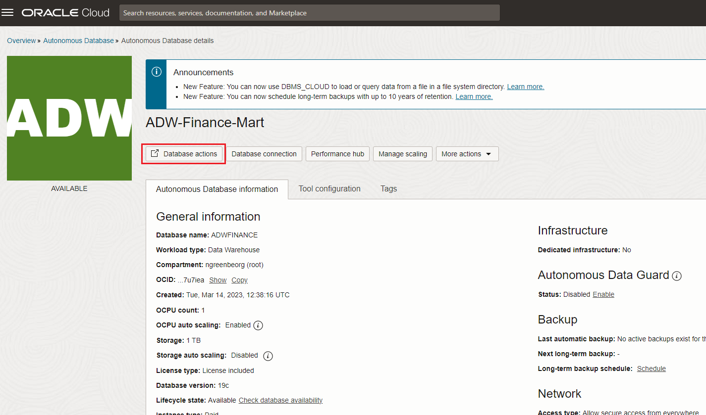
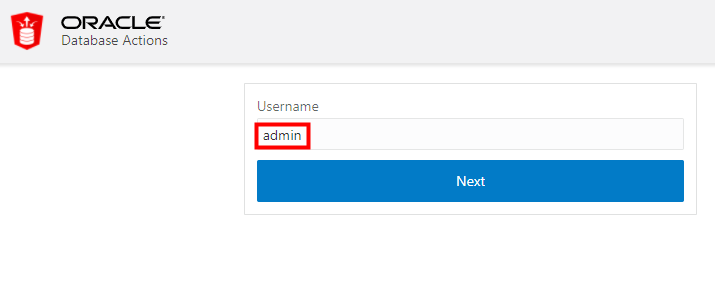
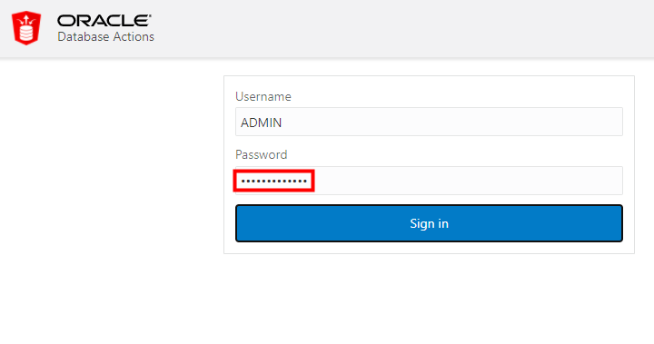
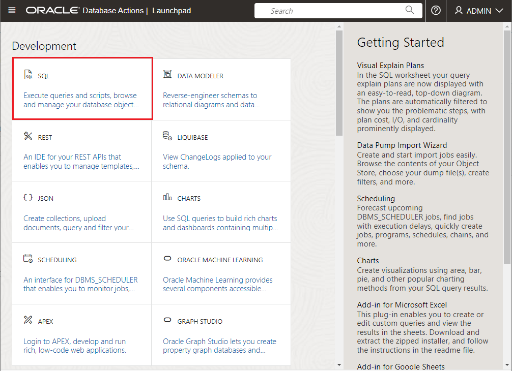

# Connect to the Database Using SQL Worksheet

## Introduction

In this lab, you will connect to the database using SQL Worksheet, a browser-based tool that is easily accessible from the Autonomous Data Warehouse or Autonomous Transaction Processing console.

Estimated lab time: 5 minutes

### Objectives

-   Learn how to connect to your new autonomous database using SQL Worksheet

### Prerequisites

-   This lab requires completion of the prior labs in this workshop: **Get Started** and **Provision an Autonomous Database**, in the Contents menu on the left.

## Task: Connect with SQL Worksheet

Although you can connect to your autonomous database from local PC desktop tools like Oracle SQL Developer, you can conveniently access the browser-based SQL Worksheet directly from your Autonomous Data Warehouse or Autonomous Transaction Processing console.

1. In your database's details page, click the **Database Actions** button.

    

2. A sign-in page opens for Database Actions. For this lab, simply use your database instance's default administrator account, **Username - admin**, and click **Next**.

    

3. Enter the Administrator **Password** you specified when creating the database. Click **Sign in**.

    

4. The Database Actions page opens. In the **Development** box, click **SQL**.

    

5. The first time you open SQL Worksheet, a series of pop-up informational boxes introduce you to the main features. Click **Next** to take a tour through the informational boxes.

    

    After touring through the informational boxes, keep this SQL Worksheet open and please **proceed to the next lab.**

## Want to Learn More?

Click [here](https://docs.oracle.com/en/cloud/paas/autonomous-data-warehouse-cloud/user/sql-developer-web.html#GUID-102845D9-6855-4944-8937-5C688939610F) for documentation on connecting with the built-in SQL Developer Web.

## Acknowledgements

- **Author** - Richard Green, Principal Developer, Database User Assistance
- **Last Updated By/Date** - Kamryn Vinson, April 2022
