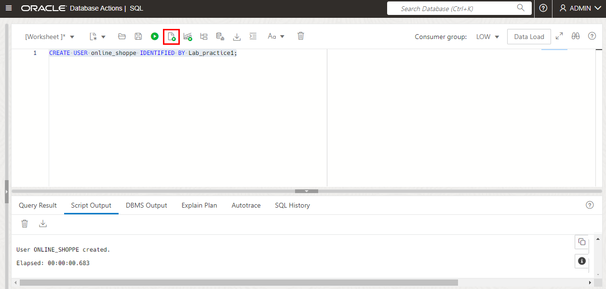
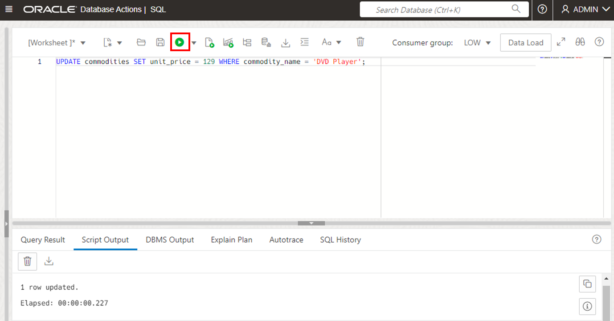
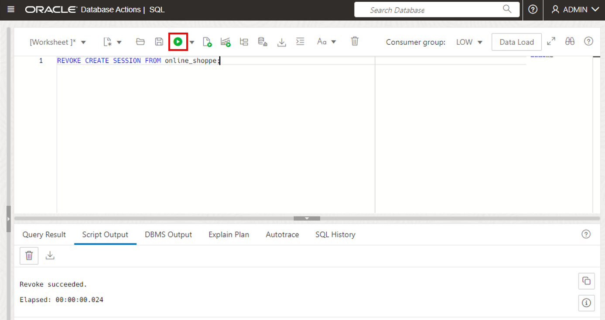

<!-- Updated April 16, 2021 -->


# Create a Schema

## Introduction

In this lab, you will create a user (schema), assign privileges to the user, and enable the user to log in to the database using SQL Worksheet. Logged in as the user, you will create tables, add and maintain records, and maintain the schema.

Estimated lab time: 25 minutes

### Objectives

-   As administrator create a database user (schema)
-   Assign privileges to the user
-   Enable database users to log in to the database using SQL Worksheet
-   As the user create tables, add and maintain records, and maintain the schema

### Prerequisites

-   This lab requires completion of the prior labs in the Contents menu on the left.

## Task 1: Create a User
Database administrators perform many tasks. One of their more common tasks is creating database users and assigning them unique usernames. After users log in to the database with their username and password, they can issue database SQL statements to create objects, query objects, and manage the database.

Creating a user is a way to create a schema. In this section, you execute the `CREATE USER` statement to create and configure a database user.

**Syntax**: `CREATE USER <USER> IDENTIFIED BY <password>;`

**Note**:  the password you specify must meet the default Oracle database password complexity rules:

  - The password must be between 12 and 30 characters long and must include at least one uppercase letter, one lowercase letter, and one numeric character.
  - Note, the password limit is shown as 60 characters in some help tooltip popups. Limit passwords to a maximum of 30 characters.
  - The password cannot contain the username.
  - The password cannot be one of the last four passwords used for the same username.
  - The password cannot contain the double quote (") character.
  - The password must not be the same password that is set less than 24 hours ago.

1. In this workshop's previous labs, you have been connecting SQL Worksheet to your autonomous database as the database administrator. Connected as administrator, open a SQL Worksheet and create a user named `ONLINE_SHOPPE`.

    ````
    <copy>CREATE USER online_shoppe IDENTIFIED BY Lab_practice1;</copy>
    ````

  

## Task 2: Assign Privileges
When multiple users access database objects, you can control the authorization of the objects with privileges. Privileges control whether a user can modify an object that is owned by another user. They are granted or revoked either by:
- The instance administrator
- A user with ADMIN privileges
- The object's owner  

In general, there are two types of privileges:
- System privilege: The right to perform a particular action on any object, such as, tables, views and indexes. Only the instance administrator or a user with the ADMIN privilege can assign or revoke system privileges.
- Object privilege: The right to perform a particular action on an object or to access another user's object. An object's owner has all object privileges for that object and can assign object privileges for that object to other database users.

Here are a few of the basic system and object privileges:

**System privileges:**
- Create a table, a view, or an index that is owned by any user in the database
- Alter a table, a view, or an index in the database
- Drop a table, a view, or an index in the database

**Object privileges:**
- Insert values into a table
- Create a foreign key dependency for a table
- Select from a table
- Update a table

You use the `GRANT` statement to assign privileges to users and roles. To assign privileges, you must have been assigned either the `ADMIN OPTION` or the `GRANT ANY PRIVILEGE` system privilege.

Syntax: `GRANT <grant_privilege> TO <user>;`

1. When you create a user with the `CREATE USER` statement, the user's privilege domain is empty by default. The administrator assigns privileges to the user based on the tasks that the user may perform in the future. In this lab, the ONLINE\_SHOPPE user establishes a session, creates a table, and writes DML statements against tables. Execute the following statements to assign the required privileges to the ONLINE\_SHOPPE user:

    ```
    <copy>GRANT CREATE SESSION to online_shoppe;
    GRANT CREATE TABLE to online_shoppe;
    GRANT UNLIMITED TABLESPACE to online_shoppe;
    GRANT SELECT ANY TABLE to online_shoppe;
    GRANT UPDATE ANY TABLE to online_shoppe;
    GRANT INSERT ANY TABLE to online_shoppe;
    GRANT DROP ANY TABLE to online_shoppe;
    </copy>
    ```

  

## Task 3: Provide SQL Worksheet Access to Database Users
The ADMIN user can provide access to SQL Worksheet to other database users.

Database users, who are not service administrators, do not have access to the Autonomous Database service console. The ADMIN user provides access to SQL Worksheet by enabling access for a user and providing a URL to access SQL Worksheet.

  

1. To enable your newly created user to have schema access to SQL Worksheet, run the following code as the ADMIN user, substituting in your own **schema-name** and specifying a **schema-alias** as explained below:

    ```
    <copy>BEGIN
      ORDS_ADMIN.ENABLE_SCHEMA(
        p_enabled => TRUE,
        p_schema => 'schema-name',
        p_url_mapping_type => 'BASE_PATH',
        p_url_mapping_pattern => 'schema-alias',
        p_auto_rest_auth => TRUE
        );
        COMMIT;
        END;  
      </copy>
      ```

  where:    
    * `schema-name` is the database schema name in all-uppercase. For this lab, use your new user `ONLINE_SHOPPE` as the schema name.
    * `schema-alias` is an alias for the schema name to use in the URL to access SQL Worksheet. For this lab, use `coffee` as the schema alias.
    * `p_auto_rest_auth` specifies the REST /metadata-catalog/ endpoint requires authorization. REST uses the metadata-catalog to get a list of published services on the schema. Set this parameter to `TRUE`.

  

2. Now that you as the **administrator** have enabled user access for the specified schema, provide **users** the URL to access SQL Worksheet, as follows:
    - Select the Autonomous Data Warehouse instance.
    - On the instance details page click **Service Console**.
  
    - Click **Development** and then click **Database Actions**
     
    - Sign in using your admin username and password
    
    - Click **SQL**
    
    - Copy the URL at the top of the screen.
        

  The copied URL is the same as the URL the **ADMIN** enters to access SQL Worksheet. For example:

  `https://dbname.adb.us-ashburn-1.example.com/ords/admin/_sdw/?nav=worksheet`

3. To provide a user with access to SQL Worksheet you need to edit the copied URL to use the alias for the schema that you specified with the parameter `p_url_mapping_pattern` in task 1.
    - For a user to access SQL Worksheet the part of the copied URL with **"admin"** is replaced with the **"schema-alias"**.
    - For example, if your schema-alias is **coffee**, after editing you would provide something similar to this URL for the user to login:

      `https://dbname.adb.us-ashburn-1.example.com/ords/coffee/_sdw/?nav=worksheet`

4. Provide the user with the modified URL. To access SQL Worksheet, the user pastes the URL into their browser and then enters the schema's Username and Password in the Sign-in dialog.

## Task 4: Log in to SQL Worksheet as the Database User and Create Tables

1. You are still connected to SQL Worksheet as administrator. Log out and log back in to SQL Worksheet as your database user `online_shoppe` by pasting into your browser whatever URL you constructed in the previous step, which will be similar to:

      `https://dbname.adb.us-ashburn-1.example.com/ords/coffee/_sdw/?nav=worksheet`

      At the log in prompt, provide your new user's username and password, such as `online_shoppe` and `Lab_practice1`.

  

2. Before creating tables in the ONLINE_SHOPPE schema, you should understand the concepts of  tables and integrity constraints.

    - **Table**: Basic unit of data storage in a database. Within a table, data is stored in rows and columns. You define a table with a table name, a set of columns, a data type, and a width.
      

    - **Integrity constraints**: Rules for columns in a table. You specify these rules to enforce data integrity within the columns for which they are defined. Basic constraints on Oracle Database include the following:

      

      In this section, you execute the `CREATE TABLE` statement to create tables.

      **Syntax**: ```CREATE TABLE [schema.]table
            (column datatype [DEFAULT expr][, ...]);```

      Perform the following steps to create the `CUSTOMERS`, `COMMODITIES`, and `ORDERS` tables in the schema.

3. Create the `CUSTOMERS` table with the `CUSTOMER_ID` column as the primary key.

    ```
    <copy>CREATE TABLE customers(
      customer_id    VARCHAR2(4),
      customer_name  VARCHAR2(20),
      address        VARCHAR2(60),
      contact        VARCHAR2(20),
      CONSTRAINT cust_id_pk PRIMARY KEY(customer_id) );
      </copy>
      ```

  

4. Create the `COMMODITIES` table with the `COMMODITY_ID` column as the primary key and the `UNIT_PRICE column` as a non-null column.

    ```
    <copy>CREATE TABLE commodities(
      commodity_id     VARCHAR2(4),
      commodity_name   VARCHAR2(20),
      unit_price       NUMBER(8,2) NOT NULL,
      CONSTRAINT comm_id_pk PRIMARY KEY(commodity_id) );
      </copy>
      ```

  

5. Create the `ORDERS` table with:
    - `ORDER_ID` column as the primary key
    - `COMMODITY_ID` and `CUSTOMER_ID` as foreign keys
    - `UNITS` and `TOTAL_COST` as NOT NULL values
    - CHECK constraint on numeric columns to accept values greater than zero

    ```
    <copy>CREATE TABLE orders(
      order_id       VARCHAR2(4),
      customer_id    VARCHAR2(4),
      commodity_id   VARCHAR2(4),
      units          NUMBER(8,2) NOT NULL,
      total_cost     NUMBER(8,2) NOT NULL,
      CONSTRAINT ordr_id_pk PRIMARY KEY(order_id),
      CONSTRAINT ordr_cust_fk FOREIGN KEY (customer_id)REFERENCES customers(customer_id),
      CONSTRAINT ordr_comm_fk FOREIGN KEY (commodity_id)REFERENCES commodities(commodity_id),
      CONSTRAINT check_unit CHECK(units > 0),
      CONSTRAINT check_totl CHECK(total_cost > 0) );
      </copy>
      ```

  

## Task 5: Insert, Modify, and Delete Records
In this section, you manipulate the records in the tables that you created.

1. **Inserting data**: You execute the `INSERT` statement to add rows of data to a database table.

    **Syntax**: ```INSERT INTO table [(column [, column...])]
                VALUES (value [, value...]);```

    Execute the following statements to insert data into the `CUSTOMERS`, `COMMODITIES`, and `ORDERS` tables.

    ```
    <copy>INSERT INTO customers VALUES ('C001', 'BDAVIS', 'Boston', '650.551.4876');
    INSERT INTO customers VALUES ('C002', 'SSTEPHEN', 'ST.Louis', '650.501.9321');
    INSERT INTO customers VALUES ('C003', 'DCARTER', 'California', '650.507.6632');

    INSERT INTO commodities VALUES ('M001', 'DVD Player', 109);
    INSERT INTO commodities VALUES ('M002', 'Cereal', 03);
    INSERT INTO commodities VALUES ('M003', 'Scrabble', 29);

    INSERT INTO orders VALUES ('R001', 'C003', 'M002', 50, 150);
    INSERT INTO orders VALUES ('R002', 'C001', 'M003', 30, 87);
    INSERT INTO orders VALUES ('R003', 'C003', 'M001', 6, 654);
    </copy>
    ```
  

2. **Modifying data**: You use the `UPDATE` statement to modify rows of data in a database table. Execute the following statement to change the unit price of the DVD player from $109 to $129:

    ```
    <copy>UPDATE commodities SET unit_price = 129 WHERE commodity_name = 'DVD Player';</copy>
    ```
  

3. **Deleting data**: You use the `DELETE` statement to delete rows of data from a database table. Execute the following statement to delete the first record in the ORDERS table:

    ```
    <copy>DELETE FROM orders WHERE order_id = 'R001';</copy>
    ```

  

## Task 6: Undo and Save Records
In this section, you use the `COMMIT` and `ROLLBACK` statements to change data permanently. You use the `ROLLBACK` statement to undo the work that was performed in your current transaction and you use the `COMMIT` statement to save the work that was performed in your current transaction.

1. Execute the `COMMIT` statement to save the data manipulation transactions that you performed in the previous section.

    ```
    <copy>COMMIT;</copy>
    ```   
  

2. Execute the following statements to delete the row whose order ID is R002 and to query the `ORDERS` table to ensure that the record was deleted.

    ```
    <copy>DELETE FROM orders WHERE order_id = 'R002';
    SELECT * FROM orders;</copy>
    ```

  
    The output shows that the record was deleted successfully.

3. Execute the following statements to undo deletion of the row whose order ID is R002 and to query the table to display the records:

    ```
    <copy>ROLLBACK;
    SELECT * FROM orders;</copy>
    ```
  
    The previous DELETE statement was rolled back.

    **Note**: You cannot undo transactions after you save them permanently with the `COMMIT` statement.

## Task 7: Remove Tables
In this section, you execute the `DROP TABLE` statement to remove a table and its data from the database.

**Syntax**: `DROP TABLE <table>;`

1. Execute the `DROP TABLE` statement to remove the CUSTOMERS table.

    ```
    <copy>DROP TABLE customers;</copy>
    ```

  
    An error message is displayed because of the referential integrity constraint on the `CUSTOMER_ID` column.

2. Include the `CASCADE CONSTRAINTS` clause to remove the table and its referential integrity constraints.

    ```
    <copy>DROP TABLE customers CASCADE CONSTRAINTS;</copy>
    ```

  

## Task 8: Revoke Privileges
In this section, you execute the `REVOKE` statement to revoke user and role system privileges. To revoke a system privilege or a role, you must be assigned the privilege with the `ADMIN OPTION`.

**Syntax**: `REVOKE <revoke_privilege> FROM <user>;`

1. You are signed in to SQL Worksheet as the **online\_shoppe** user. Sign out of SQL Worksheet. Sign back in to SQL Worksheet as the **admin** user and open a SQL Worksheet. Revoke the `CONNECT` privilege for the ONLINE\_SHOPPE user.

    ```
    <copy>REVOKE CREATE SESSION FROM online_shoppe;</copy>
    ```

  

2. Attempt to sign back in to SQL Worksheet as the **online_shoppe** user, by pasting into your browser the URL containing the alias that you used back in **Task 4: Log in to SQL Worksheet as the Database User and Create Tables**.

  
    You cannot sign in because you no longer have the `CREATE SESSION` privilege.

## Want to Learn More?

Click [here](https://docs.oracle.com/en/database/oracle/oracle-database/19/cncpt/introduction-to-oracle-database.html#GUID-A42A6EF0-20F8-4F4B-AFF7-09C100AE581E) for documentation introducing Oracle database fundamentals.

## Acknowledgements

- **Author** - Rick Green, Principal Developer, Database User Assistance
- **Contributor** - Supriya Ananth
- **Adapted for Cloud by** - Rick Green
- **Last Updated By/Date** - Kamryn Vinson, April 2022
