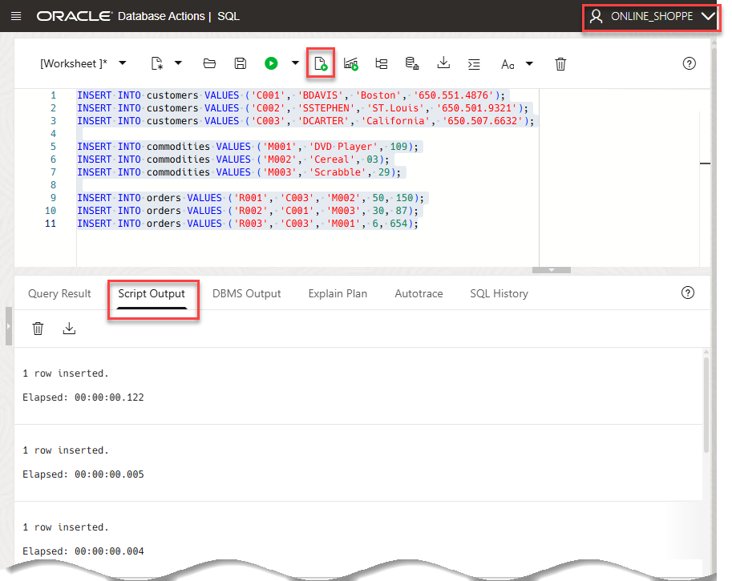

# Create a Schema

## Introduction

In this lab, you will create a user (schema), assign privileges to the user, and enable the user to log in to the database using SQL Worksheet. You will then log in as the new user and create tables, add and maintain records, and maintain the schema.

Estimated lab time: 25 minutes

### Objectives

- As the administrator (`admin`) user, create a database user (schema)
- Assign privileges to the new user
- Enable the new database user to log in to the database using the SQL Worksheet
- As the new user, create tables, add and maintain records, and maintain the schema

### Prerequisites

- This lab requires completion of the prior labs in the **Contents** menu on the left.

## Task 1: Create a User

Database administrators perform many tasks. One of their more common tasks is creating database users and assigning them unique usernames. After users log in to the database with their username and password, they can issue database SQL statements to create objects, query objects, and manage the database.

Creating a user is a way to create a schema. In this section, you execute the **`CREATE USER`** statement to create and configure a database user.

**Syntax**: 

```
<copy>
CREATE USER <USER> IDENTIFIED BY <password>;
</copy>
```

  >**Note**: The password you specify must meet the following default Oracle database password complexity rules.

  - The password must be between 12 and 30 characters long and must include at least one uppercase letter, one lowercase letter, and one numeric character.
  - Note, the password limit is shown as 60 characters in some help tooltip popups. Limit passwords to a maximum of 30 characters.
  - The password cannot contain the username.
  - The password cannot be one of the last four passwords used for the same username.
  - The password cannot contain the double quote (") character.
  - The password must not be the same password that is set less than 24 hours ago.

1. In the previous labs, you connected to your Oracle Autonomous AI Database using the SQL Worksheet as the administrator user, **`admin`**. As the **`admin`** user, create a new user named **`ONLINE_SHOPPE`**. Copy and paste the following script into your SQL Worksheet, and then click the **Run Script** icon in the Worksheet toolbar.


    ```
    <copy>
    CREATE USER online_shoppe IDENTIFIED BY Lab_practice1;
    </copy>
    ```

    

## Task 2: Assign Privileges

When multiple users access database objects, you can control the authorization of the objects with privileges. Privileges control whether a user can modify an object that is owned by another user. They are granted or revoked either by:
- The instance administrator
- A user with ADMIN privileges
- The object's owner  

In general, there are two types of privileges:
- System privilege: The right to perform a particular action on any object, such as, tables, views and indexes. Only the instance administrator or a user with the ADMIN privilege can assign or revoke system privileges.
- Object privilege: The right to perform a particular action on an object or to access another user's object. An object's owner has all object privileges for that object and can assign object privileges for that object to other database users.

Here are a few of the basic system and object privileges:

* **System privileges:**
    - Create a table, a view, or an index that is owned by any user in the database
    - Alter a table, a view, or an index in the database
    - Drop a table, a view, or an index in the database

* **Object privileges:**
    - Insert values into a table
    - Create a foreign key dependency for a table
    - Select from a table
    - Update a table

You use the `GRANT` statement to assign privileges to users and roles. To assign privileges, you must have been assigned either the `ADMIN OPTION` or the `GRANT ANY PRIVILEGE` system privilege.

When you create a user with the `CREATE USER` statement, the user's privilege domain is empty by default. The administrator assigns privileges to the user based on the tasks that the user may perform in the future. 

1. In this lab, the `ONLINE_SHOPPE` user establishes a session, creates a table, and writes DML statements against tables. Execute the following statements to assign the required privileges to the `ONLINE_SHOPPE` user.

    ```
    <copy>
    GRANT CREATE SESSION to online_shoppe;
    GRANT CREATE TABLE to online_shoppe;
    GRANT UNLIMITED TABLESPACE to online_shoppe;
    GRANT SELECT ANY TABLE to online_shoppe;
    GRANT UPDATE ANY TABLE to online_shoppe;
    GRANT INSERT ANY TABLE to online_shoppe;
    GRANT DROP ANY TABLE to online_shoppe;
    </copy>
    ```

    

## Task 3: Provide SQL Worksheet Access to Database Users

The `ADMIN` user can provide access to the SQL Worksheet to other database users.

Database users, who are not service administrators, do not have access to the Oracle Autonomous AI Database service console. The `ADMIN` user provides access to the SQL Worksheet by enabling access for a user and providing the user with a URL to access the SQL Worksheet as follows:

  * As the `admin` user, run the `ORDS_ADMIN.ENABLE_SCHEMA` package procedure to enable the database user to access a schema via the SQL Worksheet. For security reasons, Oracle recommends that you specify an alias that will appear in the user's URL instead of the actual schema name to avoid exposing it. The value must be in lowercase.
  * Copy the URL (in your browser) that connects you as the `admin` user to the SQL Worksheet.
  * Replace `admin` in the URL with the alias you specified for the user.
  * Provide your user with the alias-modified URL to connect to the SQL Worksheet.

1. To enable your newly created user to have schema access to SQL Worksheet, run the following script as the `ADMIN` user and substitute the **`schema-name`** and **`p_url_mapping_pattern`** (**`schema-alias`**) with your own values as explained below.

    ```
    <copy>
    BEGIN
      ORDS_ADMIN.ENABLE_SCHEMA(
        p_enabled => TRUE,
        p_schema => 'online_shoppe',
        p_url_mapping_type => 'BASE_PATH',
        p_url_mapping_pattern => 'coffee',
        p_auto_rest_auth => TRUE
        );
      COMMIT;
    END;  
    </copy>
    ```

  where:    
    
    * **`p_enabled:`** Set `TRUE` to enable Oracle REST Data Services access; Set to `FALSE` to disable Oracle REST Data Services access.
    * **`p_schema:`** The database schema name. For this lab, use your new user `ONLINE_SHOPPE` as the schema name.
    * **`p_url_mapping_type:`** Use `BASE_PATH` or `BASE_URL`.
    * **`p_url_mapping_pattern:`** This is the schema's alias to use in the URL to access SQL Worksheet. For this lab, use `coffee` as the schema alias.
    * **`p_auto_rest_auth:`** Specifies the REST /metadata-catalog/ endpoint requires authorization. REST uses the metadata-catalog to get a list of published services on the schema. Set this parameter to `TRUE`.

    

2. Now that you as the **`admin`** user have enabled user access for the specified schema, provide the **users** with the URL to access SQL Worksheet. While you are still signed in to SQL Worksheet as the **`admin`** user, copy the URL in your browser's address bar at the top of the screen.

        

    The copied URL is the same as the URL the **`admin`** user enters to access SQL Worksheet such as:

    **`https://hostname-adwfinance.adb.us-ashburn-1.oraclecloudapps.com/ords/admin/_sdw/?nav=worksheet`**

    >**Note:** In the above URL, we used hostname instead of actual hostname for security reasons.

3. To provide a user with access to SQL Worksheet, you need to edit the copied URL to use the alias for the schema that you specified with the parameter `p_url_mapping_pattern` in **step 1**. For a user to access the SQL Worksheet, you need to replace **`admin`** in the URL with a **"schema-alias"**. For example, if your schema-alias is **`coffee`**, after editing you would provide the user with the following URL to login to the SQL Worksheet.

    **`https://hostname-adwfinance.adb.us-ashburn-1.oraclecloudapps.com/ords/coffee/_sdw/?nav=worksheet`**

    To access the SQL Worksheet, the user would paste the URL into their browser, and then enter the schema's Username and Password on the **Sign-in** page. You will do that next.

## Task 4: Log in to the SQL Worksheet as the online_shoppe Database User and Create Tables

1. Log out of the **`admin`** user. On the **Oracle Database Actions | SQL** banner, click the drop-down list next to the **`ADMIN`** user,   and then select **Sign Out**. 

    

2. Log in to the SQL Worksheet as the **`online_shoppe`** database user that was created by the `admin` user. Paste the URL that was provided to you by the **`admin`** user in the previous task. The **Sign-in** page is displayed. 

    >**Note:** The URL is similar to the following; however, make sure you substitute the **hostname** and **region** values with your own hostname and region values. The hostname in the screen capture is blurred for security purposes.

    ```
    <copy>
    https://hostname-adwfinance.adb.us-ashburn-1.oraclecloudapps.com/ords/coffee/_sdw/?nav=worksheet
    </copy>
    ```

   

3. On the **Sign-in** page, enter **`online_shoppe`** as the username and **`Lab_practice1`** as the password, and then click **Sign in**.

   The SQL Worksheet is displayed. Click the **X** control to close the informational box.

    

4. Before creating tables in the **`ONLINE_SHOPPE`** schema, you should understand the concepts of tables and integrity constraints.

    - **Table**: Basic unit of data storage in a database. Within a table, data is stored in rows and columns. You define a table with a table name, a set of columns, a data type, and a width.

      

    - **Integrity constraints**: Rules for columns in a table. You specify these rules to enforce data integrity within the columns for which they are defined. Basic constraints on Oracle Database include the following:

      

      In this section, you will create tables using the `CREATE TABLE` statement.

      **Syntax**: 
      
        ```
        <copy>
        CREATE TABLE [schema.]table (column datatype [DEFAULT expr][, ...]);
        </copy>
        ```

Perform the following steps to create the **`CUSTOMERS`**, **`COMMODITIES`**, and **`ORDERS`** tables in the **`ONLINE_SHOPPE`** schema.

3. Create the **`CUSTOMERS`** table with the **`CUSTOMER_ID`** column as the primary key. Copy and paste the following statement into your SQL Worksheet, and then click the **Run Script** icon in the Worksheet toolbar.

    ```
    <copy>
    CREATE TABLE customers(
    customer_id    VARCHAR2(4),
    customer_name  VARCHAR2(20),
    address        VARCHAR2(60),
    contact        VARCHAR2(20),
    CONSTRAINT cust_id_pk PRIMARY KEY(customer_id) );
    </copy>
    ```

    

4. Create the **`COMMODITIES`** table with the **`COMMODITY_ID`** column as the primary key and the **`UNIT_PRICE`** column as a non-null column. Copy and paste the following statement into your SQL Worksheet, and then click the **Run Script** icon in the Worksheet toolbar.

    ```
    <copy>
    CREATE TABLE commodities(
    commodity_id     VARCHAR2(4),
    commodity_name   VARCHAR2(20),
    unit_price       NUMBER(8,2) NOT NULL,
    CONSTRAINT comm_id_pk PRIMARY KEY(commodity_id) );
    </copy>
    ```

    

5. Create the **`ORDERS`** table and specify the following:
    - **`ORDER_ID`** column as the primary key
    - **`COMMODITY_ID`** and **`CUSTOMER_ID`** as foreign keys
    - **`UNITS`** and **`TOTAL_COST`** as `NOT NULL` values
    - `CHECK` constraint on numeric columns to accept values greater than zero

        ```
        <copy>
        CREATE TABLE orders(
        order_id       VARCHAR2(4),
        customer_id    VARCHAR2(4),
        commodity_id   VARCHAR2(4),
        units          NUMBER(8,2) NOT NULL,
        total_cost     NUMBER(8,2) NOT NULL,
        CONSTRAINT ordr_id_pk PRIMARY KEY(order_id),
        CONSTRAINT ordr_cust_fk FOREIGN KEY (customer_id)REFERENCES customers(customer_id),
        CONSTRAINT ordr_comm_fk FOREIGN KEY (commodity_id)REFERENCES commodities(commodity_id),
        CONSTRAINT check_unit CHECK(units > 0),
        CONSTRAINT check_totl CHECK(total_cost > 0) );
        </copy>
        ```

        

6. You can display the newly created tables in the **Navigator** tab. The `ONLINE_SHOPPE` current user (schema) is already selected. Click the **Refresh** icon. The three new tables are displayed. 

    

7. You can drill-down on a table to display its columns.

    

## Task 5: Insert, Modify, and Delete Records

In this section, you will manipulate the records in the newly created tables.

  >**Note:** In **Database Actions**, a connection to the database is stateless.
- In a stateless environment, each HTTPS request from a client such as SQL Worksheet maps to a new database session. Therefore, a session begins and ends with every SQL statement or script execution.
- As the session state is not maintained, session attributes do not persist and commands such as `ROLLBACK` and `COMMIT` do not apply. If a SQL statement or script executes successfully, an implicit commit is performed. If it executes with an error, an implicit rollback is performed.
- Therefore, when needed, include the ROLLBACK and COMMIT commands or session attributes in the PL/SQL code block that is sent to the database for a session.
- SQL Worksheet is a handy tool to perform simple tasks, as in this lab. For the bulk of your database work, you will commonly use tools such as SQL Developer, SQLcl, and SQL*Plus augmented by Database Actions.

1. **Inserting data**   
You execute the `INSERT` statement to add rows of data to a database table.

    **Syntax**: 
    
    ```
    INSERT INTO table [(column [, column...])]
    VALUES (value [, value...]);
    ```

    Execute the following statements to insert data into the `CUSTOMERS`, `COMMODITIES`, and `ORDERS` tables.

    ```
    <copy>INSERT INTO customers VALUES ('C001', 'BDAVIS', 'Boston', '650.551.4876');
    INSERT INTO customers VALUES ('C002', 'SSTEPHEN', 'ST.Louis', '650.501.9321');
    INSERT INTO customers VALUES ('C003', 'DCARTER', 'California', '650.507.6632');

    INSERT INTO commodities VALUES ('M001', 'DVD Player', 109);
    INSERT INTO commodities VALUES ('M002', 'Cereal', 03);
    INSERT INTO commodities VALUES ('M003', 'Scrabble', 29);

    INSERT INTO orders VALUES ('R001', 'C003', 'M002', 50, 150);
    INSERT INTO orders VALUES ('R002', 'C001', 'M003', 30, 87);
    INSERT INTO orders VALUES ('R003', 'C003', 'M001', 6, 654);
    </copy>
    ```
    

2. **Modifying data**    
You use the `UPDATE` statement to modify rows of data in a database table. Execute the following statement to change the unit price of the DVD player from `$109` to **`$129`**.

    ```
    <copy>
    UPDATE commodities 
    SET unit_price = 129 WHERE commodity_name = 'DVD Player';
    </copy>
    ```
    
    

3. **Deleting data**    
You use the `DELETE` statement to delete rows of data from a database table. Execute the following statement to delete the first record in the `ORDERS` table.

    ```
    <copy>
    DELETE FROM orders 
    WHERE order_id = 'R001';
    </copy>
    ```

    

## Task 6: Remove Tables

In this section, you execute the `DROP TABLE` statement to remove a table and its data from the database.

1. Remove the `CUSTOMERS` table.

    ```
    <copy>DROP TABLE customers;</copy>
    ```

    

    An error message is displayed because of the referential integrity constraint on the `CUSTOMER_ID` column.

2. Include the `CASCADE CONSTRAINTS` clause to remove the table and its referential integrity constraints.

    ```
    <copy>DROP TABLE customers CASCADE CONSTRAINTS;</copy>
    ```

    

## Task 7: Revoke Privileges

In this section, you execute the `REVOKE` statement to revoke user and role system privileges. To revoke a system privilege or a role, you must be assigned the privilege with the `ADMIN OPTION`.

1. In the lab, you should be signed in to the SQL Worksheet as the **`online_shoppe`** user. Log out of the `online_shoppe` user. On the **Oracle Database Actions | SQL** banner, click the drop-down list next to the `online_shoppe` user, and then select **Sign Out** from the drop-down menu. 

  


2. Sign in to the SQL Worksheet as the **`admin`** user. On the **Sign-in** page, enter `admin` as the username and `Training4ADW` as the password.

    

    The Database Actions Launchpad page is displayed. 

3. Click the **Development** tab, and then click the **SQL** tab. 

    

    The SQL Worksheet for the `admin` user is displayed.

4. Revoke the `CONNECT` privilege for the `ONLINE_SHOPPE` user.

    ```
    <copy>
    REVOKE CREATE SESSION FROM online_shoppe;
    </copy>
    ```

    

5. In a new browser tab, attempt to sign back in to SQL Worksheet as the **`online_shoppe`** user, by pasting into your browser the URL containing the alias that you used back in **Task 4: Log in to SQL Worksheet as the online_shoppe Database User and Create Tables**.

    

    You cannot sign in because you no longer have the `CREATE SESSION` privilege.

## Want to Learn More?

* [Introduction to Oracle AI Database](https://docs.oracle.com/en/database/oracle/oracle-database/26/cncpt/introduction-to-oracle-database.html#GUID-A42A6EF0-20F8-4F4B-AFF7-09C100AE581E)

## Acknowledgements

- **Author:** Lauran K. Serhal, Consulting User Assistance Developer
- **Last Updated By/Date:** Lauran K. Serhal, November 2025

