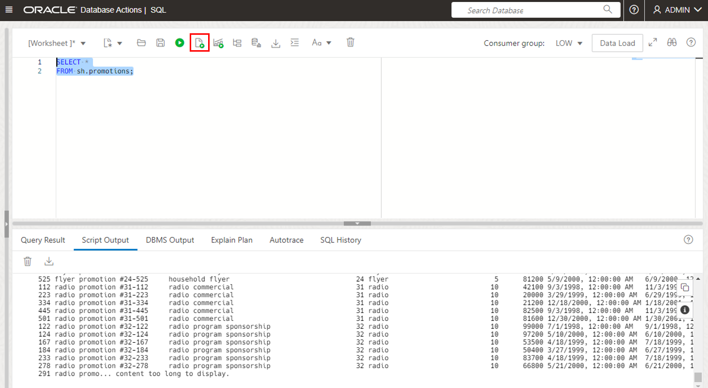
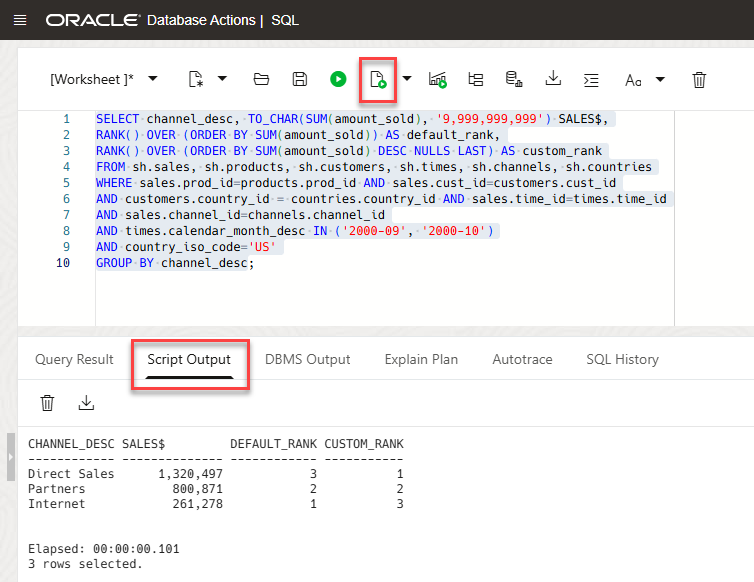

<!-- Updated March 24, 2020 -->


# Query the Sales History Sample Schema

## Introduction

In this lab, you will query the Sales History (SH) sample schema that comes with the database.

Estimated lab time: 10 minutes

### Objectives

-   Execute the SELECT statement to query tables in the SH schema

-   Use the WHERE clause to restrict the rows that are returned from the SELECT query

-   Use the ORDER BY clause to sort the rows that are retrieved from the SELECT statement


### Prerequisites

-   This lab requires completion of the preceding labs in the Contents menu on the left.

## Task 1: Querying Tables

In this section, you execute the `SELECT` statement to retrieve data from tables and views. You can select rows and columns that you want to return in the output. In its simplest form, a `SELECT` statement must contain the following:
-   A `SELECT` clause, which specifies columns containing the values to be matched
-   A `FROM` clause, which specifies the table containing the columns listed in the SELECT clause
    -   Syntax:  `SELECT {*|[DISTINCT] column|expression [alias],...} FROM <table>`

**Note:** Remember that you need to prefix the table names with the schema name SH in your queries.

1. You can display all columns of data in a table by entering an asterisk * after the SELECT keyword. Execute the following statement to view all rows and columns in the  `PROMOTIONS` table:

    ````
    <copy>SELECT *
    FROM sh.promotions;</copy>
    ````

    

2. You can display specific columns of data in a table by specifying the column names in the SELECT statement. Execute the following statement to view the `PROMO_NAME` and `PROMO_END_DATE` columns in the `PROMOTIONS` table:

    ````
    <copy>SELECT promo_name, promo_end_date
    FROM sh.promotions;</copy>
    ````

    

## Task 2: Restricting Data
In this section, you use the `WHERE` clause to restrict the rows that are returned from the `SELECT` query. A `WHERE` clause contains a condition that must be met. It directly follows the `FROM` clause. If the condition is true, the row that meets the condition is returned.

1. Modify the `SELECT` statement. Execute the following query to restrict the number of rows to where the `PROMO_SUBCATEGORY` has a value of `radio commercial`:

    ````
    <copy>SELECT *

    FROM sh.promotions

    WHERE promo_subcategory='radio commercial';</copy>
    ````

    

## Task 3: Sorting Data

In this section, you use the `ORDER BY` clause to sort the rows that are retrieved from the `SELECT` statement. You specify the column based on the rows that must be sorted. You also specify the `ASC` keyword to display rows in ascending order (default), and you specify the `DESC` keyword to display rows in descending order.

1. Execute the following `SELECT` statement to retrieve the `CUST_LAST_NAME`, `CUST_CREDIT_LIMIT`, and `CUST_YEAR_OF_BIRTH` columns of customers who live in the `Noord Holland` CUST\_STATE\_PROVINCE. Sort the rows in ascending order based on the `CUST_YEAR_OF_BIRTH` column.

    ````
    <copy>SELECT cust_last_name, cust_credit_limit, cust_year_of_birth

    FROM   sh.customers

    WHERE  cust_state_province='Noord-Holland'

    ORDER BY cust_year_of_birth;</copy>
    ````

      

2. Modify the `SELECT` statement to display rows in descending order. Use the `DESC` keyword.

    ````
    <copy>SELECT cust_last_name, cust_credit_limit, cust_year_of_birth

    FROM   sh.customers

    WHERE  cust_state_province='Noord-Holland'

    ORDER BY cust_year_of_birth DESC;</copy>
    ````

    

## Task 4:  Ranking Data

In this section, you use the `RANK ()` function to rank the rows that are retrieved from the `SELECT` statement. You can use the RANK function as an **aggregate**  function (takes multiple rows and returns a single number) or as an **analytical** function (takes criteria and shows a number for each record).

1. Execute the following `SELECT` statement to rank the rows using RANK as an analytical function.

    ```
    <copy>SELECT channel_desc, TO_CHAR(SUM(amount_sold), '9,999,999,999') SALES$,
    RANK() OVER (ORDER BY SUM(amount_sold)) AS default_rank,
    RANK() OVER (ORDER BY SUM(amount_sold) DESC NULLS LAST) AS custom_rank
    FROM sh.sales, sh.products, sh.customers, sh.times, sh.channels, sh.countries
    WHERE sales.prod_id=products.prod_id AND sales.cust_id=customers.cust_id
    AND customers.country_id = countries.country_id AND sales.time_id=times.time_id
    AND sales.channel_id=channels.channel_id
    AND times.calendar_month_desc IN ('2000-09', '2000-10')
    AND country_iso_code='US'
    GROUP BY channel_desc;</copy>
    ```

    

You may now **proceed to the next lab.**

## Want to Learn More?

Click [here](https://docs.oracle.com/en/database/oracle/oracle-database/19/cncpt/sql.html#GUID-90EA5D9B-76F2-4916-9F7E-CF0D8AA1A09D) for documentation on Data Manipulation Language (DML) statements.

## Acknowledgements

- **Author** - Rick Green, Principal Developer, Database User Assistance
- **Contributor** - Supriya Ananth
- **Adapted for Cloud by** - Rick Green
- **Last Updated By/Date** - Kamryn Vinson, April 2022

