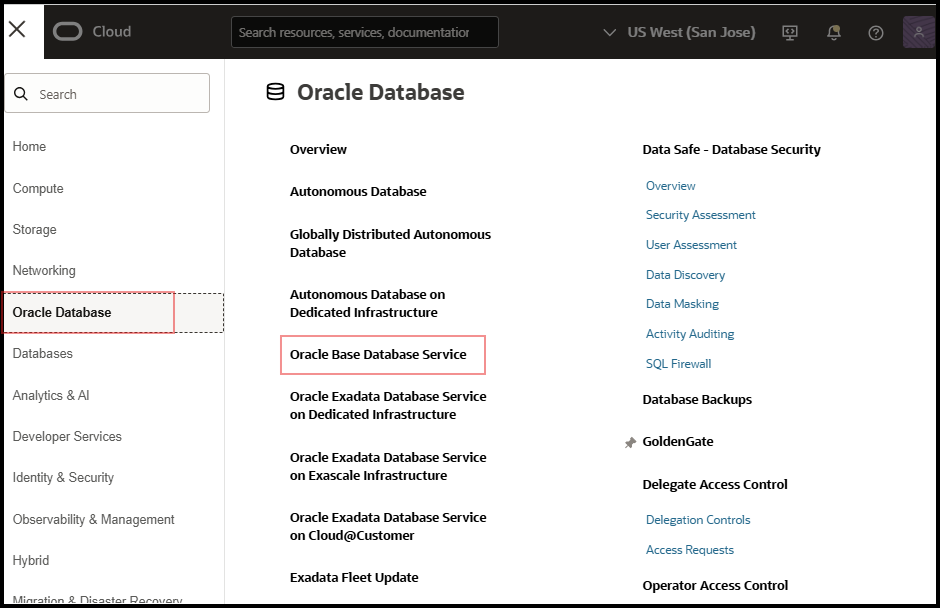
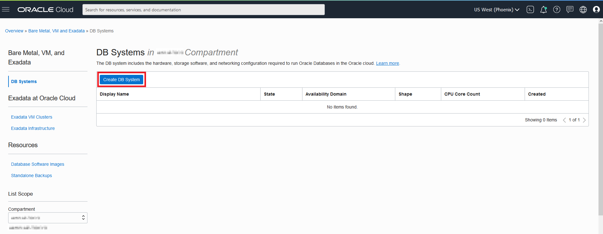

# Create Source Database

## Introduction

This lab walks you through the steps of setting up an Oracle Base Database Service Virtual Machine (VM) with Oracle Database 19c. For more information on Oracle Base Database Service and VM Database Systems visit the *Learn More* tab at the bottom of the page.

Estimated Lab Time: 75-90 minutes

### Objectives

In this lab, you will:
* Create a VM Database System as the Source Database
* Gather Database information for Connectivity
* Add data to the Pluggable Database

### Prerequisites

* An Oracle Cloud Account - Please view this workshop's LiveLabs landing page to see which environments are supported
* This lab requires completion of the preceding labs in the Contents menu on the left.

*Note: If you have a **Free Trial** account when your Free Trial expires your account will be converted to an **Always Free** account. You will not be able to conduct Free Tier workshops unless the Always Free environment is available. **[Click here for the Free Tier FAQ page.](https://www.oracle.com/cloud/free/faq.html)***

## Task 1: Setup the Source Database

The following task is *optional* if a source database is already present.

1. In the OCI Console Menu, go to **Oracle Database > Oracle Base Database Service**.

  

2. Press **Create DB System**.

  

3. Enter the following values, otherwise leave defaults. You can adjust shapes and storage to your use case requirements and available quota.
    - Name: **SourceDB**
    - SSH keys: *Generate SSH key pair* , save both keys. If preferred you can use the previously generated SSH keys.
    - Choose a license type: **License Included**
    - Virtual cloud network: **VCN\_DMS** (Or your VCN name)
    - Client subnet: **Public Subnet-VCN\_DMS** (Or your subnet name)
    - Hostname prefix: **sourcedb**
    - Database name: **sourcedb**
    - PDB name: **pdb**
    - Create administrator credentials – Password: *password of your choice*

  

  

  

4. Press **Create**.

5. The provisioning of the database can take **60 or more** minutes. Wait for the Lifecycle State of the database to change to Active.

## Task 2: Collect Database Information

1. Open the database system **SourceDB** in the DB Systems table.
  

2. Click on the **sourcedb** in the **Databases** tab.

3. Press **DB Connection**.
  

4. Press the three dots menu **(actions)** next to the Easy Connect Connection String. A string similar to **sourcedb.sub12062328210.vcndmsla.oraclevcn.com:1521/sourcedb_iad158.sub12062328210.vcndmsla.oraclevcn.com** should be shown. Click **Copy connection string**.This is the service name of your CDB, you will need this string later for accessing your database and creating migrations. Close the dialog.

  

5. Also note the service name of the PDB into a notepad, you need to replace the first section of the CDB service name with the PDB name (if you named it something else, use that), in this case **pdb.sub12062328210.vcndmsla.oraclevcn.com**

6. Go back to the **DB Systems Details** page of your database and click in the **Nodes** tab.

7. The **Nodes** list shows the **sourcedb** node. Note the **Public IP Address** and **Private IP Address** of the node into a notepad, in this case **129.159.43.185** and **10.0.0.169**.

  

You may now [proceed to the next lab](#next).

## Learn More

* [Bare Metal and Virtual Machine DB Systems](https://docs.oracle.com/en-us/iaas/Content/Database/Concepts/overview.htm)
* [Administering Oracle Database Classic Cloud Service](https://docs.oracle.com/en/cloud/paas/database-dbaas-cloud/csdbi/this-service.html)

## Acknowledgments
* **Author** - Alex Kotopoulis, Director, Product Management
* **Contributors** -  Killian Lynch, Hanna Rakhsha, Kiana McDaniel, Solution Engineers, Austin Specialist Hub
* **Last Updated By/Date** - Jorge Martinez, Product Management, May 2025
