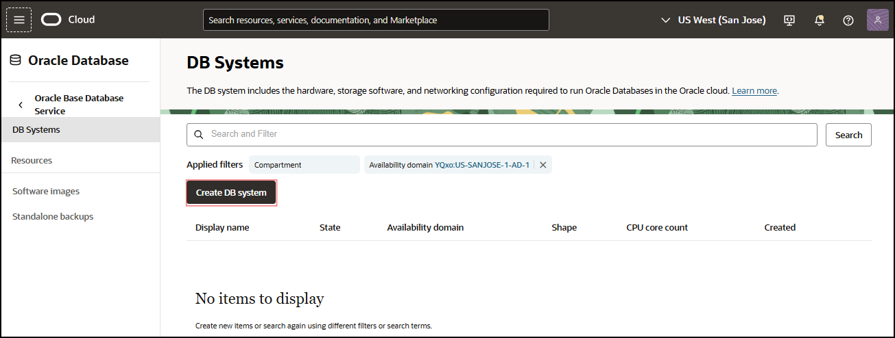
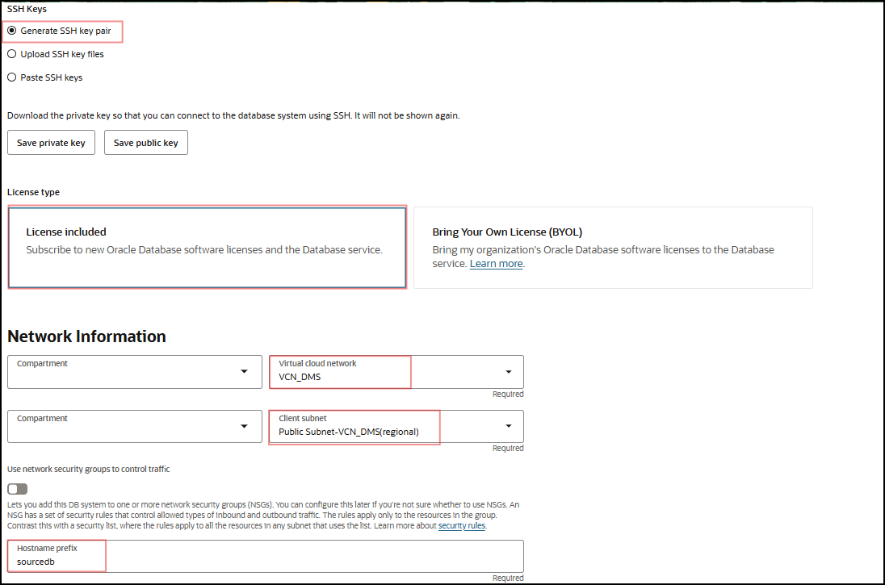
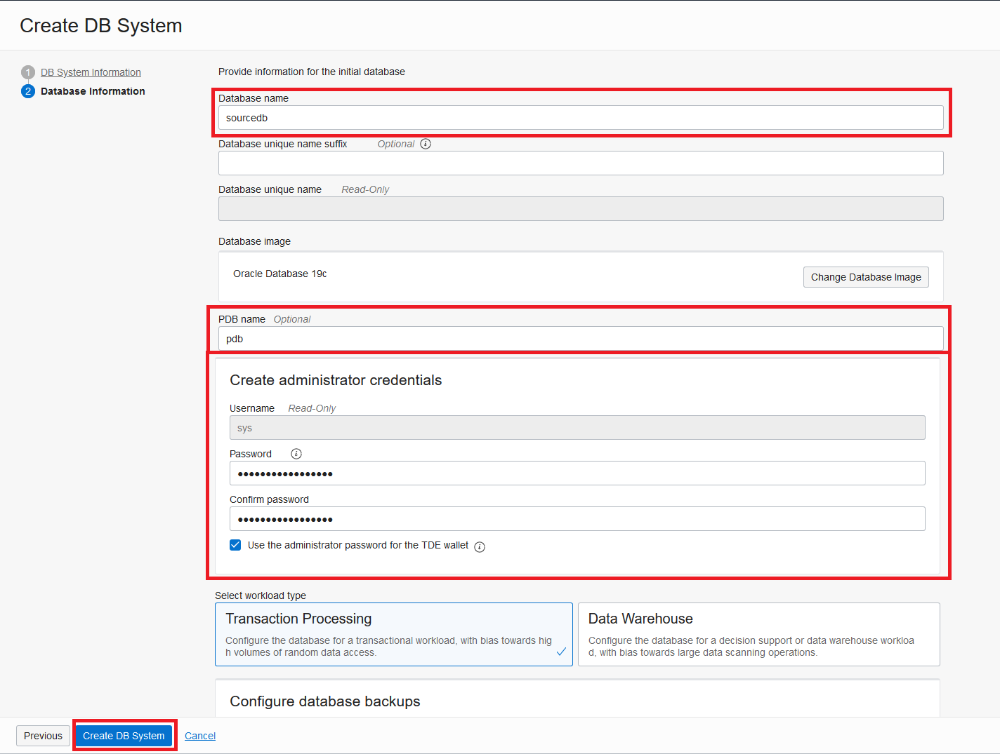

# Create Source Database

## Introduction

This lab walks you through the steps of setting up a Database Cloud Service (DBCS) Virtual Machine (VM) with Oracle Database 19c. For more information on DBCS and VM Database Systems visit the *Learn More* tab at the bottom of the page.

Estimated Lab Time: 75-90 minutes

### Objectives

In this lab, you will:
* Create a VM Database System as the Source Database
* Gather Database information for Connectivity
* Add data to the Pluggable Database

### Prerequisites

* An Oracle Cloud Account - Please view this workshop's LiveLabs landing page to see which environments are supported
* SSH Public Key in RSA format
* This lab requires completion of the preceding labs in the Contents menu on the left.

*Note: If you have a **Free Trial** account when your Free Trial expires your account will be converted to an **Always Free** account. You will not be able to conduct Free Tier workshops unless the Always Free environment is available. **[Click here for the Free Tier FAQ page.](https://www.oracle.com/cloud/free/faq.html)***

## Task 1: Setup the Source Database

The following task is *optional* if a source database is already present.

1. You will need an SSH key pair for logging into your database and environments. If you don’t already have one, please create one.
*Important*: The key needs to be in RSA format, other formats like OpenSSL are currently not supported. You can use a command like: `ssh-keygen -t rsa -N "" -b 2048 -m PEM`

2. In the OCI Console Menu, go to **Oracle Database > Oracle Base Database (VM, BM)**.

  

3. Press **Create DB System**.

  

4. Enter the following values, otherwise leave defaults. You can adjust shapes and storage to your use case requirements and available quota.
    - Name: **SourceDB**
    - Add public SSH keys: *Upload the public key file you use.*
    - Choose a license type: **License Included**
    - Virtual cloud network: **VCN\_DMS\_LA** (Or your VCN name)
    - Client subnet: **Public Subnet-VCN\_DMS\_LA** (Or your subnet name)
    - Hostname prefix: **sourcedb**

  

  

  

5. Press **Next**.

6. Enter the following values, otherwise leave defaults.
    - Database name: **sourcedb**
    - Press **Change Database Image**

    

    - Select **Display all available versions**
    - Check the box for version number **19.10.0.0**
    - Press **Select**

    

    - PDB name: **pdb**
    - Create administrator credentials – Password: *password of your choice*

  

7. Press **Create DB System**.

8. The provisioning of the database can take **60 or more** minutes. Wait for the Lifecycle State of the database to change to Active.


## Task 2: Collect Database Information

1. Open the database system **SourceDB** in the **DB Systems** table.

  

2. Open the database **sourcedb** in the **Databases** table.

  

3. Press **DB Connection**.

  

4. Press **Show** next to the **Easy Connect** Connection String. A string similar to **sourcedb.sub12062328210.vcndmsla.oraclevcn.com:1521/sourcedb\_iad158.sub12062328210.vcndmsla.oraclevcn.com** should be shown. Copy the string after the */* into a notepad, in this case **sourcedb\_iad158.sub12062328210.vcndmsla.oraclevcn.com**. This is the service name of your CDB, you will need this string later for accessing your database and creating migrations. Close the dialog.

  

5. Also note the service name of the PDB into a notepad, you need to replace the first section of the CDB service name with the PDB name (if you named it something else, use that), in this case **pdb.sub12062328210.vcndmsla.oraclevcn.com**

6. Go back to the **DB Systems Details** page of your database and select **Nodes** on the left-hand side **Resources** list.

7. The Nodes list shows the **sourcedb** node. Note the **Public IP Address** and **Private IP Address** of the node into a notepad, in this case **129.146.173.28** and **10.0.0.55**.

  

## Task 3: Adding Data to the Database

1. Open a SSH terminal to the database instance. The instructions are for Unix-style ssh command:

    ```
    <copy>ssh -i <private_key_file> opc@<dbnode_public_ip></copy>
    ```

2. Create a new directory in the user volume:

    ```
    <copy>sudo su - oracle</copy>
    ```
    ```
    <copy>mkdir /u01/app/oracle/dumpdir</copy>
    ```
3. Connect as sysdba to alter the streams pool size:

    ```
    <copy>sqlplus / as sysdba</copy>
    ```

3. Set the streams pool size = 2GB:

    ```
    <copy>alter system set streams_pool_size=2G scope=both SID='sourcedb';</copy>
    ```
4. Changing to the PDB

    ```
    <copy>show pdbs;</copy>
    ```

    ```
    <copy>alter session set container=PDB;</copy>
    ```

    

5. Adding dummy data to the PDB

    ```
    <copy>CREATE TABLE Persons (
        PersonID int,
        LastName varchar(255),
        FirstName varchar(255),
        Address varchar(255),
        City varchar(255)
    );</copy>
    ```
    ```
    <copy>INSERT INTO Persons (PersonID, LastName, FirstName, Address, City) Values ('1', 'Lynch', 'Killian', '123way', 'Austin');</copy>
    ```  
    ```
    <copy> quit;</copy>
    ```
You may now [proceed to the next lab](#next).

## Learn More

* [Bare Metal and Virtual Machine DB Systems](https://docs.oracle.com/en-us/iaas/Content/Database/Concepts/overview.htm)
* [Administering Oracle Database Classic Cloud Service](https://docs.oracle.com/en/cloud/paas/database-dbaas-cloud/csdbi/this-service.html)

## Acknowledgments
* **Author** - Alex Kotopoulis, Director, Product Management
* **Contributors** -  Killian Lynch, Hanna Rakhsha, Kiana McDaniel, Solution Engineers, Austin Specialist Hub
* **Last Updated By/Date** - Jorge Martinez, Product Manager, July 2022
