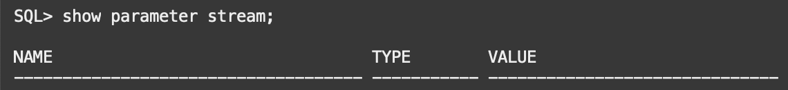
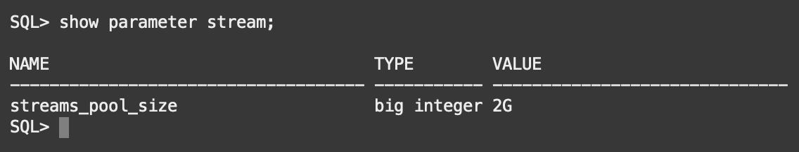
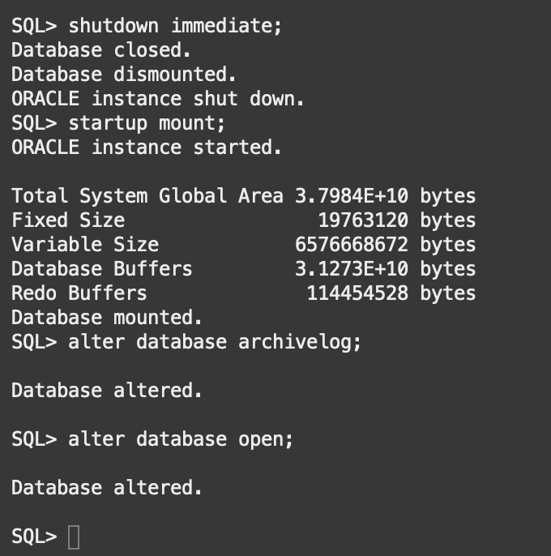
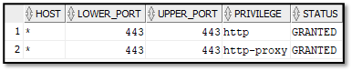

# Prepare source and target databases

## Introduction
In this lab, you will connect to your source database as system database administrator, create the required database and GoldenGate users to complete the migration, bestow them with the necessary privileges, and create a sample table to track through the migration. You will also connect to the target ADB instance and enable the standard ggadmin user.

The purpose of creating a database user and loading it with sample data is to simulate the user and data we are looking to migrate in a practical application.

Estimated Time: 15 minutes

###  Objectives

In this lab, you will:
* Learn how to Connect to the Source Database and create the required migration users.
* Learn how to Connect to the target ADB instance and enable the standard ggadmin user.

### Prerequisites
* This workshop section requires having set up a compute instance ,source database and target ABD instance.


## Task 1: Connect to Your Database and Configure required parameters

**Disclaimer**: Throughout the workshop there will be locations where you are copying and pasting multiple lines of code at a time from the instructions into SQLPlus. However, the last line pasted will not commit until you manually press enter a second time. To avoid statement failure, please be cognizant of this and press enter twice when pasting.

1. Verify that you are user 'opc' in your instance.

2. Switch from 'opc' user to user 'oracle'.
    ```
    <copy>
    sudo su - oracle
    </copy>
    ```

3. Log into SQL as system database administrator (dba).
    ```
    <copy>
    sqlplus / as sysdba
    </copy>
    ```

4. Set streams pool size parameter that will be needed for running the migration.

    Check the current status:
    ```
    <copy>
    show parameter stream;
    </copy>
    ```

    

    Set the parameter:
    ```
    <copy>
    alter system set streams_pool_size=2g scope=both;    
    </copy>
    ```

    Confirm the update went through:
    ```   
    <copy>
    show parameter stream;        
    </copy>
    ```

    

    Enable database minimal supplemental logging:

    ```
    <copy>    
    alter database add supplemental log data;
    </copy>
    ```

    Enable the parameter ENABLE _ GOLDENGATE _ REPLICATION:

    ```
    <copy>    
    ALTER SYSTEM SET ENABLE_GOLDENGATE_REPLICATION=TRUE SCOPE=BOTH;
    </copy>
    ```

    Enable ARCHIVELOG mode for the database:

    ```
    <copy>    
    shutdown immediate;
    </copy>
    ```
    ```
    <copy>    
    startup mount;
    </copy>
    ```
    ```
    <copy>    
    alter database archivelog;
    </copy>
    ```
    ```
    <copy>    
    alter database open;
    </copy>
    ``` 
       


    Enable FORCE LOGGING for the database:

    ```
    <copy>    
    alter database force logging;
    </copy>
    ```

## Task 2: Prepare SSL Certificates and Grant ACL Privileges

For your non-ADB source connectivity, you must perform the following steps:

1.  Create a new directory: 
```
    <copy>    
    mkdir /u01/app/oracle/dumpdir/wallet

    </copy>
```
2. Download a pre created SSL wallet using the following command:
```
    <copy>    
    curl -o walletSSL.zip https://objectstorage.us-ashburn-1.oraclecloud.com/p/jrzh3heRr9SzuC7HtQ5Tno5Qs-Yvj0ZX22WNnoZ9FhTpgn9I9-iQQE7-L1JuIFJZ/n/idgd2rlycmdl/b/SSL_Wallet/o/walletSSL.zip

    </copy>
```
3. Unzip the files:
```
    <copy>    
    unzip walletSSL.zip
    </copy>
```
4. Make sure these files are present in your desired directory path:

    1. 2022 ewallet.p12.lck
    2. cwallet.sso.lck
    3. ewallet.p12
    4. cwallet.sso
    5. addedCertificates.txt


5. Save this path location, you will need it during the migration creation, once there populate the SSL Wallet Path with it:

    i.e: /u01/app/oracle/dumpdir/wallet/opt/oracle/dcs/commonstore/wallets/newssl

6. The user performing the export or import requires the necessary network ACL to be granted to access the network from the source and target database host. For this guide, run the following commands as SYS if the export or import user is SYSTEM. Since your database is multitenant, the following actions need to be performed in CDB$ROOT. Replace clouduser and sslwalletdir accordingly:

```
    <copy>    
    define clouduser='system';/*user performing export at source or import at target*/
define sslwalletdir='/u01/app/oracle/dumpdir/wallet/opt/oracle/dcs/commonstore/wallets/newssl';/* OCI wallet path*/
BEGIN
    dbms_network_acl_admin.append_host_ace(host => '*', lower_port => 443, upper_port => 443, ace => xs$ace_type(privilege_list => xs$name_list(
    'http', 'http_proxy'), principal_name => upper('&clouduser'), principal_type => xs_acl.ptype_db));

    dbms_network_acl_admin.append_wallet_ace(wallet_path => 'file:&sslwalletdir', ace => xs$ace_type(privilege_list => xs$name_list('use_client_certificates',
    'use_passwords'), principal_name => upper('&clouduser'), principal_type => xs_acl.ptype_db));

END;
    </copy>
```
7. Once the connect privilege is granted, connect as the relevant user such as, SYSTEM, and verify if the privilege is granted using the following query:
```
    <copy>    
    SELECT host, lower_port, upper_port, privilege, status 
    FROM user_network_acl_privileges;

    </copy>
```

You should see a similar output to the following:


  

## Task 3: Creating Users for Your Database Migration

1.  Create a GoldenGate administration user, c##ggadmin, in CDB$ROOT, granting all of the permissions listed in the example. Please bear in mind that you may need to press enter twice after copying the following statement for it to fully create the users, grant the privileges and execute the required PL/SQL procedure.

    ```
    <copy>    
    CREATE USER C##GGADMIN IDENTIFIED BY <password> DEFAULT TABLESPACE USERS TEMPORARY TABLESPACE TEMP;
    GRANT CONNECT, RESOURCE TO C##GGADMIN CONTAINER=ALL; 
    GRANT SELECT ON SYS.CCOL$ TO C##GGADMIN CONTAINER=ALL; 
    GRANT SELECT ON SYS.CDEF$ TO C##GGADMIN CONTAINER=ALL; 
    GRANT SELECT ON SYS.COL$ TO C##GGADMIN CONTAINER=ALL; 
    GRANT SELECT ON SYS.CON$ TO C##GGADMIN CONTAINER=ALL;
    GRANT SELECT ON SYS.DEFERRED_STG$ TO C##GGADMIN CONTAINER=ALL; 
    GRANT SELECT ON SYS.ICOL$ TO C##GGADMIN CONTAINER=ALL; 
    GRANT SELECT ON SYS.IND$ TO C##GGADMIN CONTAINER=ALL; 
    GRANT SELECT ON SYS.LOB$ TO C##GGADMIN CONTAINER=ALL;
    GRANT SELECT ON SYS.LOBFRAG$ TO C##GGADMIN CONTAINER=ALL; 
    GRANT SELECT ON SYS.OBJ$ TO C##GGADMIN CONTAINER=ALL; 
    GRANT SELECT ON SYS.SEG$ TO C##GGADMIN CONTAINER=ALL; 
    GRANT SELECT ON SYS.TAB$ TO C##GGADMIN CONTAINER=ALL; 
    GRANT SELECT ON SYS.TABCOMPART$ TO C##GGADMIN CONTAINER=ALL; 
    GRANT SELECT ON SYS.TABPART$ TO C##GGADMIN CONTAINER=ALL; 
    GRANT SELECT ON SYS.TABSUBPART$ TO C##GGADMIN CONTAINER=ALL; 
    GRANT CREATE VIEW TO C##GGADMIN CONTAINER=ALL; 
    GRANT EXECUTE ON DBMS_LOCK TO C##GGADMIN CONTAINER=ALL; 
    ALTER USER C##GGADMIN QUOTA 100M ON USERS CONTAINER=ALL; 
    GRANT UNLIMITED TABLESPACE TO C##GGADMIN CONTAINER=ALL; 
    EXEC DBMS_GOLDENGATE_AUTH.GRANT_ADMIN_PRIVILEGE ('C##GGADMIN',CONTAINER=>'ALL'); 
    ALTER SYSTEM SET STREAMS_POOL_SIZE=2G SCOPE=BOTH SID='SOURCEDB'; 
    ALTER DATABASE ADD SUPPLEMENTAL LOG DATA; 
    ALTER SYSTEM SWITCH LOGFILE; 
    ALTER SYSTEM SET ENABLE_GOLDENGATE_REPLICATION=TRUE SCOPE=BOTH;

    </copy>
    ```


2. Switch the session of your container database to PDB.

    ```
    <copy>
    ALTER SESSION SET CONTAINER=PDB;
    </copy>
    ```

3. Create a GoldenGate administration user, ggadmin, in the PDB, granting all of the permissions listed in the example. Please bear in mind that you may need to press enter twice after copying the following statement for it to fully create the users, grant the privileges and execute the required PL/SQL procedure.

    ```
    <copy>    
    CREATE USER GGADMIN IDENTIFIED BY <password> DEFAULT TABLESPACE USERS TEMPORARY TABLESPACE TEMP;
    GRANT CONNECT, RESOURCE TO GGADMIN; 
    GRANT SELECT ON SYS.CCOL$ TO GGADMIN; 
    GRANT SELECT ON SYS.CDEF$ TO GGADMIN; 
    GRANT SELECT ON SYS.COL$ TO GGADMIN; 
    GRANT SELECT ON SYS.CON$ TO GGADMIN; 
    GRANT SELECT ON SYS.DEFERRED_STG$ TO GGADMIN; 
    GRANT SELECT ON SYS.ICOL$ TO GGADMIN; 
    GRANT SELECT ON SYS.IND$ TO GGADMIN; 
    GRANT SELECT ON SYS.LOB$ TO GGADMIN; 
    GRANT SELECT ON SYS.LOBFRAG$ TO GGADMIN; 
    GRANT SELECT ON SYS.OBJ$ TO GGADMIN; 
    GRANT SELECT ON SYS.SEG$ TO GGADMIN; 
    GRANT SELECT ON SYS.TAB$ TO GGADMIN; 
    GRANT SELECT ON SYS.TABCOMPART$ TO GGADMIN; 
    GRANT SELECT ON SYS.TABPART$ TO GGADMIN; 
    GRANT SELECT ON SYS.TABSUBPART$ TO GGADMIN; 
    GRANT CREATE VIEW TO GGADMIN; 
    GRANT EXECUTE ON DBMS_LOCK TO GGADMIN; 
    ALTER USER GGADMIN QUOTA 100M ON USERS; 
    GRANT UNLIMITED TABLESPACE TO GGADMIN; 
    EXEC DBMS_GOLDENGATE_AUTH.GRANT_ADMIN_PRIVILEGE('GGADMIN');

    </copy>
    ```


4. After connecting to your container database create the user 'HR01'. Write down or save the password as you will need it later.
    ```
    <copy>
    CREATE USER HR01 IDENTIFIED BY <password>;
    </copy>
    ```

5. Grant the user privileges it will need for the migration. Please bear in mind that you may need to press enter twice after copying the following statement for it to fully create the users, grant the privileges and execute the required PL/SQL procedure.

    ```
    <copy>
    GRANT CONNECT,RESOURCE,CREATE TABLE,CREATE SEQUENCE TO HR01; 
    GRANT CREATE ANY PROCEDURE TO HR01; 
    ALTER USER HR01 QUOTA UNLIMITED ON USERS; 
    CREATE TABLE HR01.EMPL (COL1 NUMBER, COL2 VARCHAR2(9), COL3 VARCHAR2(100), COL4 TIMESTAMP); 
    ALTER TABLE HR01.EMPL ADD CONSTRAINT EMPL_I1 PRIMARY KEY (COL1,COL2);
    </copy>
    ```

## Task 4: Load Sample Table
1. Connect to your database user. Enter <password> at the prompt that you set for your user.
    ```
    <copy>
    connect HR01@PDB;
    </copy>
    ```

    Password:
    ```
    <copy>
    <password>
    </copy>
    ```


2. As HR01 run the following code to create a sample table. Please bear in mind that you may need to press enter twice after copying the following statement for it to fully execute.

    ```
    <copy>
    SET ECHO OFF;
    SET HEADING OFF; 
    SET FEEDBACK OFF; 
    SET SERVEROUTPUT ON; 
    DECLARE SCN HR01.EMPL.COL1%TYPE; 
    RND1 HR01.EMPL.COL2%TYPE; 
    RND2 HR01.EMPL.COL3%TYPE; 
    RND3 HR01.EMPL.COL4%TYPE; 
    ROWSNUM NUMBER; 
    DBNAME VARCHAR2(60); 
    i INTEGER;
    BEGIN 
    i := 0; 
    LOOP 
    SELECT COUNT(*) INTO ROWSNUM FROM HR01.EMPL; 
    SELECT DBMS_RANDOM.STRING('P', 9) INTO RND1 FROM DUAL; 
    SELECT DBMS_RANDOM.STRING('P', 10) INTO RND2 FROM DUAL; 
    SELECT TO_DATE(TRUNC (DBMS_RANDOM.VALUE (2451545,5373484)), 'J') INTO RND3 FROM DUAL; 
    INSERT INTO HR01.EMPL(col1, col2, col3, col4) VALUES (ROWSNUM, RND1, RND2, RND3); 
    COMMIT; 
    DBMS_OUTPUT.PUT_LINE('Number of rows = ' || ROWSNUM); 
    IF ( i >= 1000 ) THEN EXIT;
    END IF; 
    i := i + 1;
    END LOOP;
    END; 
    / 
    </copy>
    ```

3. Check for the table name 'EMPL'.

    ```
    <copy>
    select table_name from user_tables;
    </copy>
    ```

4. View the sample table.

    ```
    <copy>
    select * from EMPL;
    </copy>
    ```
    Your source DB now has a user HR01 with a table EMPL that has 1000 rows.
    
5. This table is to demonstrate the Cloud Pre Migration advisor (CPAT) functionality during Validation on Lab 8.
    ```
    <copy>
    CREATE TABLE image_table2 ( id NUMBER, image ORDImage ) LOB(image.source.localData) STORE AS SECUREFILE;
    </copy>
    ```

6. Exit SQL.

    ```
    <copy>
    exit
    </copy>
    ```

## Task 5: Change the Source Database System Password

To perform the migration, DMS will require several passwords, for simplicity, let's change the Oracle Source Database System Password. This will help expedite the migration process when prompted for the different components passwords.

1. Connect to your source database. 
    ```
    <copy>
    sqlplus system/Ora_DB4U@localhost:1521/orcl
    </copy>
    ```

2. Change your password by copying and executing the following in SQLPLUS
   
    ```
    <copy>
    ALTER USER system IDENTIFIED BY <New password>;
    </copy>
    ```

3. The password has been changed. Exit SQL.

    ```
    <copy>
    exit
    </copy>
    ```

## Task 6: Enable ggadmin user on target database

The next steps will connect to the target ADB instance and enable the standard ggadmin user. You can skip these steps if the user is already enabled. 
The connection will be thru the Oracle GoldenGate instance using sqlplus.

Make sure the Autonomous Database regional wallet has been placed in /u02/deployments/Marketplace/etc/adb. If not, you can download the zip file from OCI Console and unzip it there.
Modify sqlnet.ora so it correctly has the wallet location (needed if connecting with sqlplus):

1. Enter the following commands:

    ```
    <copy>
    cat sqlnet.ora
    WALLET_LOCATION = (SOURCE = (METHOD = file) (METHOD_DATA = (DIRECTORY="/u02/deployments/Marketplace/etc/adb"))) SSL_SERVER_DN_MATCH=yes

    </copy>
    ```
2. You need to set the following Export variables:    
    ```
    <copy>
    EXPORT ORACLE_HOME="/U01/APP/OGG/LIB/INSTANTCLIENT"
    </copy>
    ```
    ```
    <copy>
    EXPORT LD_LIBRARY_PATH="$ORACLE_HOME"
    </copy>
    ```
     ```
    <copy>
    EXPORT PATH="$ORACLE_HOME:$PATH"
    </copy>
    ```
      ```
    <copy>
    EXPORT TNS_ADMIN="/U02/DEPLOYMENTS/MARKETPLACE/ETC/ADB"
    </copy>
    ```
      ```
    <copy>
    $ORACLE_HOME/SQLPLUS ADMIN/ <DB PASSWORD>@ ADW_name
    </copy>
    ```
    
2. In SQL Plus enter the following commands:

    ```
    <copy>
    alter user ggadmin identified by <new password> account unlock;
    </copy>
    ```
3. Exit SQL. 

    ```
    <copy>
    quit
    </copy>
    ```


You may now [proceed to the next lab](#next).


## Acknowledgments
* **Author** - Zachary Talke, Solutions Engineer, NA Tech Solution Engineering
* **Author** - Ameet Kumar Nihalani, Senior Principal Support Engineer, Oracle Cloud Database Migration
* **Author** - Ricardo Gonzalez, Senior Principal Product Manager, Oracle Cloud Database Migration
* **Contributors** - LiveLabs Team, ZDM Development Team
* **Last Updated By/Date** - Jorge Martinez, Product Manager, July 2022
