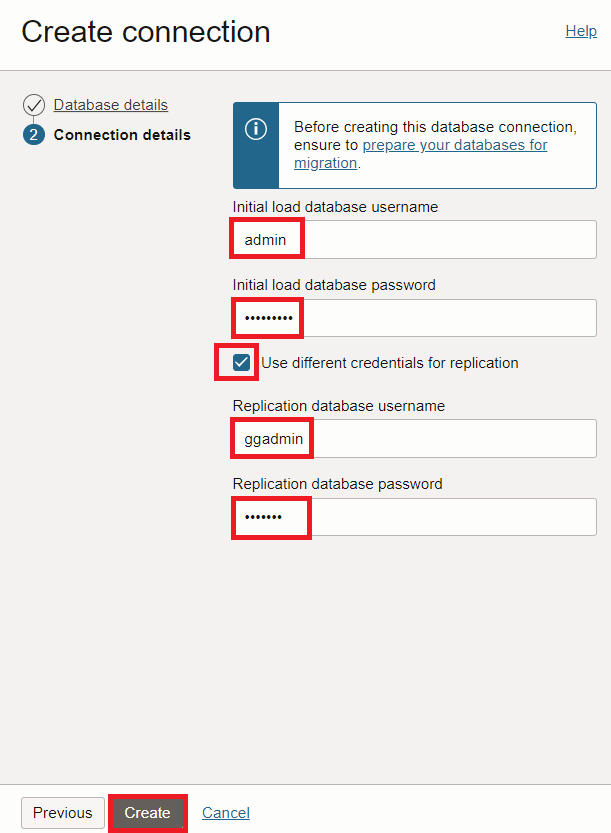

# Create Database Connections

## Introduction

This lab walks you through the steps to create a database connection to use with DMS. Database connection resources enable networking and connectivity for the source and target databases.

Estimated Lab Time: 20 minutes

### Objectives

In this lab, you will:
* Create a database connection for Source CDB
* Create a database connection for Source PDB
* Create a database connection for Target ADB
* Create a Migration

### Prerequisites

* An Oracle Cloud Account - Please view this workshop's LiveLabs landing page to see which environments are supported
* This lab requires completion of the preceding labs in the Contents menu on the left.
* Source DB Private IP
* Source DB CDB Service Name
* Source DB PDB Service Name
* Database Administrator Password

*Note: If you have a **Free Trial** account when your Free Trial expires your account will be converted to an **Always Free** account. You will not be able to conduct Free Tier workshops unless the Always Free environment is available. **[Click here for the Free Tier FAQ page.](https://www.oracle.com/cloud/free/faq.html)***

## Task 1: Create a Database Connection for Source CDB

For this task you need the following info from previous steps:
* Source DB Private IP
* Source DB CDB Service Name
* Database Administrator Password

1. In the OCI Console Menu , go to **Migration & Disaster Recovery > Database Migration > Database Connections**

  

2. Press **Create Connection**

  

3. On the page Database Details, fill in the following entries, otherwise leave defaults:
    - Name: **SourceCDB**
    - Vault: **DMS_Vault**
    - Encryption Key: **DMS_Key**
    - Database Type: **DB System Database (Bare Metal, VM, Exadata)**
    - Database System: **SourceDB**
    - Database: **sourcedb**
    - Connect String: Change existing string by replacing the qualified hostname with the **private IP** of the database node, for example:
        - **10.0.0.3**:1521/sourcedb_iad158.sub12062328210.vcndmsla.oraclevcn.com
    - Subnet: Pick the Subnet that the DB is in

4. Press **Next**

  

5. On the page Connection Details, fill in the following entries, otherwise leave defaults:
    - Initial load database username: **system**
    - Initial load database password: <*Admin password*>
    
6. Press **Create**

  

## Task 2: Create Database Connection for Source PDB

For this task you need the following info from previous steps:
* Source DB Private IP
* Source DB PDB Service Name
* Database Administrator Password

1. In the OCI Console Menu , go to **Migration & Disaster Recovery > Database Migration > Database Connections**

  

2. Press **Create connection**

  

3. On the page Database Details, fill in the following entries, otherwise leave defaults:
    - Name: **SourcePDB**
    - Vault: **DMS_Vault**
    - Encryption Key: **DMS_Key**
    - Database Type: **DB System Database (Bare Metal, VM, Exadata)**
    - Database System: **SourceDB**
    - Database: **sourcedb**
    - Connect String: Change existing string by replacing the qualified hostname with the **private IP** of the database node. Then replace service name with **PDB service name**, for example:
        - **10.0.0.3**:1521/**pdb**.sub12062328210.vcndmsla.oraclevcn.com
    - Subnet: Pick the Subnet that the DB is located in

4. Press **Next**

  

5. On the page Connection Details, fill in the following entries, otherwise leave defaults:
    - Initial load database username: **system**
    - Initial load database password: <*Admin password*>
    

6. Press **Create**

   

## Task 3: Create Database Connection for Target ADB

For this task you need the following info from previous steps:
* Database Administrator Password

1. In the OCI Console Menu , go to **Migration & Disaster Recovery > Database Migration > Database Connections**

  

2. Press **Create connection**

   

3. On the page Database Details, fill in the following entries, otherwise leave defaults:
    - Name: **TargetATP**
    - Vault: **DMS_Vault**
    - Encryption Key: **DMS_Key**
    - Database Type: **Autonomous Database**
    - Database: **TargetATP**

4. Press **Next**

  

5. On the page Connection Details, fill in the following entries, otherwise leave defaults:
    - Initial load database username: **admin**
    - Initial load database password: <*Admin password*>

6. Press **Create**

  

## Task 4: Create Migration

  1. In the OCI Console Menu , go to **Migration & Disaster Recovery > Database Migration > Migrations**

    

  2. Press **Create Migration**

    

  3. On the page **Add Details**, fill in the following entries, otherwise leave defaults:
      - Name: **TestMigration**
      - Vault: **DMS_Vault**
      - Encryption Key: **DMS_Key**

      

  4. Press **Next**

  5. On the page **Select Databases**, fill in the following entries, otherwise leave defaults:
      - Source Database: **SourcePDB**
      - *Check* Database is pluggable database (PDB)
      - Container Database connection: **SourceCDB**
      - Target Database: **TargetATP**

      

  6. On the page **Migration Options**, fill in the following entries, otherwise leave defaults:
      - In **Initial Load**, select **Datapump via Object Storage**
      - Object Storage Bucket: **DMSStorage**
      - Export Directory Object:
          - Name: **dumpdir**
          - Path: **/u01/app/oracle/dumpdir**
      - Source Database file system SSL wallet path:
          - **/u01/app/oracle/dumpdir/wallet/opt/oracle/dcs/commonstore/wallets/newssl**
     
          

  7. Check **Use Online Replication**
     - GoldenGate Hub URL: **https://(goldengate public IP)**
     - GoldenGate Administrator Username: **oggadmin**
     - GoldenGate Administrator Password: **(As previously selected)**

     

     - Source database:
          - GoldenGate deployment name: **Marketplace**
          - Database Username: **ggadmin**
          - Database Password: **(As previously selected)**
          - Container Database Username: **c##ggadmin**
          - Container Database Password: **(As previously selected)**

          
     
     - Target database:
          - GoldenGate Deployment Name: **Marketplace**
          - Database Username: **ggadmin**
          - Database Password: **(As previously selected)**
          - Press Show Advanced Options
          - Press Replication tab
          - GoldenGate Instance OCID: **(OCID as copied from GoldenGate compute instance)** (This field is optional; if OCID is given, validation will check for GoldenGate space requirements) 
          

     

      - Press Create to initiate the Migration creation

You may now [proceed to the next lab](#next).

## Learn More

* [Managing Registered Databases](https://docs.oracle.com/en-us/iaas/database-migration/doc/managing-registered-databases.html)
* [Managing Migrations](https://docs.oracle.com/en-us/iaas/database-migration/doc/managing-migrations.html)

## Acknowledgments
* **Author** - Alex Kotopoulis, Director, Product Management
* **Contributors** -  Kiana McDaniel, Hanna Rakhsha, Killian Lynch, Solution Engineers, Austin Specialist Hub
* **Last Updated By/Date** - Jorge Martinez, Product Manager, July 2022
