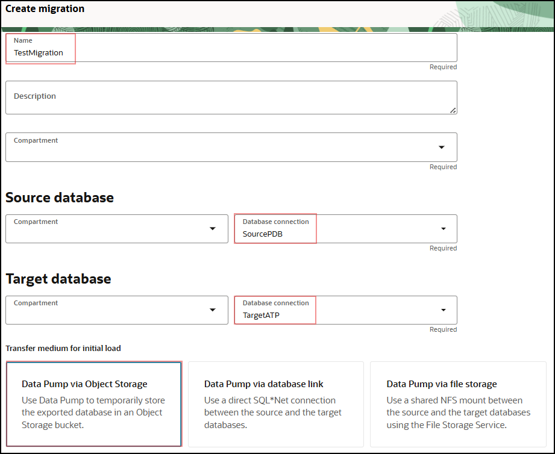

# Create Database Connections

## Introduction

This lab walks you through the steps to create a database connection to use with DMS. Database connection resources enable networking and connectivity for the source and target databases.

Estimated Lab Time: 20 minutes

### Objectives

In this lab, you will:
* Create a database connection for Source CDB
* Create a database connection for Source PDB
* Create a database connection for Target ADB
* Create an online Migration

### Prerequisites

* An Oracle Cloud Account - Please view this workshop's LiveLabs landing page to see which environments are supported
* This lab requires completion of the preceding labs in the Contents menu on the left.
* Source DB Private IP
* Source DB CDB Service Name
* Source DB PDB Service Name
* Database Administrator Password

*Note: If you have a **Free Trial** account when your Free Trial expires your account will be converted to an **Always Free** account. You will not be able to conduct Free Tier workshops unless the Always Free environment is available. **[Click here for the Free Tier FAQ page.](https://www.oracle.com/cloud/free/faq.html)***

## Task 1: Create a Database Connection for Source CDB

For this task you need the following info from previous steps:
* Source DB  Name
* Database Administrator Password

1. In the OCI Console Menu , go to **Migration & Disaster Recovery > Database Migration > Database Connections**

  

2. Press **Create Connection**

  

3. On the page Database Details, fill in the following entries, otherwise leave defaults:
    - Name: **SourceCDB**
    - Type: **Oracle Database**
    - Vault: **DMS_Vault**
    - Encryption Key: **DMS_Key**

  Select Database details: Select an OCI database
   - Database System: **SourceDB**
   - Initial load database username: **system**
   - Initial load database password: \****

Check **Use different credentials for replication** and provide c##ggadmin and password.
Don’t check create private endpoint option.

4. Press **Create**

  
   

## Task 2: Create database connection for source PDB

For this task you need the following info from previous steps:
* Source DB PDB Service Name
* Database Administrator Password

1. In the OCI Console Menu , go to **Migration & Disaster Recovery > Database Migration > Database Connections**

  

2. Press **Create connection**

  

3. On the page Database Details, fill in the following entries, otherwise leave defaults:
    - Name: **SourcePDB**
    - Type: **Oracle Database**
    - Vault: **DMS_Vault**
    - Encryption Key: **DMS_Key**

  Select Database details: Select an OCI database
   - Database System: **SourceDB**
   - Pluggable database: **pdb**
   - Initial load database username: **system**
   - Initial load database password: \****

Check **Use different credentials for replication** and provide ggadmin and password.
Don’t check create private endpoint option.

4. Press **Create**

  
  
  

  

## Task 3: Create database connection for target ADB

For this task you need the following info from previous steps:
* Database Administrator Password

1. In the OCI Console Menu , go to **Migration & Disaster Recovery > Database Migration > Database Connections**

  

2. Press **Create connection**

   

3. On the page Database Details, fill in the following entries, otherwise leave defaults:
    - Name: **TargetATP**
    - Type: **Oracle Autonomous Database**
    - Vault: **DMS_Vault**
    - Encryption Key: **DMS_Key**

   Select the Autonomous database name in your compartment i.e: dmsatp2
    - Initial load database username: **admin**
    - Initial load database password: \****

   Check **Use different credentials for replication**”** and provide ggadmin and password.
    - Replication database username: **ggadmin**
    - Replication database password: \****
   
   Network connectivity: Create private endpoint to access this database and select the correct subnet.

4. Press **create**

  
  

## Task 4: Create Migration

  1. In the OCI Console Menu , go to **Migration & Disaster Recovery > Database Migration > Migrations**

    

  2. Press **Create Migration**

    

  3. On the page **Create migration**, fill in the following entries, otherwise leave defaults:
      - Name: **TestMigration**
      - Compartment: **your compartment**
      
    Source database
      - Database connection: **SourcePDB**

    Target database
      - Database connection: **TargetATP** 

    Transfer medium for initial load
      - Data Pump via Object Storage

    Source database
      - Export directory object name: **dumpdir**
      - Export directory object path: **/u01/app/oracle/dumpdir**
      - Source Database file system SSL wallet path: **/u01/app/oracle/wallet**

    Object Storage bucket
      - DMSStorage

    Online replication:
      - Check Use Online Replication 
      - *Check* Source database is a pluggable database with version less than 21c

    Source container database
      - Container database connection: **SourceCDB** 

     
  4. Press **Create** 
  
  

  
You may now [proceed to the next lab](#next).

## Learn More

* [Managing Registered Databases](https://docs.oracle.com/en-us/iaas/database-migration/doc/managing-registered-databases.html)
* [Managing Migrations](https://docs.oracle.com/en-us/iaas/database-migration/doc/managing-migrations.html)

## Acknowledgments
* **Author** - Alex Kotopoulis, Director, Product Management
* **Contributors** -  Kiana McDaniel, Hanna Rakhsha, Killian Lynch, Solution Engineers, Austin Specialist Hub
* **Last Updated By/Date** - Jorge Martinez, Product Management, May 2025
