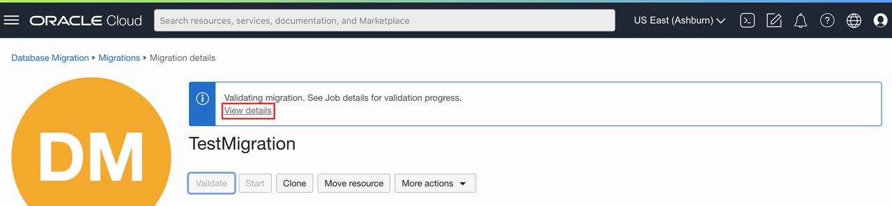
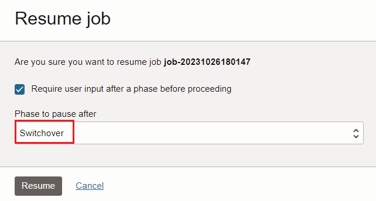

# Validate Migration

## Introduction

This lab walks you through the steps to validate a migration prior to running it. Before you can run a job with a migration resource in OCI Database Migration, the migration resource must be validated. The validation job will check that all associated database environments are correctly set up.

Estimated Lab Time: 20 minutes

Watch the video below for a quick walk-through of the lab.
[Validate Migration](videohub:1_pl8uedpr)

### Objectives

In this lab, you will:
* Validate a migration
* Run a migration

### Prerequisites

* An Oracle Cloud Account - Please view this workshop's LiveLabs landing page to see which environments are supported
* This lab requires completion of the preceding labs in the Contents menu on the left.


## Task 1: Validate Migration

1. In the OCI Console Menu , go to **Migration & Disaster Recovery > Database Migration > Migrations**

    

2. Select **TestMigration**

  

3. If Migration is still being created, wait until Lifecycle State is Active

4. Press **Validate** button

  

5. Press **Validate** button to confirm   


6. Click on **View Details** in the information box above the validate button. You can also navigate to the Jobs resources of this migration.

  

7. Phases will be shown, and status will be updated as phases are completed. It can take 2 minutes before the first phase is shown.
    

8. If a phase has failed, it will show with the status **Failed**. In this case, press on the phase name to learn more about the reason for failure. Resolve the issue described and rerun the validation by pressing the Validate button again.

  

9. Once all phases show complete, move to the next step.

## Task 2: Run Migration

  1. In the OCI Console Menu , go to **Migration & Disaster Recovery > Database Migration > Migrations**

    

  2. Select **TestMigration**

    

  3. Press **Start** to begin the Migration. The Start Migration dialog is shown. Select the default phase: **Monitor replication lag**.This will cause the replication to run continuously until the Migration is resumed. 

    

  4. Click on **Jobs** in the left-hand **Resources** list

  5. Click on the most recent Migration Job

  6. Click on **Phases** in the left-hand **Resources** list

  7. Job phases are updated as the migration progresses

  8. Wait till **Monitor replication lag** phase completes and te migration goes into **Waiting** state.

  

 Data replication is in progress and is capturing all transactions since start of the migration. 
  
  9. Open the Cloud Shell located under the developer tools icon on the top ribbon:
  

   Enter the following command to run SQL*Plus:
    ```
    <copy>
    sqlplus system/<admin_password>@<PDB Connection String>
    </copy>
    ```

    Please replace the following placeholders withe the actual values from terraform output:
    * <admin\_password\>
    * <PDB\_Connection\_String\>

    

    In the SQL*Plus prompt please enter the following command:

    ```
    <copy>
    INSERT INTO "HR01"."EMPL" (COL1, COL2, COL3, COL4) VALUES ('99999', 'Joe', 'Smith', CURRENT_TIMESTAMP); 
    </copy>
    ``` 

    ```
    <copy>
    commit;
    </copy>
    ``` 
    This will insert a record into the source database simulating new transactions which GoldenGate will identify and replicate to the target database.
    You can close the Cloud Shell window now.

 10. Let's review the migrated data in the autonomous database.
    In the OCI Console Menu , go to **Oracle Database > Autonomous Database**

     

 11. In the list of autonomous databases, click on the entry TargetADB#####.   

     

 12. Click on the **Database Actions** list of values button and SQL. If your browser blocks the popup, change it to allow popups from Oracle cloud. 

     

 
 13. Run the following query to locate the previously inserted record on the source database that was replicated to our ADB instance:

      ```
    <copy>
    select * from hr01.empl where col1='99999';
    </copy>
      ``` 

    Click on the Run Statement button, you should see the record in the bottom:

     

 14. You can close the Database Actions window and go back to OCI.

 15. In the OCI Console Menu , go to **Migration & Disaster Recovery > Database Migration > Migrations**

    

 16. Select **TestMigration**

    

 17. Select the most recent Migration job.  

 18. This is the point where a migration user would stop the source application so that no more transactions are applied to the source DB. You can now press **Resume** on the job to complete replication. In the Resume Job dialog, chose the **Switchover App** phase and press **Resume**. The Switchover App phase will gracefully stop replication and allow the user to activate the target application.
 
    

 19. Once the Job status is WAITING and Switchover phase is Completed , press Resume again:
    

 20. The migration runs the final cleanup phases and shows as Succeeded when finished:


## Learn More

* [Managing Migration Jobs](https://docs.oracle.com/en-us/iaas/database-migration/doc/managing-migration-jobs.html)

## Acknowledgments
* **Author** - Alex Kotopoulis, Director, Product Management
* **Contributors** -  Kiana McDaniel, Hanna Rakhsha, Killian, Lynch, Solution Engineers, Austin Specialist Hub
* **Last Updated By/Date** - Jorge Martinez, Product Manager, June 2024
