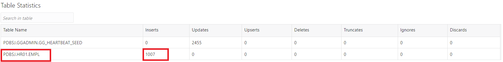
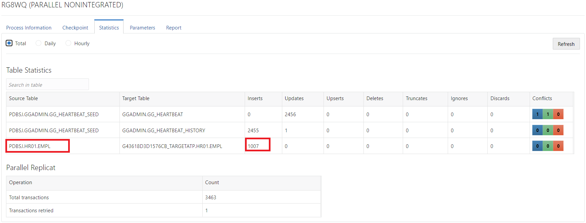
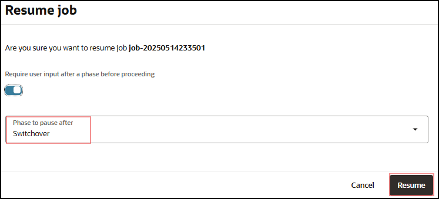
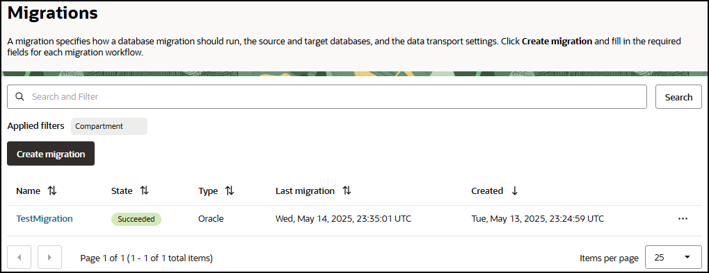

# Validate Migration

## Introduction

This lab walks you through the steps to validate a migration prior to running it. Before you can run a job with a migration resource in OCI Database Migration, the migration resource must be validated. The validation job will check that all associated database environments are correctly set up.

Estimated Lab Time: 20 minutes

### Objectives

In this lab, you will:
* Validate a migration
* Run a migration

### Prerequisites

* An Oracle Cloud Account - Please view this workshop's LiveLabs landing page to see which environments are supported
* This lab requires completion of the preceding labs in the Contents menu on the left.


## Task 1: Validate Migration

1. In the OCI Console Menu , go to **Migration & Disaster Recovery > Database Migration > Migrations**

    

2. Select **TestMigration**

  

3. If Migration is still being created, wait until Lifecycle State is Active

4. Press **Validate** button

  

5. Click on **Jobs** in left-hand **Resources** list

  

6. Click on most recent Evaluation Job

7. Click on **Phases** in the left-hand **Resources** list

  

8. Phases will be shown, and status will be updated as phases are completed. It can take 2 minutes before the first phase is shown.
    
9. If a phase has failed, it will show with the status **Failed**. In this case, press **Download Log** to learn more about the reason for failure. Press **Abort** on a failed job to allow further jobs or deleting of the migration.

  

10. In this case **Validate premigration advisor** phase has failed.CPAT is a tool that will assess your source database instance, checking for potentially problematic content and other factors that could impede a successful migration. If you click on the link it will take you to a summary view. 


11. You can click on every check and access to the check details. You will be presented with a description of the issue, the impact and a recommended action. You can mark the check to be excluded from the migration.

  

12. Since we took care of the problematic finding the validation Job can be run again. This process should be repeated until “Validate premigration advisor” phase completes with no error.


13. Once all phases show complete, move to the next step.

## Task 2: Run Migration

 1. In the OCI Console Menu , go to **Migration & Disaster Recovery > Database Migration > Migrations**

    

  2. Select **TestMigration**

    

  3. Press **Start** to begin the Migration. The Start Migration dialog is shown. Select the default phase: **Monitor replication lag**.This will cause the replication to run continuously until the Migration is resumed. 

    

  4. Click on **Jobs** in the left-hand **Resources** list

  5. Click on the most recent Migration Job

  6. Click on **Phases** in the left-hand **Resources** list

  7. Job phases are updated as the migration progresses

  8. Wait till **Monitor replication lag** phase completes.

  

  9. Now data replication is in progress. **If you want test the replication please continue, otherwise you can jump to step 15**.
  Go back to your source database and execute the following script:

      ```
    <copy>
    SET ECHO OFF;
    SET HEADING OFF; 
    SET FEEDBACK OFF; 
    SET SERVEROUTPUT ON; 
    DECLARE SCN HR01.EMPL.COL1%TYPE; 
    RND1 HR01.EMPL.COL2%TYPE; 
    RND2 HR01.EMPL.COL3%TYPE; 
    RND3 HR01.EMPL.COL4%TYPE; 
    ROWSNUM NUMBER; 
    DBNAME VARCHAR2(60); 
    i INTEGER;
    BEGIN 
    i := 0; 
    LOOP 
    SELECT COUNT(*) INTO ROWSNUM FROM HR01.EMPL; 
    SELECT DBMS_RANDOM.STRING('P', 9) INTO RND1 FROM DUAL; 
    SELECT DBMS_RANDOM.STRING('P', 10) INTO RND2 FROM DUAL; 
    SELECT TO_DATE(TRUNC (DBMS_RANDOM.VALUE (2451545,5373484)), 'J') INTO RND3 FROM DUAL; 
    INSERT INTO HR01.EMPL(col1, col2, col3, col4) VALUES (ROWSNUM, RND1, RND2, RND3); 
    COMMIT; 
    DBMS_OUTPUT.PUT_LINE('Number of rows = ' || ROWSNUM); 
    IF ( i >= 1006 ) THEN EXIT;
    END IF; 
    i := i + 1;
    END LOOP;
    END; 
    /
    </copy>
    ``` 
    This will insert 1007 records into the source database simulating new transactions which GoldenGate will identify and replicate to the target database.

  10. Lets review how this is identified in GoldenGate. Log in to the Oracle GoldenGate Service Manager homepage using the GoldenGate Hub Public ip : **https://__ogg\_public\_ip__** (replace the __ogg\_public\_ip__ value with the value saved from previous steps). The browser will show warnings that the page is insecure because it uses a self-signed certificate. Ignore those warnings and proceed. Oracle GoldenGate Service Manager opens. Click on port 9011 to log in to the Source – Administration Server. Use the same credential as Service Manager.

    
  
  11. Use the same credentials as in Service Manager. Click on the available extract and navigate to **Statistics** tab:

  

  12. Observe the 1007 inserts we performed on the source database in the previous step:
  

  13. Navigate back to Overview Tab and click on the existing replicat and navigate to **Statistics** tab:
  
 14. Observe the 1007 inserts we performed on the source database in the previous step, and how they were replicated to the target:
  
 15. This is the point where a migration user would stop the source application so that no more transactions are applied to the source DB. You can now press **Resume** on the job to complete replication. In the Resume Job dialog, chose the **Switchover App** phase and press **Resume**. The Switchover App phase will gracefully stop replication and signal the target application to initiate transactions to the target DB.


16. After Job resumes and waits after Switchover App phase, press Resume. Select the last phase Cleanup and press Resume:


17. The migration runs the final cleanup phases and shows as Succeeded when finished:



## Learn More

* [Managing Migration Jobs](https://docs.oracle.com/en-us/iaas/database-migration/doc/managing-migration-jobs.html)

## Acknowledgments
* **Author** - Alex Kotopoulis, Director, Product Management
* **Contributors** -  Kiana McDaniel, Hanna Rakhsha, Killian, Lynch, Solution Engineers, Austin Specialist Hub
* **Last Updated By/Date** - Killian Lynch, Kiana McDaniel, Hanna Rakhsha, Solution Engineers, July 2021
