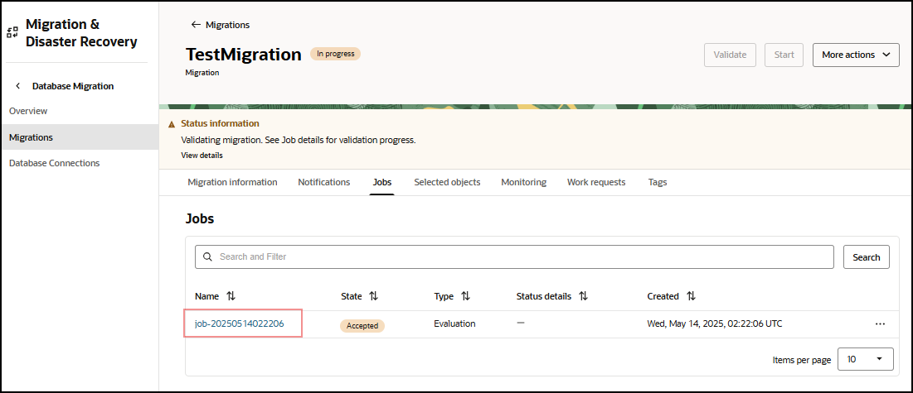

# Validate Migration

## Introduction

This lab walks you through the steps to validate a migration prior to running it. Before you can run a job with a migration resource in OCI Database Migration, the migration resource must be validated. The validation job will check that all associated database environments are correctly set up.

Estimated Lab Time: 20 minutes

### Objectives

In this lab, you will:
* Validate a migration
* Run a migration

### Prerequisites

* An Oracle Cloud Account - Please view this workshop's LiveLabs landing page to see which environments are supported
* This lab requires completion of the preceding labs in the Contents menu on the left.

*Note: If you have a **Free Trial** account when your Free Trial expires your account will be converted to an **Always Free** account. You will not be able to conduct Free Tier workshops unless the Always Free environment is available. **[Click here for the Free Tier FAQ page.](https://www.oracle.com/cloud/free/faq.html)***

## Task 1: Validate Migration

1. In the OCI Console Menu , go to **Migration > Migrations**

  

2. Select **TestMigration**

  

3. If Migration is still being created, wait until Lifecycle State is Active

4. Press **Validate** button

  

5. Click on **Jobs** in left-hand **Resources** list

  

6. Click on most recent Evaluation Job

7. Click on **Phases** in the left-hand **Resources** list

  

8. Phases will be shown, and status will be updated as phases are completed. It can take 2 minutes before the first phase is shown.
    

9. If a phase has failed, it will show with the status **Failed**. In this case, press **Download Log** to learn more about the reason for failure. Press **Abort** on a failed job to allow further jobs or deleting of the migration.

  

10. Once all phases show complete, move to the next step.

## Task 2: Run Migration

  1. In the OCI Console Menu , go to **Migration > Migrations**

    

  2. Select **TestMigration**

    

  3. Press **Start** to begin the Migration. Please note, if a dialog box appears, press **Start** in the dialog box  to begin the migration.

    

  4. Click on **Jobs** in the left-hand **Resources** list

  5. Click on the most recent Evaluation Job

  6. Click on **Phases** in the left-hand **Resources** list

  7. Job phases are updated as the migration progresses

  8. Wait till all the phases have been completed and your screen should look like the picture below.

  

  9. The migration runs the final cleanup phases and shows as **Succeeded** when finished

## Learn More

* [Managing Migration Jobs](https://docs.oracle.com/en-us/iaas/database-migration/doc/managing-migration-jobs.html)

## Acknowledgments
* **Author** - Alex Kotopoulis, Director, Product Management
* **Contributors** -  Kiana McDaniel, Hanna Rakhsha, Killian, Lynch, Solution Engineers, Austin Specialist Hub
* **Last Updated By/Date** - Killian Lynch, Kiana McDaniel, Hanna Rakhsha, Solution Engineers, July 2021
