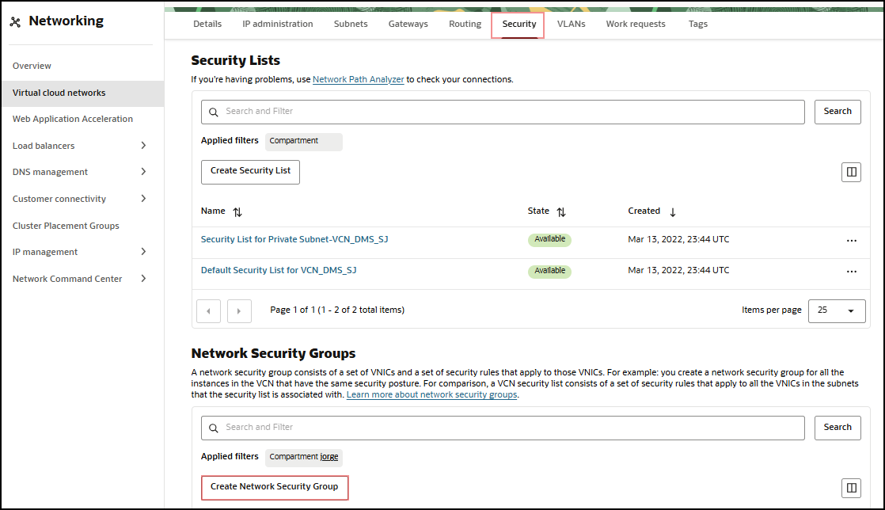
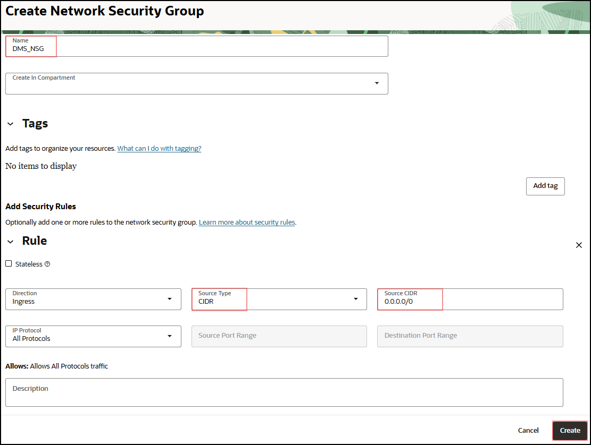
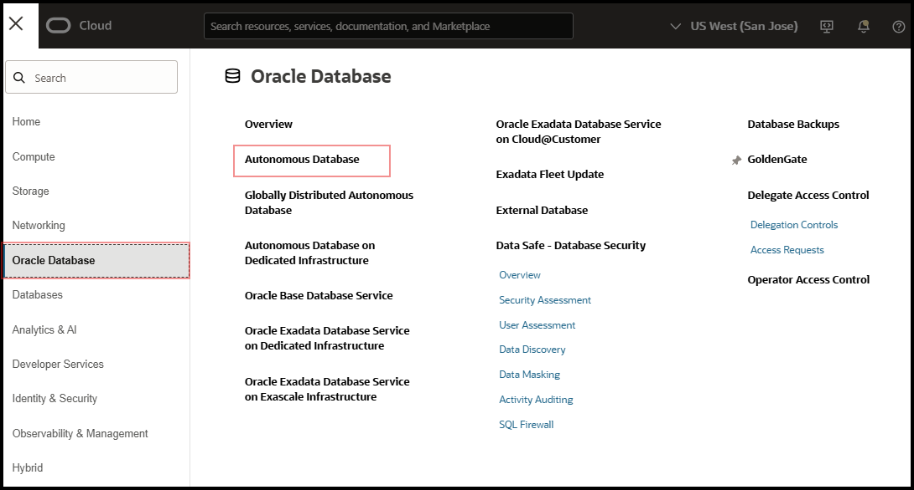
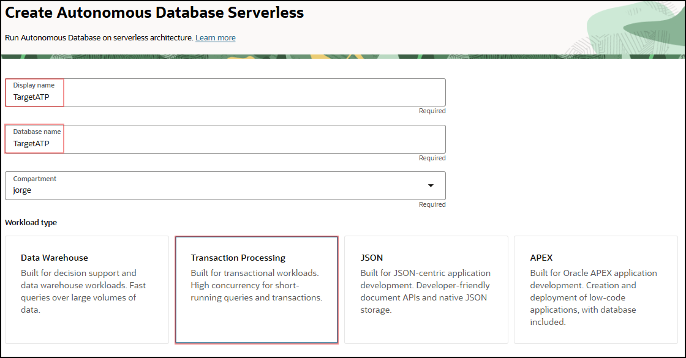
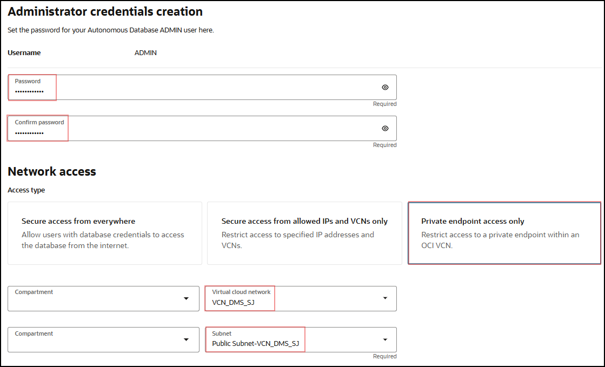

# Create Target Autonomous Database

## Introduction

This lab walks you through the steps of creating an Autonomous Transaction Processing Shared instance for your target database.

  

Estimated Lab Time: 10 minutes

### Objectives

In this lab, you will:
* Create a Network Security Group (NSG) for use
* Create an Autonomous Transaction Processing Database

### Prerequisites

* An Oracle Cloud Account - Please view this workshop's LiveLabs landing page to see which environments are supported
* This lab requires completion of the preceding labs in the Contents menu on the left.

*Note: If you have a **Free Trial** account, when your Free Trial expires your account will be converted to an **Always Free** account. You will not be able to conduct Free Tier workshops unless the Always Free environment is available. **[Click here for the Free Tier FAQ page.](https://www.oracle.com/cloud/free/faq.html)***

## Task 1: Add Network Security Group

The following tasks are *optional* if a target autonomous database is already present.

1. You first need to create a Network Security Group for use in a Private IP ADB instance. In the OCI Console Menu, go to **Networking > Virtual Cloud Networks** and pick your VCN.

2. In the left-hand Resources list, pick **Network Security Groups**.

3. Press **Create Network Security Group**.

  

4. Enter Name such as **DMS\_NSG** and press **Next**.

  

5. In the **Rule** box please enter the following entries, otherwise leave defaults:
    - Source Type: **CIDR**
    - Source CIDR: **0.0.0.0/0**

6. Press **Create**.

  

## Task 2: Create Target Autonomous Database

1. Now you can create the ADB instance. In the OCI Console Menu, go to **Oracle Database > Autonomous Transaction Processing**.

  

2. Pick a compartment on the left-hand side **Compartment** list.

3. Press **Create Autonomous Database**.

4. Enter the following values, otherwise leave defaults. You can adjust shapes and storage to your use case.
    - Display Name: **TargetATP**
    - Database Name: **TargetATP**
    - Create administrator credentials – Password: *password of your choice*
    - Access Type: **Secure Access from Everywhere**
    - Choose a license type: **License Included**

  

  

  

5. Close the dialog by pressing **Create Autonomous Database**.

You may now [proceed to the next lab](#next).

## Learn More

* [Overview of Autonomous Database](https://docs.oracle.com/en-us/iaas/Content/Database/Concepts/adboverview.htm)
* [Autonomous Transaction Processing](https://docs.oracle.com/en/cloud/paas/atp-cloud/index.html)

## Acknowledgements
* **Author** - Alex Kotopoulis, Director, Product Management
* **Contributors** -  Hanna Rakhsha, Kiana McDaniel, Solution Engineers, Killian Lynch, Austin Specialist Hub
* **Last Updated By/Date** - Hanna Rakhsha, Kiana McDaniel, Killian, Lynch Solution Engineers, July 2021
