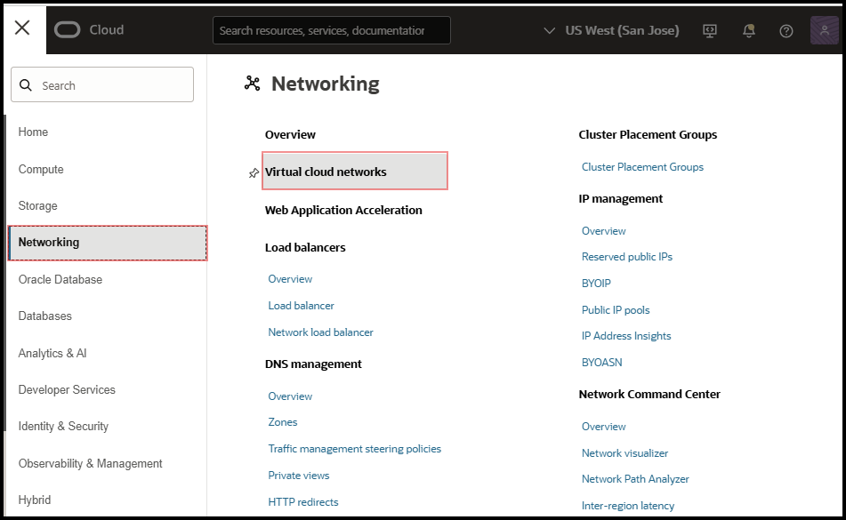
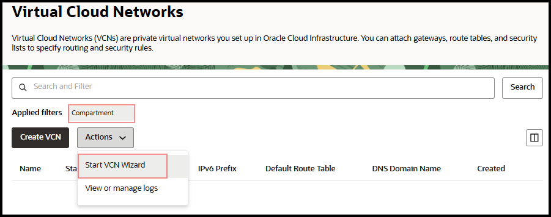
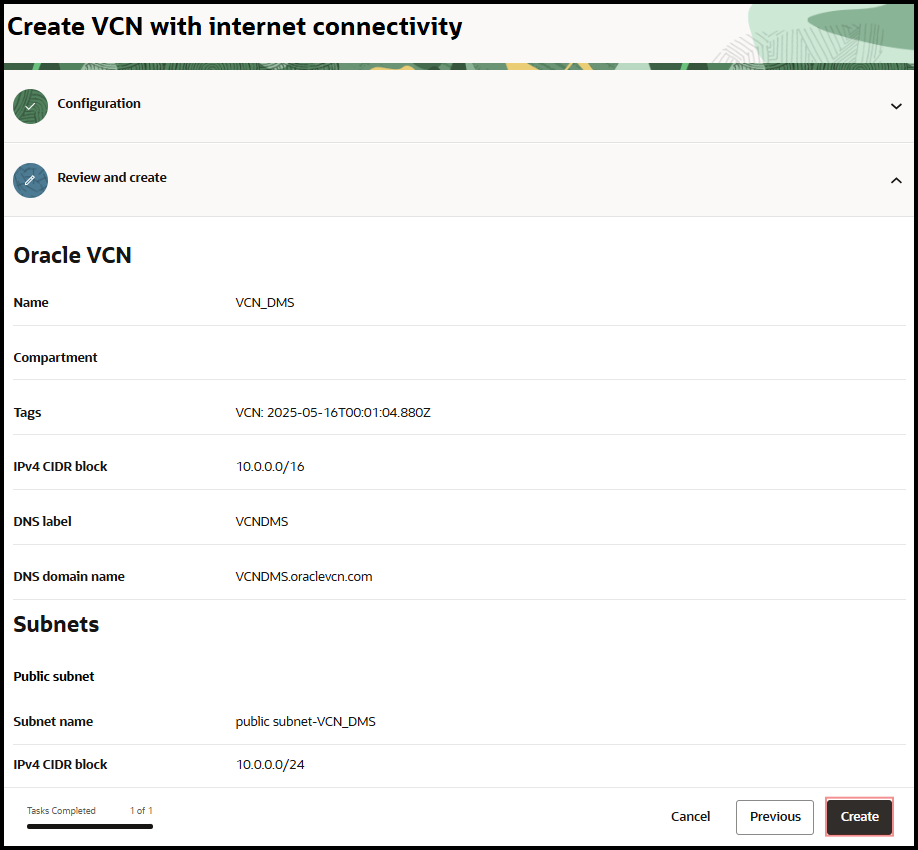
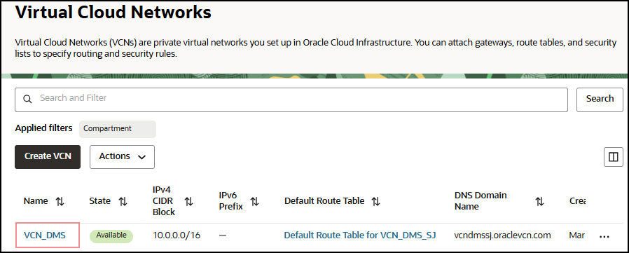
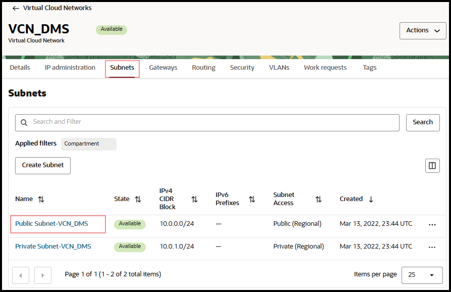
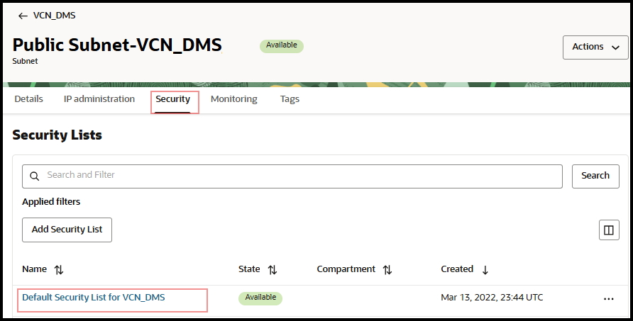
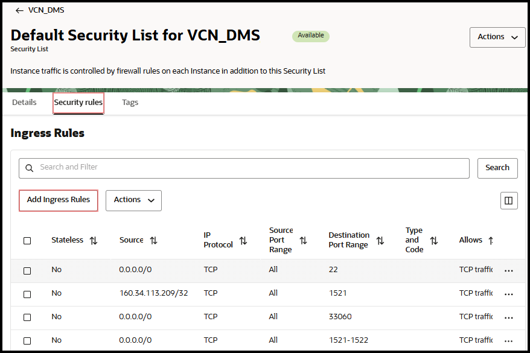
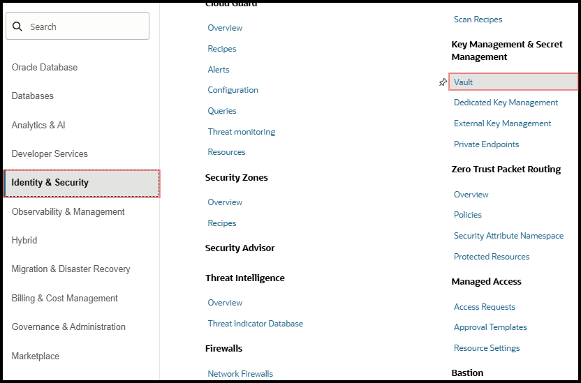
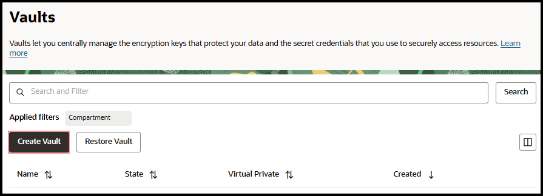
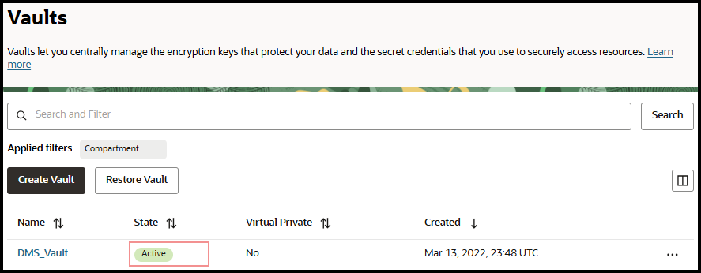

# Prepare Virtual Cloud Network

## Introduction

This lab walks you through the steps of creating your own virtual cloud network and updating the security list, allowing for future Database access. You will also walk through the steps of creating a vault, an encrypted key, and the steps to create an empty Object Storage Bucket for use in the migration. The OCI Object Storage service is an internet-scale, high-performance storage platform that offers reliable and cost-efficient data durability. In this lab, Object Storage is used as temporary storage between the source and target databases with Data Pump. For more information visit the *Learn More* tab at the bottom of the page.

For a full understanding of the network components and their relationships view the linked video, or visit the *Learn More* tab below.

  

Estimated Lab Time: 20-30 minutes

### Objectives

In this lab, you will:
* Create a virtual cloud network (VCN) with Internet Connectivity
* Update Security List for Virtual Cloud Network Subnet (VCN)
* Create a vault
* Create a key
* Provision an empty bucket

### Prerequisites

* An Oracle Cloud Account - Please view this workshop's LiveLabs landing page to see which environments are supported
* This lab requires completion of the preceding labs in the Contents menu on the left.

*Note: If you have a **Free Trial** account, when your Free Trial expires your account will be converted to an **Always Free** account. You will not be able to conduct Free Tier workshops unless the Always Free environment is available. **[Click here for the Free Tier FAQ page.](https://www.oracle.com/cloud/free/faq.html)***

## Task 1: Create Virtual Cloud Network

The following task is *optional* if a suitable VCN is already present.

1. In the OCI Console Menu, go to **Networking** > **Virtual Cloud Networks**.

  

2. Pick a compartment on the left-hand side **Compartment** list. You need to have the necessary permissions for the compartment.

  

3. Press **Start VCN Wizard** and pick **VCN with Internet Connectivity**.

  
  

4. Enter a **VCN Name**, such as VCN\_DMS\_LA. Leave CIDR block defaults, unless you need non-overlapping addresses for peering later. Press **Next**.

  

5. Review Summary and press **Create**.

  

## Task 2: Update Security List for Virtual Cloud Network Subnet

This task assumes default permissions in your public subnet. If you disabled or restricted your default permissions such as port 22 SSH access or restricted egress, please add default permissions as needed.

1. In the OCI Console Menu, go to **Networking** > **Virtual Cloud Networks** and pick your VCN.

  

2. In the **Subnets** list, pick **Public Subnet-VCN NAME**.

  

3. In the **Security Lists** list, pick **Default Security List for VCN NAME**.

  

4. In the **Ingress Rules** list press **Add Ingress Rules**.

  

5. Enter the following values, otherwise leave defaults:
    - Source CIDR: **0.0.0.0/0**
    - Destination Port Range: **443**
    - Description: **OGG HTTPS**
    - Close dialog by pressing **Add Ingress Rules**.

  

6. In the **Ingress Rules** list press **Add Ingress Rules**.

7. Enter the following values, otherwise leave defaults:
    - Source CIDR: **10.0.0.0/16**
    - Destination Port Range: **1521**
    - Description: **Oracle DB access for PEs**
    - Close dialog by pressing **Add Ingress Rules**.

  

You may now [proceed to the next lab](#next).

## Task 3: Create Vault

These steps walks you through the steps of creating a vault and encrypted key. For more information visit the *Learn More* tab at the bottom of the page.

The following task is *optional* if a Vault is already present.

1. In the OCI Console Menu, go to **Identity & Security** > **Vault**.

  

2. Pick a compartment on the left-hand side **Compartment** list.

3. Press **Create Vault**.

  

4. In the **Create Vault** dialog, enter a Name such as **DMS\_Vault**.

5. Close the dialog by pressing **Create Vault**.

  

6. Wait until the state of the new vault is **Active**. This takes about 5 minutes.

  

7. Click on the new vault and press **Create Key** in the **Master Encryption Keys** list.

  

8. In the **Create Key** dialog, enter a Name such as **DMS\_Key**.

9. Close the dialog by pressing **Create Key**.

  

## Task 4: Create Object Storage Bucket

Create an empty Object Storage bucket for use in the migration.

1. In the OCI Console Menu, go to **Storage > Object Storage & Archive Storage**

  

2. Press **Create Bucket**

  

3. On the page Create Bucket, fill in the following entries, otherwise leave defaults:

    - Bucket Name: **DMSStorage**

4. Press **Create**

  

You may now [proceed to the next lab](#next).

## Learn More

* [Networking Overview](https://docs.oracle.com/en-us/iaas/Content/Network/Concepts/overview.htm)
* [Overview of Vault](https://docs.oracle.com/en-us/iaas/Content/KeyManagement/Concepts/keyoverview.htm)
* [Overview of Object Storage](https://docs.oracle.com/en-us/iaas/Content/Object/Concepts/objectstorageoverview.htm)

## Acknowledgements
* **Author** - Alex Kotopoulis, Director, Product Management
* **Contributors** -  Hanna Rakhsha, Kiana McDaniel, Killian Lynch, Solution Engineers, Austin Specialist Hub
* **Last Updated By/Date** - Hanna Rakhsha, Kiana McDaniel, Killian, Lynch Solution Engineers, July 2021
