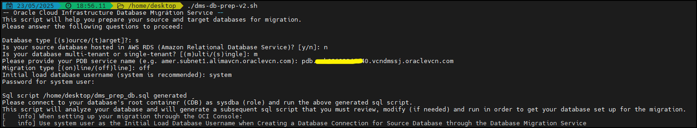
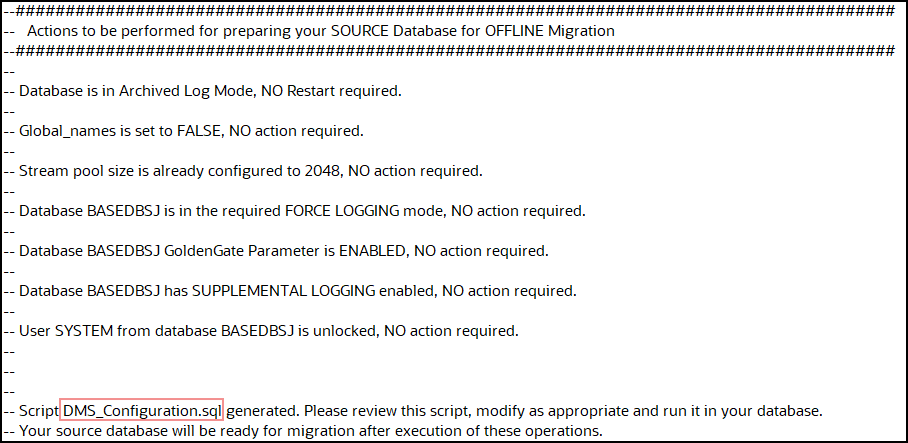
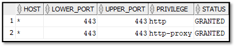

# Prepare source and target databases

## Introduction
In this lab, you will connect to your source database as system database administrator, create the required database users to complete the migration, bestow them with the necessary privileges, and create a sample table to track through the migration.

The purpose of creating a database user and loading it with sample data is to simulate the user and data we are looking to migrate in a practical application.

Estimated Time: 15 minutes

###  Objectives

In this lab, you will:
* Learn how to Connect to the Source Database and create the required migration users.

### Prerequisites
* This workshop section requires having set up a compute instance and the source database.


## Task 1: Connect to your database and configure the required parameters

**Disclaimer**: Throughout the workshop there will be locations where you are copying and pasting multiple lines of code at a time from the instructions into SQLPlus. However, the last line pasted will not commit until you manually press enter a second time. To avoid statement failure, please be cognizant of this and press enter twice when pasting.

1. The next step will prepare the source database. 

    1. Download the preparation script from this [link] (https://support.oracle.com/epmos/main/downloadattachmentprocessor?attachid=2953866.1%3ASETUP_SCRIPT&docType=REFERENCE&action=download)
    2. Locate the file and run it ./dms-db-prep-v2.sh
    3.  Follow the instructions:
    
	- Database type [(s)ource/(t)arget]?: **s**
    - Is your source database hosted in AWS RDS (Amazon Relational Database Service)? [y/n]: **n**
    - Is your database multi-tenant or single-tenant? [(m)ulti/(s)ingle]: **m**
    - Please provide your PDB service name (e.g. amer.subnet1.alimavcn.oraclevcn.com): pdb.aaayyyyzz.vcndmssj.oraclevcn.com
    - Password for system user:
    - Migration type [(on)line/(off)line]: **off**
    - Initial load database username (system is recommended): system
    - Password for system user:

    

2. The next step is to locate the output file dms\_prep_db.sql generated by the script, you should see the path on the screen. Connect to your database’s root container (CDB) as        sysdba (role) and run the above generated sql script.

    This script will analyze your database and will generate a subsequent sql script (DMS_Configuration.sql) that you must review, modify (if needed) and run in order to get your database set up for the migration.

    

3. The next steps add a user HR01 with a sample table and data. If your database already contains data for migration, you can skip these steps.
   Create the script file create_hr01.sql with the following content:
    ```
    <copy>
    DROP USER HR01 CASCADE;
    CREATE USER HR01 IDENTIFIED BY HR##hr01123;
    GRANT CONNECT,RESOURCE,CREATE TABLE,CREATE SEQUENCE to HR01;
    GRANT CREATE ANY PROCEDURE to HR01;
    ALTER USER HR01 quota unlimited on users;
    CREATE TABLE HR01.EMPL (col1 number, col2 varchar2(9), col3 varchar2(100), col4 timestamp);
    ALTER TABLE HR01.EMPL ADD CONSTRAINT EMPL_i1 PRIMARY KEY (col1,col2);

    </copy>
    ```
    
    Create the script file data_hr01.sql with the following content:
    ```
    <copy>
    SET ECHO OFF;
    SET HEADING OFF;
    SET FEEDBACK OFF;
    SET SERVEROUTPUT ON;
    DECLARE
    SCN     HR01.EMPL.COL1%TYPE;
    RND1    HR01.EMPL.COL2%TYPE;
    RND2    HR01.EMPL.COL3%TYPE;
    RND3    HR01.EMPL.COL4%TYPE;
    ROWSNUM NUMBER;
    DBNAME VARCHAR2(60);
    i       INTEGER;
    EGIN
    i := 0;
    LOOP
    SELECT COUNT(*) INTO ROWSNUM FROM HR01.EMPL;
    SELECT DBMS_RANDOM.STRING('P', 9) INTO RND1 FROM DUAL;
    SELECT DBMS_RANDOM.STRING('P', 10) INTO RND2 FROM DUAL;
    SELECT TO_DATE(TRUNC (DBMS_RANDOM.VALUE (2451545, 5373484)), 'J') INTO RND3 FROM DUAL;
    INSERT INTO HR01.EMPL(col1, col2, col3, col4) VALUES (ROWSNUM, RND1, RND2, RND3);
    COMMIT;
    DBMS_OUTPUT.PUT_LINE('Number of rows = ' || ROWSNUM);
    IF ( i >= 1000 ) THEN
    EXIT;
    END IF;
    i := i + 1;
    END LOOP;
    END;
    /

    </copy>
    ```

    Connect to your database, enter the following commands:
    ```
    <copy>
    sqlplus sys/ <db password>@ <db private ip>/ <db pdb service>  as sysdba 
    </copy>
    ```

    In SQL Plus enter the following commands:
    ```
    <copy>
    SQL> @create_hr01.sql
    DROP USER HR01 CASCADE  (You can ignore this error)
          
    ERROR at line 1:
    ORA-01918: user 'HR01' does not exist

    SQL> @data_hr01.sql
    Number of rows = 0
    […]
    Number of rows = 1000
    SQL> quit

    </copy>
    ```
    Your source DB now has a user HR01 with a table EMPL that has 1000 rows.


## Task 2: Prepare SSL Certificates and Grant ACL Privileges

For your source database connectivity, you must perform the following steps:

1.  Create a new directory: 
```
    <copy>    
    mkdir /u01/app/oracle/wallet

    </copy>
```
2. Download a pre created SSL wallet using the following command:
```
    <copy>    
    curl -o walletSSL.zip https://objectstorage.us-phoenix-1.oraclecloud.com/p/YYkalHlLbbrfOAMIor-Mzl1qcFxaAZOvrYABKzRQYPErFQdzJrVjma1cUg4SIXEu/n/axsdric7bk0y/b/SSL-Wallet-For-No-SSH-Migrations-Setup/o/walletSSL.zip

    </copy>
```
3. Unzip the files:
```
    <copy>    
    unzip walletSSL.zip
    </copy>
```
4. Make sure these files are present in your desired directory path:

    1. 2022 ewallet.p12.lck
    2. cwallet.sso.lck
    3. ewallet.p12
    4. cwallet.sso
    5. addedCertificates.txt


5. Save this path location, you will need it during the migration creation, once there populate the SSL Wallet Path with it:

    i.e: /u01/app/oracle/wallet

6. The user performing the export or import requires the necessary network ACL to be granted to access the network from the source and target database host. For this guide, run the following commands as SYS if the export or import user is SYSTEM. Since your database is multitenant, the following actions need to be performed in CDB$ROOT. Replace clouduser and sslwalletdir accordingly:

```
    <copy>    
    define clouduser='system';/*user performing export at source or import at target*/
define sslwalletdir='/u01/app/oracle/dumpdir/wallet'; /* OCI wallet path*/
BEGIN
    dbms_network_acl_admin.append_host_ace(host => '*', lower_port => 443, upper_port => 443, ace => xs$ace_type(privilege_list => xs$name_list(
    'http', 'http_proxy'), principal_name => upper('&clouduser'), principal_type => xs_acl.ptype_db));

    dbms_network_acl_admin.append_wallet_ace(wallet_path => 'file:&sslwalletdir', ace => xs$ace_type(privilege_list => xs$name_list('use_client_certificates',
    'use_passwords'), principal_name => upper('&clouduser'), principal_type => xs_acl.ptype_db));

END;
    </copy>
```
7. Once the connect privilege is granted, connect as the relevant user such as, SYSTEM, and verify if the privilege is granted using the following query:
```
    <copy>    
    SELECT host, lower_port, upper_port, privilege, status 
    FROM user_network_acl_privileges;

    </copy>
```

You should see a similar output to the following:


  


You may now [proceed to the next lab](#next).


## Acknowledgments
* **Author** - Zachary Talke, Solutions Engineer, NA Tech Solution Engineering
* **Author** - Ameet Kumar Nihalani, Senior Principal Support Engineer, Oracle Cloud Database Migration
* **Contributors** - LiveLabs Team, ZDM Development Team
* **Last Updated By/Date** - Jorge Martinez, Product Management, May 2025
