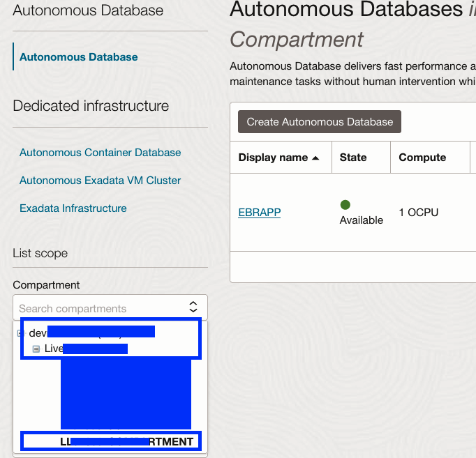
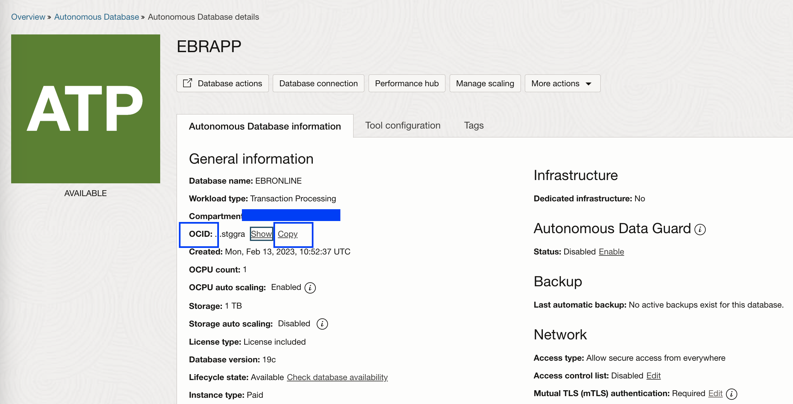
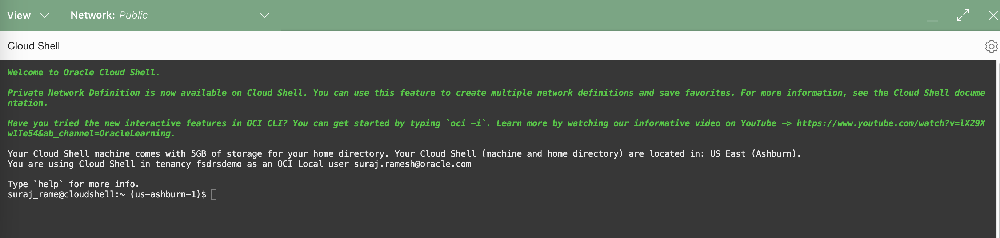

# Download the Autonomous Database Wallet and Lab Files

## Introduction

Download the Autonomous database wallet and the lab files required for this lab.

Estimated Time: 10 minutes

Watch the video below for a quick walk-through of the lab.
[Download the Autonomous Database Wallet and Lab Files](videohub:1_mfql3sf3)

### Objectives

In this lab, you will

- Download the Autonomous Database wallet
- Download the lab files

### Prerequisites

The LiveLabs Sandbox environment comes with a pre-created Autonomous Database (ATP).

## Task 1: Download the Autonomous Database wallet

1. Login into OCI Console with your provided Credentials.

2. Click the **Navigation Menu** in the upper left, navigate to **Oracle Database**, and select **Autonomous Transaction Processing**.

    

3. Select the compartment you were assigned. Expand the **root** compartment and then the **Livelabs** compartment. Select the **Compartment** assigned to you.You can verify the compartment assigned to you from the credentials page. Example: LL57859-COMPARTMENT. Make sure to select the right compartment assigned to you, if not you will not be able to see the ATP database.

    

4.  You should be able to see an Autonomous Database, similar to the one below. Make sure to change to the compartment which was assigned to you in case if you don't see the ATP database. Now gather the **OCID (Oracle Cloud Identifier)** of the Autonomous Database.

    

5. Click on the database, which should display a name like "EBRAPP". In the Autonomous Database Information tab, copy the OCID of the ATP database and keep it safe. That is required for downloading the wallet in the next step.

    

6. Launch Cloud Shell

    

    Within a few seconds, you will have a cloud shell prompt.You will see a message "Would you like to run a tutorial to learn more about all the features included in Cloud Shell?", Type **N**

    

    For better viewing, you can maximize the Cloud Shell.

    

7. Download the Autonomous Database wallet

   Make sure to modify the database OCID in the below command. You should replace the OCID after --autonomous-database-id with the value you captured earlier.

    ````text
    <copy>oci db autonomous-database generate-wallet --generate-type ALL --file ebronline.zip --password Ebronline@123 --autonomous-database-id ocid1.autonomousdatabase.oc1.iad.xxxxxxxxxxxxxxxxxxxxxx</copy>
    ```

    You should be able to see the wallet file which was downloaded with the name `ebronline.zip`. Verify using the list command `ls -ltr` as provided in the screenshot.

    


## Task 2: Download Lab files

1. Using the same cloud shell console, download the required lab files

    ```text
    <copy>wget https://c4u04.objectstorage.us-ashburn-1.oci.customer-oci.com/p/EcTjWk2IuZPZeNnD_fYMcgUhdNDIDA6rt9gaFj_WZMiL7VvxPBNMY60837hu5hga/n/c4u04/b/livelabsfiles/o/data-management-library-files/ebronline.zip</copy>
    ```

    Verify the download of the file `ebronline.zip` using the list command ls -ltr as provided in the screenshot.

   

2. Unzip the ebronline file

    ```text
    <copy>unzip ebronline.zip</copy>
    ```

    

    It should have two folders **initial_setup** and **changes**, with a bunch of SQL and XML files. Verify using the list command ls -ltr as provided in the screenshot.

    

You have successfully downloaded the ADB wallet and lab files. [Proceed to the next lab](#next) to setup the HR schema.

## Acknowledgements

- Authors - Ludovico Caldara,Senior Principal Product Manager,Oracle MAA PM Team and Suraj Ramesh,Principal Product Manager,Oracle MAA PM Team
- Last Updated By/Date -Suraj Ramesh, November 2024
