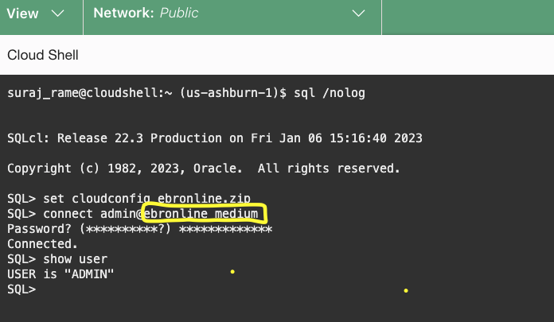

# Download lab files and Connect to ADB 

### Objectives

- Download ATP Wallet
- Download Lab files 
- Test the connection 


### Prerequisites

This lab assumes you have:

- Performed the previous lab on provisioning an Oracle Autonomous Database or you already have an existing Autonomous Database

## Task 1: Download ATP Wallet 

1. Login into OCI Console with your provided Credentials. 

2. Click the **Navigation Menu** in the upper left, navigate to **Compute**, and select **Instances**.

   

3. Select the compartment you were assigned. Expand the **root** compartment and then the **Livelabs** compartment. Select the compartment assigned to you.
   

4. Launch cloud shell. You should be able to open your cloud shell

   
    
   Within few seconds, you will have cloud shell prompt

   

5. As next step, need to gather the OCID( Oracle Cloud Identifier) of the ATP database.Leave the existing Cloud Shell browser tab and use duplicate tab to open a new tab in browser.

   From the Hamburger menu, select Oracle Database, then Autonomous Transaction Processing.

  

  You should be able to see an ATP database, similar to below. Make sure to change to the compartment which was assigned to you.

  

6. Click the ATP database, which should have display like "EBRAPP" ( Whichever DB display name used during provisioning) and in the Autonomous Database Information tab, copy the OCID of the ATP database and keep it safe. This is required for downloading the wallet in the next step.

  

7. Download the ATP Wallet for this lab using the Cloud Shell. Switch to the first tab of your browser, where Cloud Shell was initially opened. In case if the Cloud Shell got disconnected, reconnect it again.

  You can maximize the Cloud Shell view and restore it as your requirements. For better viewing, you can use maximize option.

  

8. Make sure to modify the ATP database OCID for your database in the below command.You should replace the OCID after --autonomous-database-id with your values which was captured in Step 6

   ````text
   <copy>oci db autonomous-database generate-wallet --generate-type ALL --file ebronline.zip --password Ebronline@123 --autonomous-database-id ocid1.autonomousdatabase.oc1.iad.xxxxxxxxxxxxxxxxxxxxxx</copy>
   ```

9. Copy the command and execute in Cloud Shell prompt.You should be able to see the Wallet file which was downloaded. Verify that using the list command ls -ltr as provided in the screenshot.

   


## Task 2: Download Lab files

1. Using the same cloud shell console, download the Lab required files

   ```text
   <copy>wget bit.ly</copy>
   ```
   Copy the command and execute in Cloud Shell prompt.You should be able to see the ebrlabs.zip got downloaded. Verify that using the list command ls -ltr as provided in the screenshot.

   

2. Unzip the ebrlab.zip file 

   ```text
   <copy>unzip ebrlab.zip</copy>
   ```
   
   Copy the command and execute in Cloud Shell prompt.You should be able to see the ebrlabs.zip has been unzipped.

   

   It should have two folders **initial_setup** and **changes** with bunch of sql and xml files. Verify that using the list command ls -ltr as provided in the screenshot.

   

## Task 3: Connect to ATP Database using SQLCl

   SQLcl(SQL Developer command line) is installed in Cloud Shell by default

1. Connect to admin user to ATP database 

2. We already downloaded the wallet in the Cloud shell home folder.

3. From the Cloud shell, connect to SQLcl 

   ```text
   <copy>sql /nolog </copy>
   ```

4. After getting the SQL prompt, set the cloudconfig details with the wallet file

   ```text
   <copy>set cloudconfig ebronline.zip</copy>
   ```

5. Connect as admin user and enter admin password when prompted. This is the ADMIN password while creating the ATP database. If you are using livelabs tenancy, you should refer your login page for getting those credentials. 

   ```text
   <copy>connect admin@ebronline_medium</copy>
   ```

   

6. Verify the user is connected as admin

   ```text
   <copy>show user</copy>
   ```

 

## **Acknowledgements**

- Author - Suraj Ramesh and Ludovico Caldara
- Last Updated By/Date -Suraj Ramesh, Jan 2023

