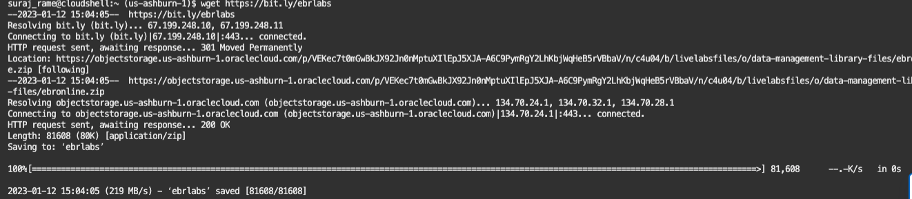

# Download the Autonomous Database Wallet and Lab Files

## Introduction

Download the Autonomous database wallet and the lab files required for this lab.

Estimated Time: 10 minutes

### Objectives

- Download the Autonomous Database wallet
- Download the lab files

### Prerequisites

This lab assumes you have performed the previous lab on provisioning an Oracle Autonomous Database or you already have an existing Autonomous Database.The LiveLabs Sandbox environment comes with a pre-created Autonomous Database (ATP).


## Task 1: Download the Autonomous Database wallet

1. Login into OCI Console with your provided Credentials.

2. Click the **Navigation Menu** in the upper left, navigate to **Oracle Database**, and select **Autonomous Transaction Processing**.

    

3. Select the compartment you were assigned. Expand the **root** compartment and then the **Livelabs** compartment. Select the compartment assigned to you.

    

4. Now gather the OCID (Oracle Cloud Identifier) of the Autonomous Database.

   You should be able to see an Autonomous Database, similar to the one below. Make sure to change to the compartment which was assigned to you.

    

5. Click on the database, which should display a name like "EBRAPP". In the Autonomous Database Information tab, copy the OCID of the ATP database and keep it safe. That is required for downloading the wallet in the next step.

    

6. Launch Cloud Shell

    

    Within a few seconds, you will have a cloud shell prompt.

    

    For better viewing, you can maximize the Cloud Shell.

    

7. Download the Autonomous Database wallet

   Make sure to modify the database OCID in the below command. You should replace the OCID after --autonomous-database-id with the value you captured earlier.

    ````text
    <copy>oci db autonomous-database generate-wallet --generate-type ALL --file ebronline.zip --password Ebronline@123 --autonomous-database-id ocid1.autonomousdatabase.oc1.iad.xxxxxxxxxxxxxxxxxxxxxx</copy>
    ```

    You should be able to see the wallet file which was downloaded with the name `ebronline.zip`. Verify using the list command `ls -ltr` as provided in the screenshot.

    


## Task 2: Download Lab files

1. Using the same cloud shell console, download the required lab files

    ```text
    <copy>wget http://bit.ly/ebrlabs</copy>
    ```
    Verify the download of the file `ebrlabs` using the list command ls -ltr as provided in the screenshot.

   

2. Unzip the ebrlabs file

    ```text
    <copy>unzip ebrlabs</copy>
    ```

    

    It should have two folders **initial_setup** and **changes**, with a bunch of SQL and XML files. Verify using the list command ls -ltr as provided in the screenshot.

    

You have successfully downloaded the ADB wallet and lab files. [Proceed to the next lab](#next) to setup the HR schema.

## Acknowledgements

- Author - Ludovico Caldara and Suraj Ramesh
- Last Updated By/Date -Suraj Ramesh, Feb 2023
