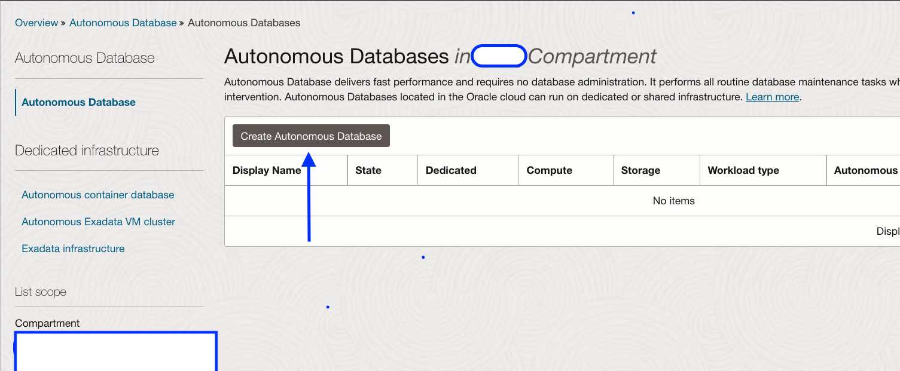
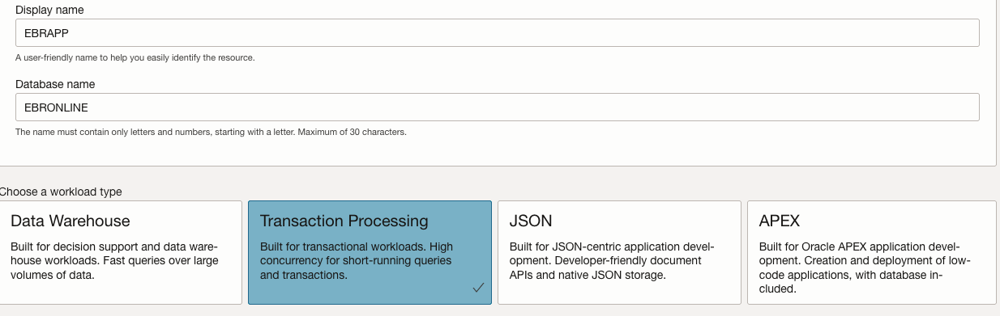
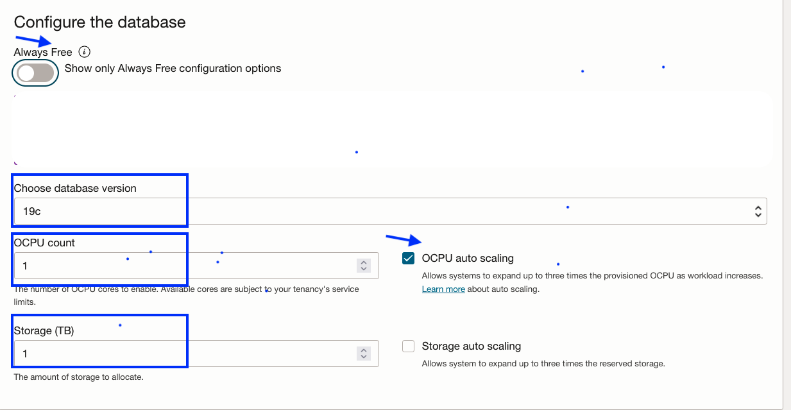
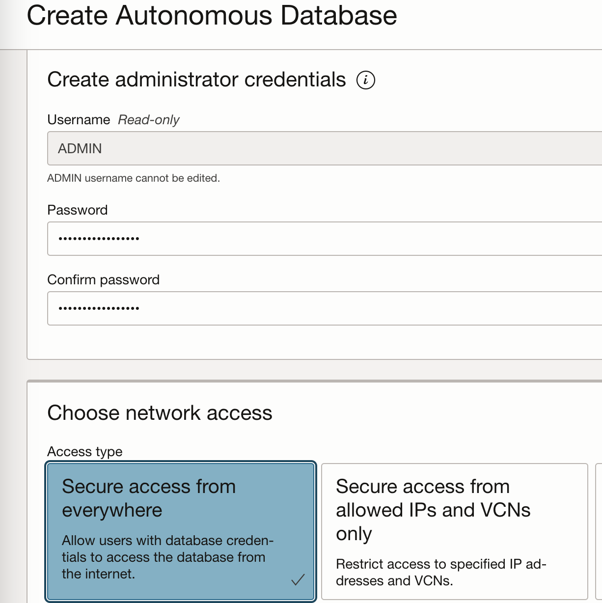
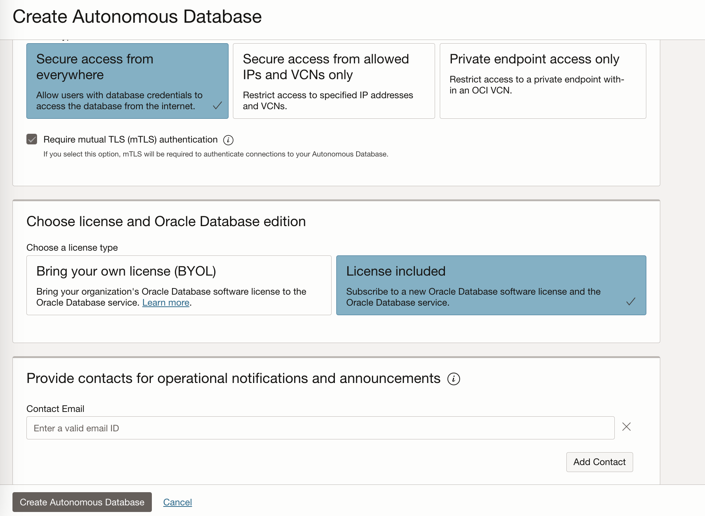
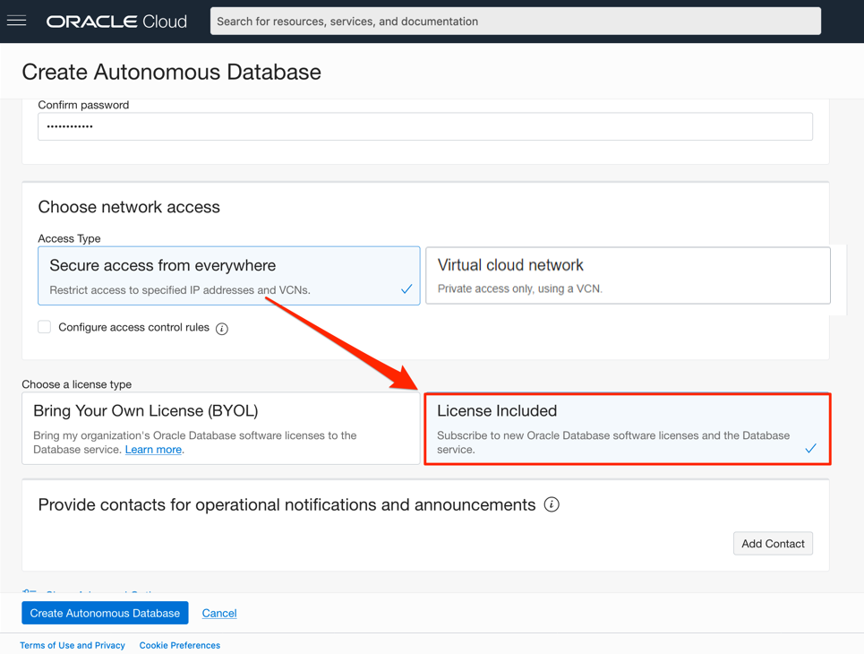
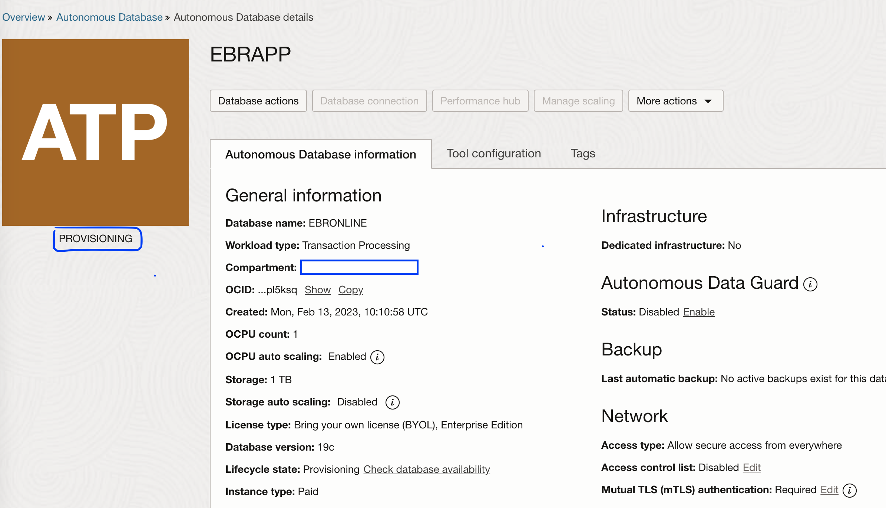

# Provision an Oracle Autonomous Database

## Introduction 

This lab walks you through the steps to get started using the Oracle Autonomous Database Autonomous Transaction Processing [ATP] on Oracle Cloud. In this lab, you will provision a new ATP database.

Estimated lab time: 10 minutes

Watch the video below for a quick walk-through of the lab.
[Provision an ADB Instance](videohub:1_22f82n6x)

>**Note:** Video has the steps for ADW, the steps are the same for creating an ATP database.

### Objectives

In this lab, you will:

- Learn how to provision a new Autonomous Database

### Prerequisites

- OCI account with IAM policies to provision ATP database and have access to Cloud Shell. If not, please setup the right policies before proceeding further

## Task 1: Choose ATP from the services menu

1. Log in to the Oracle Cloud.

2. Click the navigation menu in the upper left to show top level navigation choices- Oracle Database- Autonomous Transaction Processing

    

## Task 2: Create the ATP database

1. Click **Create Autonomous Database** to start the instance creation process and make sure to select the right compartment.

    

2. This brings up the **Create Autonomous Database** screen where you will specify the configuration of the instance.

3. Specify basic information for the autonomous database:

    - **Compartment** - Choose the compartment assigned to you.
    - **Display Name** - EBRAPP
    - **Database Name** - EBRONLINE

4. Choose a workload type. Select the workload type as

    - **Transaction Processing**

    

5. Choose a deployment type. Select the deployment type for your database from the choices:

    - **Shared Infrastructure** - For this lab, choose **Shared Infrastructure** as the deployment type.

    

6. Configure the database:

    - **Always Free** - If your Cloud Account is an Always Free account, or your Cloud Account is a paid account but want to avoid any charges, you can select this option to create an *Always Free autonomous database*. An always free database comes with 1 CPU and 20 GB of storage. For this lab, we recommend you leave Always Free unchecked.
    - **Choose database version** - Select a database version from the available versions.
    - **OCPU count** - Number of CPUs for your service. For this lab, specify **1 CPU**. If you choose an Always Free database, it comes with 1 CPU.
    - **Storage (TB)** - Select your storage capacity in terabytes. For this lab, specify **1 TB** of storage. Or, if you choose an Always Free database, it comes with 20 GB of storage.
    - **Auto Scaling** - For this lab, keep auto scaling enabled, to enable the system to automatically use up to three times more CPU and IO resources to meet workload demand.
    - **New Database Preview** - If a checkbox is available to preview a new database version, do NOT select it.

    > **Note:** You cannot scale up/down an Always Free autonomous database.

    

7. Create administrator credentials:

    - **Password and Confirm Password** - Specify the password for ADMIN user of the service instance. The password must meet the following requirements:
    - The password must be between 12 and 30 characters long and must include at least one uppercase letter, one lowercase letter, and one numeric character.
    - The password cannot contain the username.
    - The password cannot contain the double quote (") character.
    - The password must be different from the last 4 passwords used.
    - The password must not be the same password that you set less than 24 hours ago.
    - Re-enter the password to confirm it. Make a note of this password.

    

    ***Store your ADMIN password safely and it will be required in the upcoming labs***

8. Choose network access:
    - For this lab, accept the default, **Secure access from everywhere**.
    - If you want to allow traffic only from the IP addresses and VCNs you specify - where access to the database from all public IPs or VCNs is blocked, select **Secure access from allowed IPs and VCNs only** in the Choose network access area.
    - If you want to restrict access to a private endpoint within an OCI VCN, select **Private endpoint access only** in the Choose network access area.
    - If the **Require mutual TLS (mTLS) authentication** option is selected, mTLS will be required to authenticate connections to your Autonomous Database. TLS connections allow you to connect to your Autonomous Database without a wallet, if you use a JDBC thin driver with JDK8 or above. See the [documentation for network options](https://docs.oracle.com/en/cloud/paas/autonomous-database/adbsa/support-tls-mtls-authentication.html#GUID-3F3F1FA4-DD7D-4211-A1D3-A74ED35C0AF5) for options to allow TLS, or to require only mutual TLS (mTLS) authentication.

    

<if type="livelabs">
9. Choose a license type. For this lab, choose __Bring Your Own License (BYOL)__. The two license types are:
</if>
<if type="freetier">
9. Choose a license type. For this lab, choose __License Included__. The two license types are:
</if>

    - __Bring Your Own License (BYOL)__ - Select this type when your organization has existing database licenses.
    - __License Included__ - Select this type when you want to subscribe to new database software licenses and the database cloud service.

<if type="livelabs">
    
</if>
<if type="freetier">
    
</if>

10. For this lab, do not provide a contact email address. The **Contact Email** field allows you to list contacts to receive operational notices and announcements as well as unplanned maintenance notifications.

11. Click **Create Autonomous Database**.

12. Your instance will begin provisioning. In a few minutes, the state will turn from Provisioning to Available. At this point, your ATP database is ready to use! Have a look at your instance's details here including its name, database version, OCPU count, and storage size.

    

You have successfully created ATP database [proceed to the next lab](#next) for downloading ATP wallet and lab files.

## Learn more

Go to [the documentation](https://docs.oracle.com/en/cloud/paas/autonomous-data-warehouse-cloud/user/autonomous-workflow.html#GUID-5780368D-6D40-475C-8DEB-DBA14BA675C3) on the typical workflow for using Oracle Autonomous Database on Shared Exadata Infrastructure .

## Acknowledgements

- Authors - Ludovico Caldara,Senior Principal Product Manager,Oracle MAA PM Team and Suraj Ramesh,Principal Product Manager,Oracle MAA PM Team
- Last Updated By/Date - Suraj Ramesh, Feb 2023
