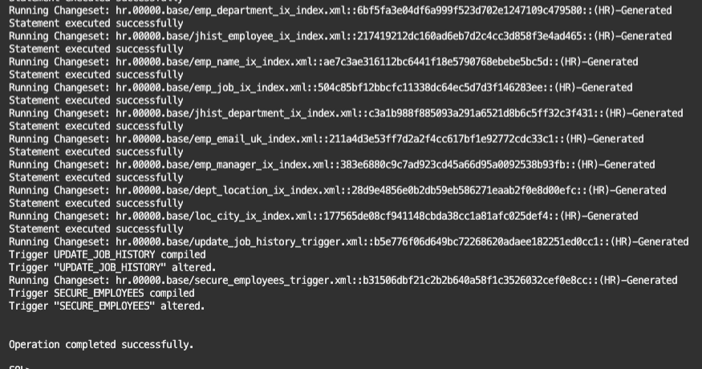

# Create the directory structure for Liquibase and sync the metadata

## Introduction

In this lab, you will learn 

- How to modify the directory structure for the change logs

Estimated lab time: 10 minutes

Watch the video below for a quick walk-through of the lab.
[Create the directory structure for Liquibase and sync the metadata](videohub:1_tral6svn)

### Objectives

In this lab, you will learn 

- How to modify the directory structure for the change logs which we generated in previous lab and sync metadata

## Task 1: Modify the directory structure 

As part of release management best practices,we recommend to maintain separate directories for reach releases and have clean directory structure.

1. For the base and subsequent changelogs, you might want to use a neater directory organization. Navigate to the `changes` directory and see the directory structure. 

    

    Having each changelog contained in a separate directory facilitates the development when schemas start getting bigger and the number of changesets is important.

    For this reason, we want to convert the file hr.00000.base/controller.xml to hr.00000.base.xml

    The conversion can be achieved with the below steps:

    In the Cloud Shell prompt, navigate to the `changes` directory, then execute the following `sed`:

    ```text
    <copy>cd ~/changes</copy>
    <copy>sed -e "s/file=\"/file=\"hr.00000.base\//" hr.00000.base/controller.xml > hr.00000.base.xml</copy>
    ```

    


2. This command will create a new XML file *hr.00000.base.xml* with the hr.00000.base folder structure. Verify the folder structure details by opening the file `hr.00000.base.xml`

    

    The file `main.xml` (in the **changes** directory) includes all the changelogs, so in a single update, all the modifications from the initial version to the last changelog will be checked and eventually applied.

    

    In the example, there are already two placeholders for the next schema/code releases.

## Task 2: Apply the initial changelog 

1. Run `lb update` to apply the changelog on the existing schema.We will do it to synchronize the definition with the Liquibase metadata.

    Login to the HR schema and verify that the current working directory is your home directory.

    

    The folder will be different in your environment.

    ```text
    <copy>cd ~</copy>
    <copy>sql /nolog</copy>
    ```
    **Replace ebronline_medium with your connection string. You must have noted down your connect strings in Lab 2**
    ```text
    <copy>set cloudconfig ebronline.zip</copy>
    <copy>connect hr/Welcome#Welcome#123@ebronline_medium</copy>
    <copy>show user</copy>
    pwd
    ```

    

    ```text
    <copy>cd changes</copy>
    <copy>lb status -changelog-file main.xml</copy>
    ```

    

2. Now run the `lb update` command:

    ```text
    <copy>lb update -changelog-file main.xml</copy>
    ```

    

    


3. `lb status` now shows everything up to date. A subsequent `lb update` will not change anything.

    ```text
    <copy>lb status -changelog-file main.xml</copy>
    ```

    ```text
    <copy>lb update -changelog-file main.xml</copy>
    ```

    


You have successfully reorganized the changelog directory structure and synchronized the Liquibase metadata. [Proceed to the next lab](#next) to review and deploy the scripts for the new edition.

## Acknowledgements

- Authors - Ludovico Caldara and Suraj Ramesh
- Last Updated By/Date - Suraj Ramesh, August 2023
