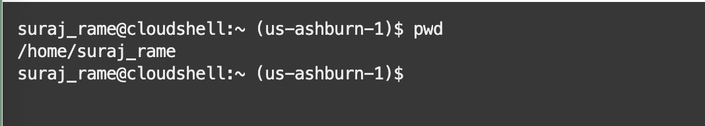
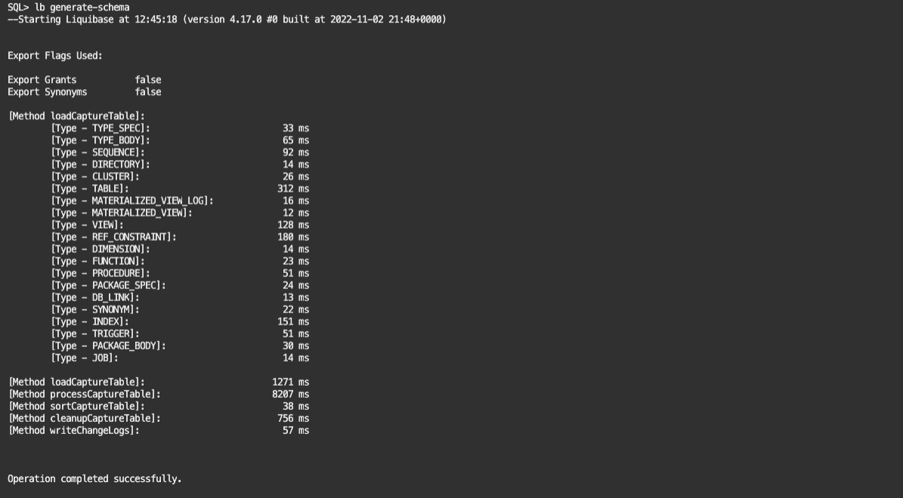
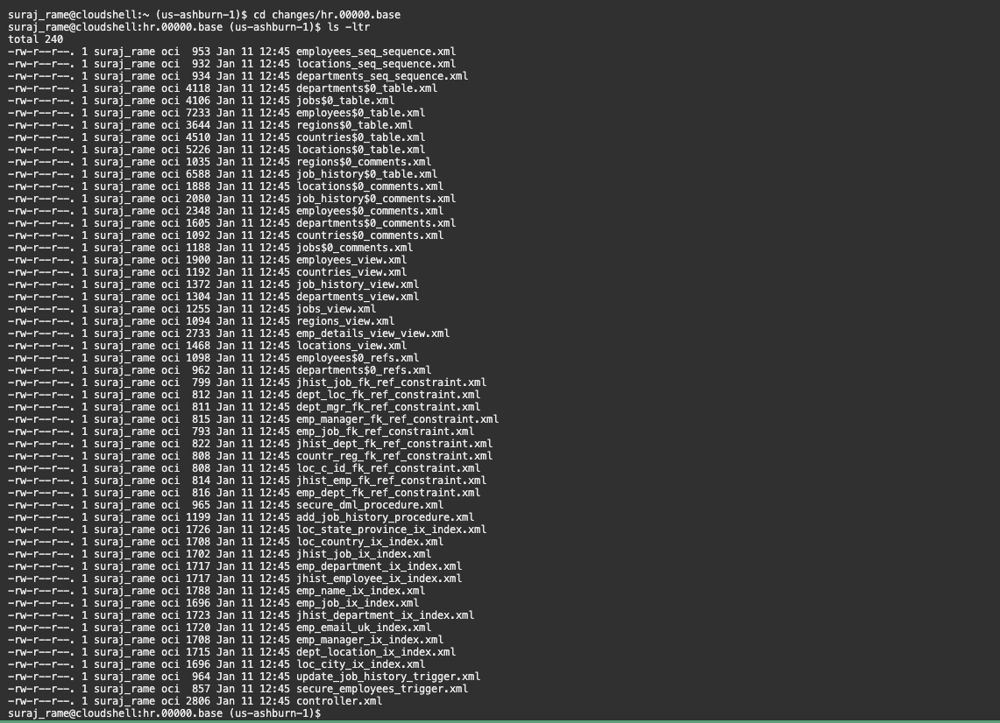
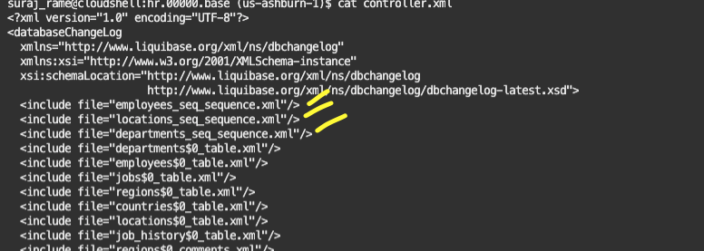

# Use Liquibase to generate the base schema

## Introduction

In this lab, you will learn how to use Liquibase to generate the base changelog of the HR Schema.

Liquibase is an open-source database-independent library for tracking, managing and applying database schema changes.

In SQLcl, you can now execute commands to generate a changelog for a single object or for a full schema (changeset and changelogs). You can process these objects manually using SQLcl or through any of the traditional Liquibase interfaces.

With the Liquibase feature in SQLcl, you can:

- Generate and execute single object changelogs
- Generate and execute schema changesets with object dependencies
- Automatically sort a changeset during creation based on object dependencies
- Record all SQL statements for changeset or changelog execution, as it is generated
- Provide full rollback support for changesets and changelogs automatically

Estimated lab time: 10 minutes

### Objectives

In this lab, you will learn how to use Liquibase to generate the base changelog of the HR Schema.

## Task 1: Run lb generate-schema to generate the base changelog

1. The command `lb generate-schema` creates the base Liquibase changelog. 

    

    The folder will be different in your environment.Verify that the current working directory is your home directory.

    ```text
    <copy>cd ~</copy>
    <copy>sql /nolog</copy>
    ```

2. Connect to the HR schema (using the correct connection string):

    ```text
    <copy>set cloudconfig ebronline.zip</copy>
    <copy>connect hr/Welcome#Welcome#123@ebronline_medium</copy>
    <copy>show user</copy>
    <copy>pwd</copy>
    ```

    

3. Make sure to run the lb generate-schema command from the directory ***changes/hr.00000.base***.

   Change the working directory to ***changes/hr.00000.base***, remove any existing files and run lb generate-schema

    ```text
    <copy>cd changes/hr.00000.base</copy>
    <copy>! rm -rf *.*</copy>
    <copy>lb generate-schema</copy>
    ```

    

    This initial changelog is useful if you plan to recreate the schema from scratch on a new environment by using `Liquibase`  instead of the `hr_main.sql` scripts.
    Notice that the `HR` schema creation is not included in the changelog.

4. The Liquibase changelog is created as a set of XML files. Exit from the SQLcl prompt and verify the generated XML files (check the file timestamp)

    ```text
    <copy>cd changes/hr.00000.base</copy>
    <copy>ls -ltr</copy>
    ```

    

    The `controller.xml` is the changelog file that contains the changesets. Open it and note that changesets are called from the current path 

    

You have successfully generated the changelog for the HR schema using Liquibase. [Proceed to the next lab](#next) to modify the directory structure and sync the metadata.

## Acknowledgements

- Authors - Ludovico Caldara and Suraj Ramesh
- Last Updated By/Date - Suraj Ramesh, Feb 2023