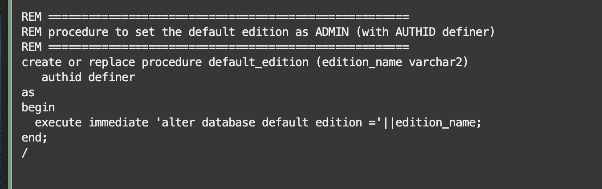

# Review the HR schema

Estimated lab time: 10 minutes

## Objectives

In this lab, you will learn how to recognize the edition of an object and review the helper procedures that we have created in the previous lab.

## Task 1: Review the helper procedures created to deal with the editions

In a production environment, the management of editions is usually a DBA task.

Some operations like `CREATE EDITION`, `DROP EDITION`, `ALTER DATABASE DEFAULT EDITION`, etc., require elevated privileges that should not be granted to normal users.
For CI/CD testing, and therefore for production environments that rolled out with CI/CD pipelines, these procedures using `AUTHID DEFINER` will facilitate the integration without executing anything as DBA.
Keep in mind, editions are shared among all schemas in the database, therefore all the schemas must belong to the same application and follow the same edition scheme. Different applications should be separated in different databases (or PDBs).

The file `hr_main.sql` that we used to create the HR schema in the previous lab, creates the following procedures to let users manage and use editions themselves. Open the script *hr_main.sql* to review the contents.





In a normal situation, either a DBA or a single administrative user would take care of the editions, but in a development database, developers may want to maintain the editions themselves. The `CREATE ANY EDITION` privilege is also handy, but not effective when the users that create them are recreated as part of integration tests: an edition is an object at database (PDB) level, but the grants work like for normal objects (grants are lost if the grantor is deleted).

The file `hr_main.sql` gives the extra grants to the `HR` user:


## Task 2: Review Base Tables and Editioning Views

The set of scripts that install the `HR` schema is different from the default one.

Also give a look at the file `hr_cre.sql`.This script is available in initial_setup folder.Each table has a different name compared to the original `HR` schema (a suffix `$0` in this example):


Each table has a corresponding *editioning view* that covers the table one to one:


To verify this, connect with the `HR` user in SQLcl ( If you got disconnected from sqlcl, refer Lab 3,Task 1 for setting up the DB wallet)

```text
 <copy>connect hr/Welcome#Welcome#123@ebronline_medium</copy>
```

Then use the SQLcl command `ddl` on `regions` and you should able to see DDL of the regions view as below


The views, and all the depending objects, are editioned and belong to the `ORA$BASE` edition. This is the default edition when a database is created. Let us verify using the below SQL in the HR schema.

```text
 <copy>select OBJECT_NAME, OBJECT_TYPE, EDITION_NAME from user_objects_ae WHERE edition_name is not null  order by 2,3;</copy>
 ```


You have successfully reviewed the HR schema [proceed to the next lab](#next) to start working with Liquibase and SQLcl.

## Acknowledgements

- Authors - Ludovico Caldara,Senior Principal Product Manager,Oracle MAA PM Team and Suraj Ramesh,Principal Product Manager,Oracle MAA PM Team
- Last Updated By/Date - Suraj Ramesh, Jan 2023

