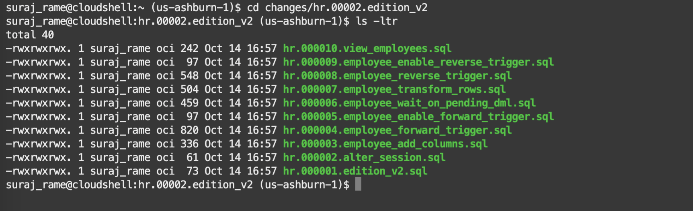
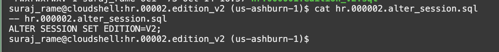
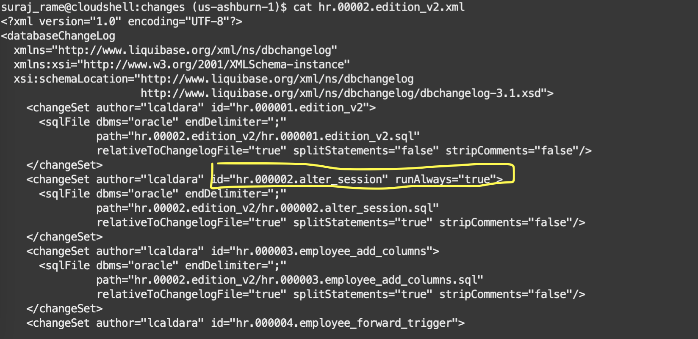
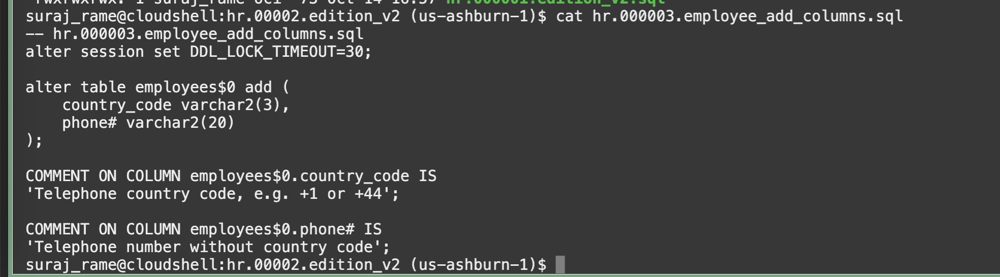

# Review and deploy the changelog for the new edition

## Introduction

In this lab,you will review the new edition scripts to create a new edition and split the column

Estimated lab time: 10 minutes

## Objectives

In this lab,you will review the new edition scripts to create a new edition and split the column `employees.phone_number` to `country_code` and `phone#`.

## Task 1: Review the scripts for the new edition

1. From the Cloud Shell home directory, navigate to *changes/hr.00002.edition_v2* folder

    ```text
    <copy>cd changes/hr.00002.edition_v2</copy>
    <copy>ls -ltr</copy>
    ```

    You will see a list of SQL scripts.

    

    For the remaining part of **Task 1** we will review the script content for better understanding of Oracle Edition-Based Redefinition.

    **If you are interested in the details of the scripts please continue reading. Otherwise, go to Task #2**

2. Create the new edition

    For this, we will use the helper function created earlier:

    

    This runs the `CREATE EDITION V2` and `GRANT USE ON EDITION V2` to the HR user.

    Remember, for real-world scenarios, it would be best to have separate PDBs per schema to avoid conflicts in the management of editions.

3. Use the new edition

    The second one is also important, as it sets the edition for the subsequent changesets:

    

    The second changesets must always run in the changelog to ensure that the correct edition is set, so we will call it with the parameter runAlways=true. In case of errors, another Liquibase session would reconnect to the previous edition. With this parameter, we avoid that.

    

    The other changesets have a different `splitStatements` parameter depending on their nature (SQL or PL/SQL).

4. Add the new columns. This operation is online for subsequent DMLs but must wait on the existing ones. We specify a `DDL_LOCK_TIMEOUT` for that:

    

5. Create the forward cross-edition trigger and enable it.

    Two triggers make sure that DMLs executed in the old and new editions populate the columns correctly.

    The forward cross-edition trigger propagates the changes from the old edition to the new columns. There will be a reverse cross-edition trigger that does the same for the DMLs on the new edition.

    

    Enable the trigger

    

6. Populate the new columns

    Before populating the new columns, we wait for the current DMLs to finish:

    

    The population happens by applying the forward cross-edition trigger on all the rows of the table, using a special dbms_sql.parse call:

    

7. Create the reverse cross-edition trigger and enable it.

    Before using the new edition, we create the reverse trigger so that new DMLs on the new columns will update the old column. That way, the pre-update application keeps working even if the table layout is changing.

    

    Enable the trigger 

    

8. Create a new version of the editioning view

    The editioning view is a "surrogate" of the base table. In the new edition, we want to have `country_code` and `phone#` columns, and remove phone_number. Note that we can also choose the order of the columns in the new edition.

    

9. Actualize the objects

    Now that the modifications to the existing objects have been made, we can "transfer" all the inherited objects from the previous edition to the new one, and at the same time validate/recompile them (nobody is using them yet).

    ```text
    <copy>cd ~/changes/common</copy>
    <copy>cat actualize_all.sql</copy>
    ```

    

## Task 2: Run the Liquibase update for the new changelog 

1.  The home directory will be different in your environment.

    

    ```text
    <copy>cd ~</copy>
    <copy>sql /nolog</copy>
    ```

    ```text
    <copy>set cloudconfig ebronline.zip</copy>
    <copy>connect hr/Welcome#Welcome#123@ebronline_medium</copy>
    <copy>show user</copy>
    <copy>pwd</copy>
    ```

    

2. Run the changelog `hr.00002.edition_v2.xml`

    ```text
    <copy>cd changes</copy>
    <copy>lb update -changelog-file hr.00002.edition_v2.xml</copy>
    ```

    

    Verify the outcome of the execution.

You have successfully deployed the changelog for the new edition of the HR schema. [Proceed to the next lab](#next) to verify the new edition.

## Acknowledgements

- Authors - Ludovico Caldara and Suraj Ramesh
- Last Updated By/Date - Suraj Ramesh, Feb 2023
