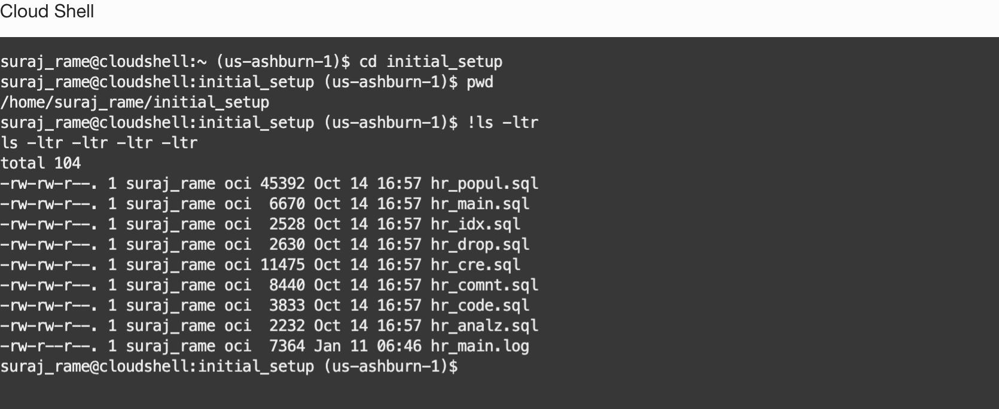
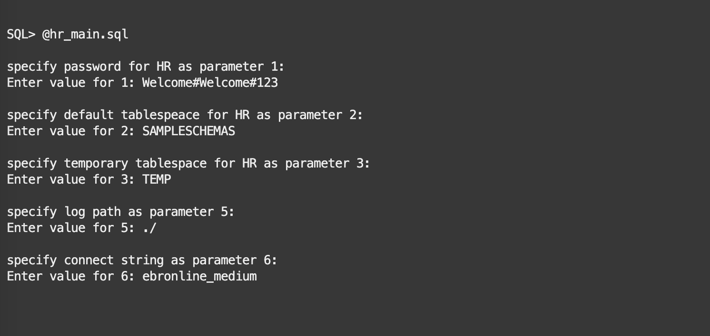

# Connect to the Autonomous Database and prepare the HR schema

## Introduction

This lab will go through the steps of connecting to Autonomous database and create,prepare the HR schema.

Estimated lab time: 10 minutes

Watch the video below for a quick walk-through of the lab.
[Connect to the Autonomous Database and prepare the HR schema](videohub:1_sz0987ab)

### Objectives

In this lab, you will 

- Connect as the ADMIN user to the autonomous database and create the HR schema, along with a few helper procedures
- Verify the HR schema creation logs

### Prerequisites

- Created or have access to ATP database
- Downloaded Lab Files

## Task 1: Connect to the Autonomous Database using SQLcl
   
1. Connect as the ADMIN user

2. We already downloaded the wallet in the Cloud shell home folder in the previous lab.

3. Reopen the Cloud Shell if it is disconnected.SQLcl (SQL Developer command line) is installed in Cloud Shell by default.From the Cloud shell  home folder, connect to SQLcl

    ```text
    <copy>cd ~</copy>
    <copy>sql /nolog </copy>
    ```

4. After getting the SQL prompt, set the `cloudconfig` details with the wallet file

    ```text
    <copy>set cloudconfig ebronline.zip</copy>
    ```

5. You should refer to the page "View Login Info" for getting the Database Admin Password and Database Name. Make a note of these values.

   

   For example if your database name is "EBRONLINE57859", use "ebronline57859_medium" as connect string. 

    ```text
    <copy>connect admin@ebronline57859_medium</copy>
    ```
    You are required to select a service when you connect to ATP database,currently there are five services available as listed below. We are going to use **medium** service in this lab.

    - databasename_tpurgent
    - databasename_tp
    - databasename_high
    - databasename_medium
    - databasename_low

    We will use anyone of the below connect strings depending on the user we would like to connect in upcoming labs.Save the connect command line for later use

    - **connect admin@ebronline57859\_medium**  --- Use this for admin user
    - **connect hr@ebronline57859\_medium** --- Use this for HR user

   

   **You must use the database name assigned to you with fail, if not the you will not be able to connect the database**

6. Verify the user is connected as the ADMIN user

    ```text
    <copy>show user</copy>
    ```

## Task 2: Setup the HR schema

1. In SQLcl change the directory to initial_setup and verify the SQL files

    ```text
    <copy>cd initial_setup</copy>
    <copy>pwd</copy>
    <copy>!ls -ltr</copy>
    ```

    **Verify you are in the initial_setup directory and able to see the *.sql files**

    

2. Execute the SQL file hr_main.sql

    ````text
    <copy>@hr_main.sql</copy>
    ```

    The scripts prompts for few parameters and make sure you provide the correct details if not the script will error

    - The password for the `HR` user - Input as  **Welcome#Welcome#123**
    - The default tablespace for the `HR` user - Input as **SAMPLESCHEMAS**
    - The temporary tablespace for the `HR` user- Input as **TEMP**
    - The path used to store the logs- Input as **./**
    - The name of the TNS name to connect to the Autonomous Database- Input as **ebronline57859_medium**   (**Use your connect string**)

    

    

    **Verify hr_main.log in the current folder. If you see any errors in the script execution, verify the parameters input and execute again**

You have successfully created the HR schema. [Proceed to the next lab](#next) to have an overview of the Editions and the helper procedure that we have created in this lab.

## Acknowledgements

- Authors - Ludovico Caldara,Senior Principal Product Manager,Oracle MAA PM Team and Suraj Ramesh,Principal Product Manager,Oracle MAA PM Team
- Last Updated By/Date -Suraj Ramesh, November 2024