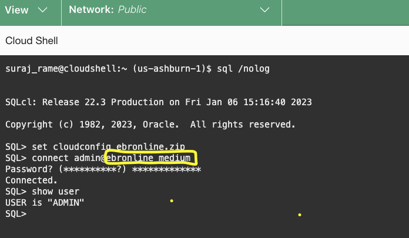
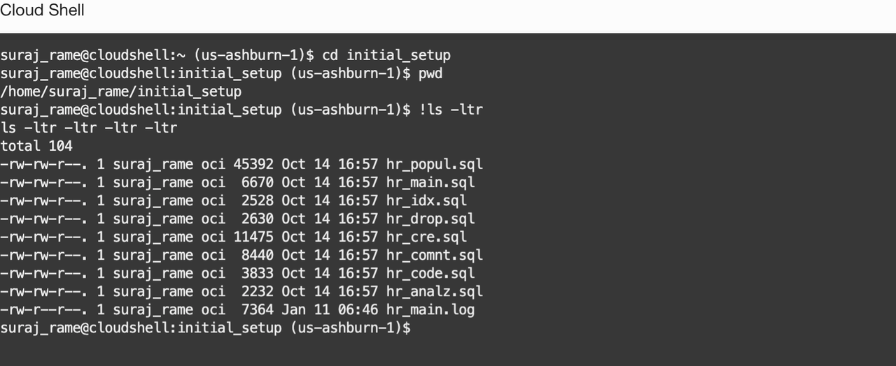
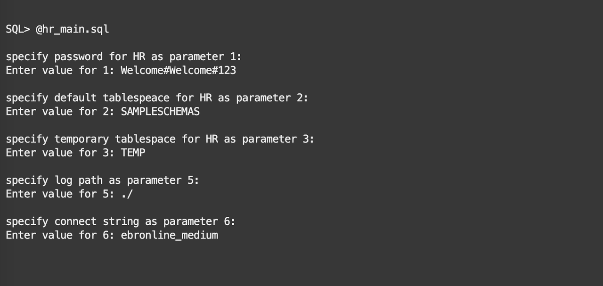
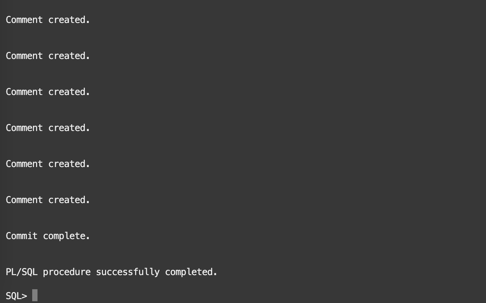

# Connect to the Autonomous Database and prepare the HR schema

## Introduction

This lab will go through the steps of connecting to Autonomous database and create,prepare the HR schema.

Estimated lab time: 10 minutes

### Objectives

In this lab, you will connect as the ADMIN user to the autonomous database and create the HR schema, along with a few helper procedures.
The HR schema is a modified version of the well-known HR schema to support editions directly after its creation.

### Prerequisites

- Created or have access to ATP database
- Downloaded Lab Files

## Task 1: Connect to the Autonomous Database using SQLcl
   
1. Connect as the ADMIN user

2. We already downloaded the wallet in the Cloud shell home folder in the previous lab.

3. Reopen the Cloud Shell if it is disconnected.SQLcl (SQL Developer command line) is installed in Cloud Shell by default.From the Cloud shell  home folder, connect to SQLcl

    ```text
    <copy>cd ~</copy>
    <copy>sql /nolog </copy>
    ```

4. After getting the SQL prompt, set the `cloudconfig` details with the wallet file

    ```text
    <copy>set cloudconfig ebronline.zip</copy>
    ```

5. Connect as the ADMIN user and enter the password when prompted. This is the ADMIN password for the database and it is provided will creating the Autonomous Database.

    ```text
    <copy>connect admin@ebronline_medium</copy>
    ```

   **If you are using the LiveLabs sandbox, you should refer to the page "View Login Info" for getting the ADMIN credentials. The connection string will also be unique to your environment.**

   If you are using the LiveLabs sandbox, replace "ebronline" in the connection string with the full Database Name found on the Login Info page. E.g. for EBRONLINE41137 you must provide:

    ```text
    <copy>connect admin@ebronline41137_medium</copy>
    ```

    Save the connect command line for later use. From now on, we'll always show `connect admin@ebronline_medium` or `connect hr@ebronline_medium` regardless of your actual connection string.

   

6. Verify the user is connected as the ADMIN user

    ```text
    <copy>show user</copy>
    ```

## Task 2: Setup the HR schema

1. In SQLcl change the directory to initial_setup and verify the SQL files

    ```text
    <copy>cd initial_setup</copy>
    <copy>pwd</copy>
    <copy>!ls -ltr</copy>
    ```

    **Verify you are in the initial_setup directory and able to see the *.sql files**

    

2. Execute the SQL file hr_main.sql

    ````text
    <copy>@hr_main.sql</copy>
    ```

    The scripts prompts for few parameters and make sure you provide the correct details if not the script will error

- The password for the `HR` user - Input as  **Welcome#Welcome#123**
- The default tablespace for the `HR` user - Input as **SAMPLESCHEMAS**
- The temporary tablespace for the `HR` user- Input as **TEMP**
- The path used to store the logs- Input as **./**
- The name of the TNS name to connect to the Autonomous Database- Input as **ebronline_medium**

  **(change it to the actual connection string, e.g. ebronline41137_medium)**

   

   

   **Verify hr_main.log in the current folder. If you see any errors in the script execution, verify the parameters input and execute again**

You have successfully created the HR schema. [Proceed to the next lab](#next) to have an overview of the Editions and the helper procedure that we have created in this lab.

## Acknowledgements

- Authors - Ludovico Caldara and Suraj Ramesh
- Last Updated By/Date - Suraj Ramesh, Feb 2023
