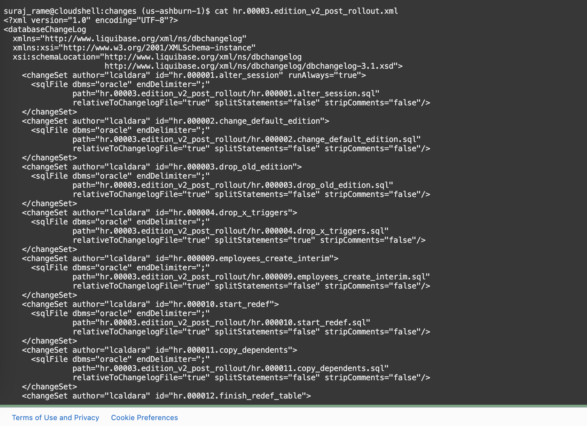

# Switch to the new edition and decommission the old edition

## Introduction

In this lab, we will switch to the new edition `V2` and decommission the old edition `ORA$BASE`

Estimated lab time: 15 minutes

### Objectives

In this lab, we will switch to the new edition `V2` and decommission the old edition `ORA$BASE`. We will also use **Oracle Online Redefinition** (PL/SQL package `DBMS_REDEF`) to redefine the `employee` table online.

## Task 1: Verify all the scripts 

1. We will review all the scripts of the second Liquibase changelog for better understanding. If you want to directly execute the changelog, skip **Task 1** and proceed to **Task 2** 

    Now that the new edition is ready, instances of the new application version can use the new edition, using either a dedicated service or by issuing an `alter session`.

    Once the application is validated, you can gradually roll over all the application servers, performing a truly rolling application upgrade.
    You can also change the database default edition so that all new sessions will see the new one.

    However, all the applications that are sensitive to the change should explicitly set the edition, so that reconnections will not cause any harm.

    For this demo, we will integrate this step in a changelog that decommissions the old edition.

    The last changelog contains the SQL files that clean up everything, drop the old edition and redefine the table `employees`without the `phone_number` column.

    All the scripts are available in **hr.00003.edition\_v2\_post_rollout** directory.

    ```text
    <copy>cd ~/changes/hr.00003.edition_v2_post_rollout</copy>
    ```

2. Alter session to use edition V2

    

3. Change the default edition to V2

    As the `HR` user, we can use the helper procedure previously created. Internally, the procedure runs `execute immediate 'alter database default edition ='||edition_name;`

    

4. Drop the old edition

    **This step will fail if any session is still connected to the old edition.**

    Here we use a helper procedure again:

    

    The user has `grant select on dba_editions`. The `drop_edition` procedure will execute internally `execute immediate 'DROP EDITION '||edition_name||' CASCADE`, then `dbms_editions_utilities.clean_unusable_editions`.


5. Drop the cross-edition triggers

    Now that nobody uses the old columns, it is safe to drop the cross-edition triggers.

    

6. Redefine the Table: Create the interim table

    

7. Redefine the Table: Start the redefinition

    

8. Redefine the Table: Copy the table dependents

    

9. Redefine the Table: Finish the redefinition

    

10. Redefine the table: Drop the interim table

    

    The clause "cascade constraints" is necessary for the self-referencing foreign key (employee->manager).

11. Run the changelog with Liquibase

    The changelog file is `hr.00003.edition_v2_post_rollout.xml`, available in the **changes** directory.

    

## Task 2: Run the change log 

1. The home directory will be different in your environment

    

    ```text
    <copy>cd ~</copy>
    <copy>sql /nolog</copy>
    ```


    ```text
    <copy>set cloudconfig ebronline.zip</copy>
    <copy>connect hr/Welcome#Welcome#123@ebronline_medium</copy>
    <copy>show user</copy>
    <copy>pwd</copy>
    ```

    

2. Run the changelog. **Remember, in this lab, we are the only user, so we can set the edition to V2 and immediately drop the old one. In real-world environments, you will need to change the default edition first, and ensure that no old sessions use the old edition, or you will not be able to drop it!**

    ```text
    <copy>cd changes</copy>
    <copy>alter session set edition=V2;</copy>
    <copy>lb update -changelog-file hr.00003.edition_v2_post_rollout.xml</copy>
    ```
    

    Verify the outcome of the deployment. If you see the following error, it means you have old sessions connected to the old edition. Disconnect the sessions and retry.

    

You have successfully switched to the new edition, decommissioned the old edition and redefined the `employees` table online.

This is the end of this LiveLabs. We hope you enjoyed it!

## Acknowledgements

- Authors - Ludovico Caldara and Suraj Ramesh
- Last Updated By/Date - Suraj Ramesh, Feb 2023
