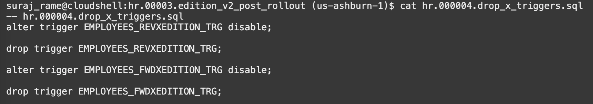

# Switch to the new edition,decommission the old edition

Estimated lab time: 15 minutes

### Objectives

In this lab,we will switch to the new edition (v2) and decomission the old edition. We will be also using DBMS_REDEF procedure to redefine the tables online.

## Task 1: Verify all the scripts 

All these scripts are reviewed for understanding. If you want to directly execute the script, skip **Task 1** and proceed to **Task 2** 

Now selected application containers can connect to the new edition using either a dedicated service or by issuing an `alter session` (either explicit or in the connection string).

Once the application is validated, all the new sessions can switch to the new edition by changing the database default:

However, all the applications that are sensible to the change should explicitly set the edition so that reconnections will not cause any harm.

For this demo, we will integrate this step in a changelog that decommission the old edition.

The last changelog contains the SQL files that cleanup everything, drop the old edition and redefine the table without the `phone_number` column.

All the scripts are available in **hr.00003.edition\_v2\_post_rollout** directory.

```text
<copy>cd changes/hr.00003.edition_v2_post_rollout</copy>
```

### 1. Alter session for v2 

Script is setting edition as v2


### 2. Change default edition as v2

As `HR` user, we achieve that using the helper procedure previously created.Internally, the procedure just runs `execute immediate 'alter database default edition ='||edition_name;`


### 3. Drop the old edition

Here we use a helper procedure again:


The user has a `grant select on dba_editions`. The `drop_edition` procedure will execute internally a `execute immediate 'DROP EDITION '||edition_name||' CASCADE`, then a `dbms_editions_utilities.clean_unusable_editions`.

### 4. Drop the cross-edition triggers

Keeping the cross-edition triggers when the previous edition is no longer in use will just add overhead to the table DMLs.



### 5. Redefine the Table: Create the interim table


### 6. Redefine the Table: Start the redefinition


### 7. Redefine the Table: Copy the table dependents


### 8. Redefine the Table: Finish the redefinition


### 9. Redefine the table: Drop the interim table


The cascade constraints is necessary for the self-referencing foreign key (employee->manager).

### 10. Run the changelog with Liquibase

The changelog file will look similar to this. The script used is `hr.00003.edition_v2_post_rollout.xml` and this file is available in **changes** folder.


## Task 2: Run the change log 


***Home folder will be different for you***

```text
<copy>cd ~</copy>
<copy>sql /nolog</copy>
```


```text
<copy>set cloudconfig ebronline.zip</copy>
<copy>connect hr/Welcome#Welcome#123@ebronline_medium</copy>
<copy>show user</copy>
<copy>pwd</copy>
```


Run the changelog 

```text
<copy>cd changes</copy>
<copy>lb update -changelog-file hr.00003.edition_v2_post_rollout.xml</copy>
```


Verify for successful execution. In case if you are getting error like the below one, restart the ATP database from OCI console and retry again.


You have successfully switched to the new edition, decommissioned the old edition and redefined the table online.

## Acknowledgements

- Authors - Ludovico Caldara,Senior Principal Product Manager,Oracle MAA PM Team and Suraj Ramesh,Principal Product Manager,Oracle MAA PM Team
- Last Updated By/Date - Suraj Ramesh, Jan 2023
