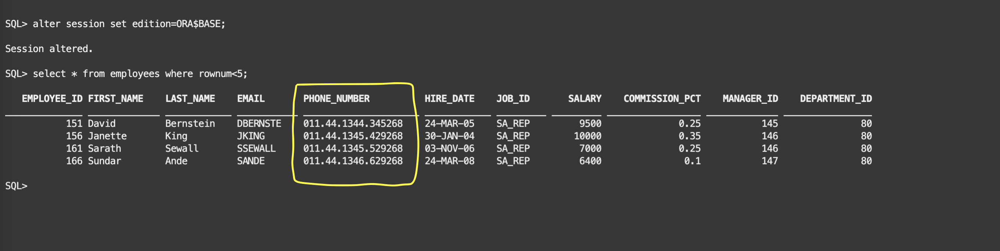
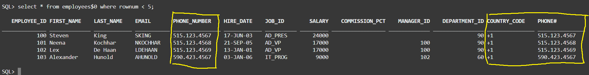

# Verify the new edition

## Introduction

In this lab, we will verify the new edition, and see how both editions work together.

Estimated lab time: 5 minutes

### Objectives

In this lab, we will verify the new edition, and see how both editions work together.

## Task 1: Verify both editions

1. It is assumed you are connected to the `HR` schema.

    After the deployment of the new edition, we still have the old one using the `PHONE_NUMBER` column. 

    - Base edition

    ```text
    <copy>alter session set edition=ORA$BASE;</copy>
    <copy>select * from employees where rownum < 5;</copy>
    ```

    

    - Edition `V2` with the columns `COUNTRY_CODE` and `PHONE#`

    ```text
    <copy>alter session set edition=v2;</copy>
    <copy>select * from employees where rownum < 5;</copy>
    ```

    

2. The base table itself contains all of them, but should not be used directly. It is visible in both editions.

    ```text
    <copy>select * from employees$0 where rownum < 5;</copy>

    ```
    

    Notice how the new columns `COUNTRY_CODE` and `PHONE#` are at the end of the base table column layout.

    We can check the objects for all the editions. We see a copy for each one because we forced their actualization. Without that step, in `V2` we would see only the objects that have been changed, and the others would have been inherited from `ORA$BASE`.

    ```text
    <copy>select OBJECT_NAME, OBJECT_TYPE, STATUS, EDITION_NAME from user_objects_ae WHERE edition_name is not null  order by 2,1,4;</copy>
    ```
    

You have successfully verified both editions of the HR schema. [Proceed to the next lab](#next) to switch to the new edition and decommission the old one.

##Acknowledgements

- Authors - Ludovico Caldara and Suraj Ramesh
- Last Updated By/Date - Suraj Ramesh, Feb 2023
