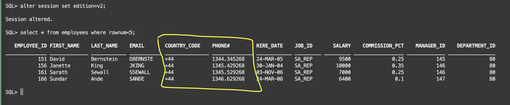

# Verify Editions

Estimated lab time: 5 minutes

### Objectives

In this lab,we will verify both editions.

## Task 1: Verify both editions

At this point we have one edition using the old column (PHONE_NUMBER). It is assumed you are connected to HR schema.

- Base edition

```text
<copy>alter session set edition=ORA$BASE;</copy>
<copy>select * from employees where rownum<5;</copy>
```


- Edition v2 with other two columns (COUNTRY_CODE and PHONE#)

```text
<copy>alter session set edition=v2;</copy>
<copy>select * from employees where rownum<5;</copy>
```



The base table itself contains all of them, but should not be used directly.

```text
<copy>select * from employees where rownum<5;</copy>

```


We can check the objects for all the editions. We see a copy for each one because we forced their actualization. Without that step, in V2 we would see only the objects that have been changed, and the others would have been inherited from ORA$BASE.

```text
<copy>select OBJECT_NAME, OBJECT_TYPE, STATUS, EDITION_NAME from user_objects_ae WHERE edition_name is not null  order by 2,1,4;</copy>
```


You have successfully executed the verified the editions in  the HR schema [proceed to the next lab](#next)

##Acknowledgements

- Author - Ludovico Caldara and Suraj Ramesh 
- Last Updated By/Date -Suraj Ramesh, Jan 2023
