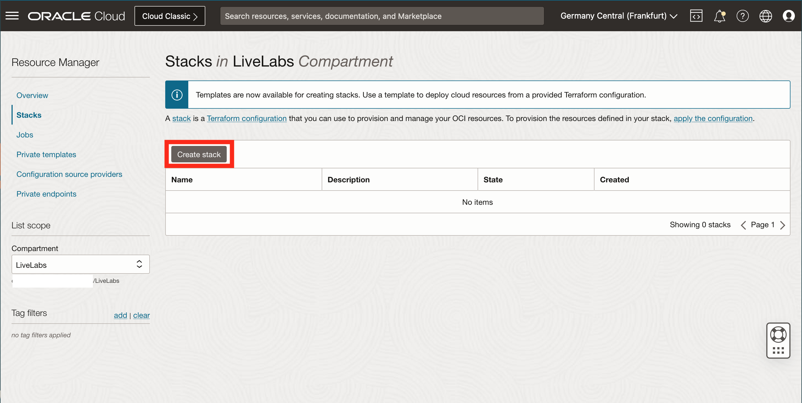
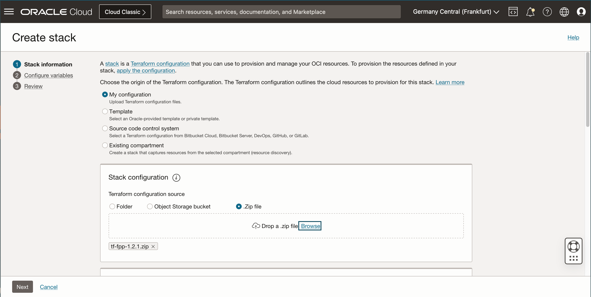
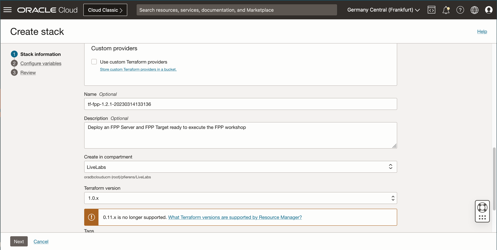
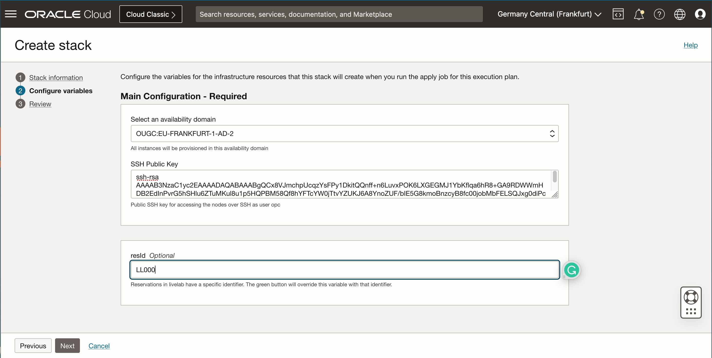
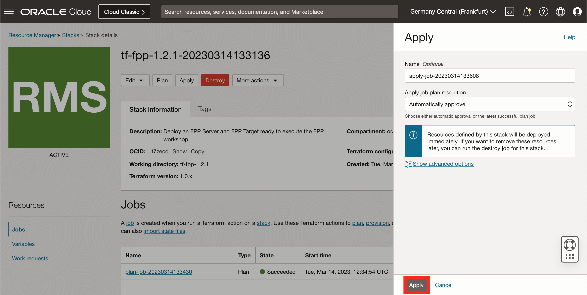
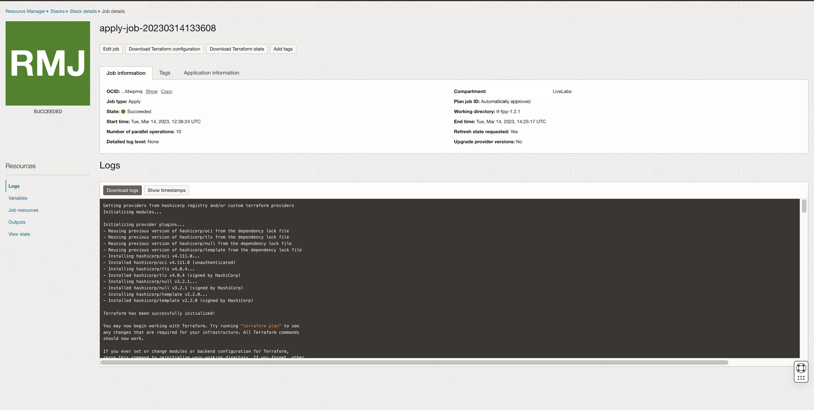

# Create the Environment with Resource Manager
## Introduction
This lab will show you how to setup a Resource Manager stack that will generate the Oracle Cloud objects needed to run this workshop. This workshop requires a DB System running the FPP Server and a Compute Instance to run the FPP Target in a Virtual Cloud Network (VCN).

Estimated Lab time: 20 minutes (Execution Time - 2 hours)

### About Terraform and Oracle Cloud Resource Manager
For more information about Terraform and Resource Manager, please see the appendix below.

### Objectives
* Create the DB System, Compute and Networking Resource Manager stack.
* Get the public IP address of the FPP server.

### Prerequisites
* An Oracle Livelabs or Paid Oracle Cloud Account.
* A SSH key-pair ready to use.

## Task 1: Create the stack

1. Click on the link below to download the Resource Manager zip file you need to build your environment.

    [tf-fpp-1.0.zip](https://objectstorage.us-ashburn-1.oraclecloud.com/p/VEKec7t0mGwBkJX92Jn0nMptuXIlEpJ5XJA-A6C9PymRgY2LhKbjWqHeB5rVBbaV/n/c4u04/b/livelabsfiles/o/data-management-library-files/tf-fpp-1.0.zip)

2. Login to Oracle Cloud
3. Select the correct region
4. Open up the hamburger menu in the left hand corner. Select **Developer Services**. Under **Resource Manager** select **Stacks**.
    

5. In the left pane, select the compartment where you would like to create the environment. It is recommended that you choose an empty compartment.
    

6. Click on Create Stack
    
7. Select **My Configuration**, choose the **.ZIP FILE** button, click the **Browse** link and select the zip file (tf-fpp-1.0.zip) that you downloaded. Click **Select**.
    
8. Make sure that the base information is populated properly
    
9. Click **Next**
10. In the **Configure Variables** step, select the appropriate Availability Domain (depending on your region you may need to specify it or not)
11. Paste your **SSH Public Key**, you will need the corresponding private key to access the FPP Server once the environment will be provisioned
12. The variable **ResID** is Optional. You can use it to add a specific suffix to the Display Name of the Cloud Resources.

    
13. Click **Next**
14. Review the **Stack Information** and click **Create**
    

    Your Stack has now been created!
    

## Task 2: Terraform Plan (OPTIONAL)
This is optional, you may skip directly to Step 3.

When using Resource Manager to deploy an environment, execute a **Terraform plan** to verify the configuration.
1. **[OPTIONAL]** Click **Plan** to validate your configuration. 
    

2. Select the **Plan** button in the bottom right of the screen. This takes about a minute, please be patient.
    

## Task 3: Terraform Apply
When using Resource Manager to deploy an environment, execute a **Terraform Apply** to actually create the configuration. Let's do that now.

1. At the top of your page, click on **Stack Details**. click the **Apply** button. 

    

2. Select the **Apply** button in the bottom right of the screen. This will create your cloud network, the db system and the compute instance.
    

3. Once this job succeeds, you will get an apply complete notification from Terraform. Examine it closely.

    

4. In the left pane, click **Outputs**
5. Click on **Show** next to **fppserver** to show the IP address of the FPP Server. Note it down, you will need it to access it as **opc** user with the private key that you have supplied when creating the stack.
    

You may now [proceed to the next lab](#next) and connect to the server.

## Acknowledgements

- **Author** - Ludovico Caldara
- **Contributors** - Kamryn Vinson
- **Last Updated By/Date** -  Kamryn Vinson, April 2021