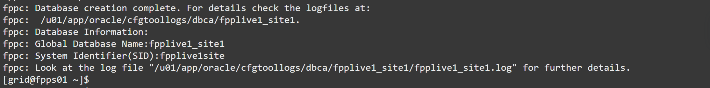
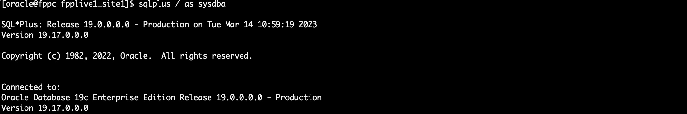
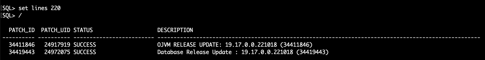

# Provision a new database

## Introduction
FPP is best at provisioning Oracle Homes, patching Grid Infrastructure and Database environments. But it can also provision Databases. For Database provisioning Fleet Patching and Provisioning triggers the remote execution of the Database Creation Assistant (or dbca), that will take care of most of the creation steps.

By provisioning databases with FPP you don't have to spend time to run dbca in silent mode manually (or worse, doing everything in interactive mode). All you need is:
* a DBCA Template Database, either local on the client or included in the gold image (standard templates such as General_Purpose.dbt work perfectly well)
* one rhpctl command to provision the database on the target node or cluster

Estimated lab time: 20 minutes

### Objectives
In this lab, you will:
- Provision the database using the standard template
- Verify the new database

### Prerequisites
- A Free Tier, Paid or LiveLabs Oracle Cloud account
- SSH Private Key to access the host via SSH
- You have completed:
      - Lab: Generate SSH Keys (Free-tier and Paid Tenants only)
      - Lab: Create the environment with Resource Manager (Free-tier and Paid Tenants only)
      - Lab: Get the Public IP of the FPP Server (Livelabs Tenant only)
      - Lab: Get Acquainted with the Environment and the rhpctl Command line tool
      - Lab: Import Gold Images
      - Lab: Provision an Oracle Restart environment
      - Lab: Install the Oracle Database homes (working copies)

## Task 1: Provision the database using the standard template

1. Run the following command on the FPP Server (Est. 14-15 minutes): password is always FPPll##123 unless you have changed it

    ```
    rhpctl add database -workingcopy  WC_db_previous_FPPC  \
      -dbname fpplive1_site1 -datafileDestination DATA -dbtype SINGLE \
      -sudouser opc -sudopath /bin/sudo
    ```
  
  

  Notice that you have not specified the target name: the FPP server knows what is the target node (or cluster) because the working copy named `WC_db_previous_FPPC` has been provisioned there. This information is stored in the FPP metadata schema.

## Task 2: Verify the new database

1. Connect to the target node:

    ```
    ssh opc@fppc
    ```

    ```
    sudo su - oracle
    ```

  

2. As user `oracle`, set the environment for the new database:

    ```
    $ . oraenv
    ORACLE_SID = [oracle] ? fpplive1site
    The Oracle base has been set to /u01/app/oracle
    [oracle@fppc ~]$
    ```
    

3. Check the status of the database with `srvctl` and `sqlplus`:

    ```
    srvctl status database -db fpplive1_site1 -verbose
    ```
  

    ```
    sqlplus / as sysdba
    ```
  

    ```
    set lines 220
    ```

    ```
    select PATCH_ID, PATCH_UID, STATUS, DESCRIPTION from DBA_REGISTRY_SQLPATCH;
    ```

    ```
    exit
    ```
    

The database is there, wasn't that easy? You may now [proceed to the next lab](#next) and try to patch it.

## Acknowledgements

- **Author** - Ludovico Caldara
- **Contributors** - Kamryn Vinson - Philippe Fierens
- **Last Updated By/Date** -  Philippe Fierens, March 2023
