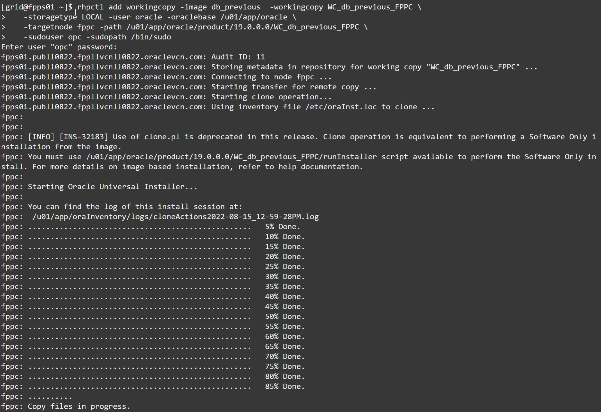
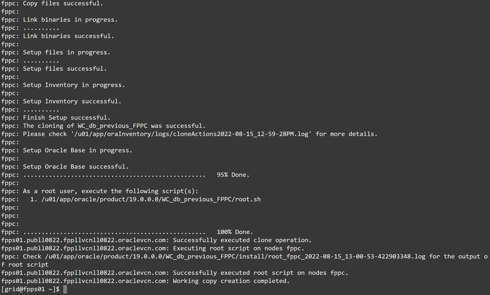
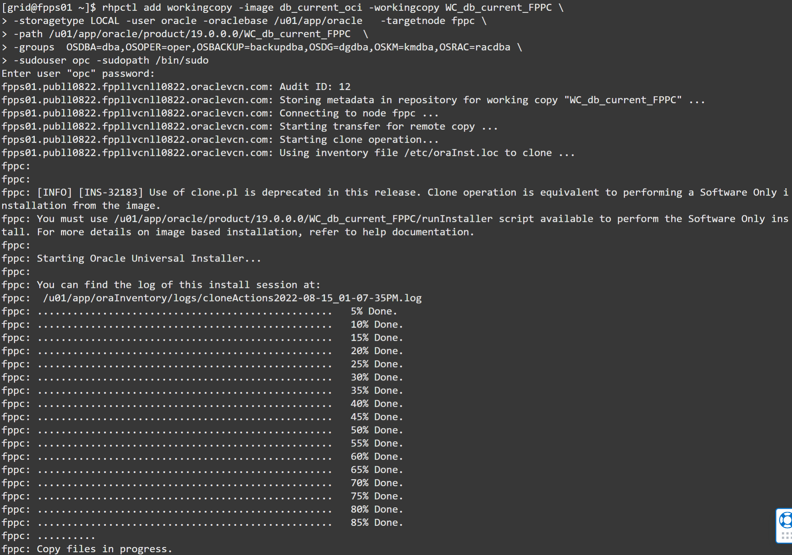
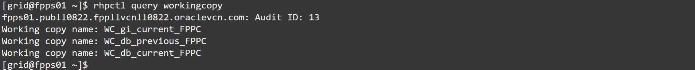
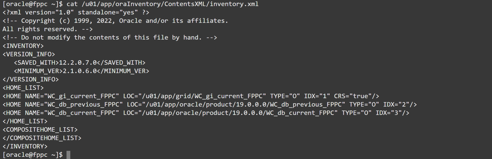

# Install the Oracle Database homes (working copies)

## Introduction
The main reason for starting using Oracle Fleet Patching and Provisioning is probably its ability to easily patch many databases with a single command.

In this Lab, we will provision two Oracle Homes, with different patch levels.

Estimated lab time: 25 minutes

### In-place vs out-of-place patching
When it comes to patching the binaries, a common approach is **in-place patching**, where customers follow these macro-steps:
- Stage the latest `opatch` and patch bundle on the server (e.g. latest Release Update)
- Stop the databases (downtime starts)
- Update `opatch`
- Apply the patch
- Restart the databases (downtime ends)
- Run `datapatch`

The downtime window must be large enough to accommodate the patching operation and its rollback in case of any problems.

**Our-of-place patching** is generally a better approach, that consists in the following steps:
- Prepare a new Oracle Home which contains the required patches
- Stop the databases (all, or one at the time)
- Restart the databases in the new Oracle Home
- Run `datapatch`

The downtime window can be scheduled separately for each database, because at any time, both Oracle Homes will be available. This gives more flexibility and allows an easier rollback (the previous Oracle Home is still there).
Customers do not always implement our-of-place patching because the new binaries preparation and installation require some additional steps before the patching campaign.

Fleet Patching and Provisioning takes this burden off by automating the Oracle Home provisioning for you, that's it, FPP use out-of-place patching, and helps you keeping your Oracle Homes under control, in a central and standardized way.

### Objectives
In this lab, you will:
- Provision the first workingcopy
- Provision the second workingcopy
- Verify the working copies

### Prerequisites
- A Free Tier, Paid or LiveLabs Oracle Cloud account
- SSH Private Key to access the host via SSH
- You have completed:
      - Lab: Generate SSH Keys (Free-tier and Paid Tenants only)
      - Lab: Create the environment with Resource Manager (Free-tier and Paid Tenants only)
      - Lab: Get the Public IP of the FPP Server (Livelabs Tenant only)
      - Lab: Get Acquainted with the Environment and the rhpctl Command line tool
      - Lab: Import Gold Images
      - Lab: Provision an Oracle Restart environment

## Task 1: Provision the first workingcopy

1. From the FPP Server, verify that you have the images that you should have imported in the lab **Import Gold Images**.

      ```
      rhpctl query image
      ```
      

2. Then, provision the first DB image to the target. The opc password is always `FPPll##123` unless you have changed it (Est. 8-9 minutes):

      ```
      $ rhpctl add workingcopy -image db_19_9_0  -workingcopy WC_db_19_9_0_FPPC \
         -storagetype LOCAL -user oracle -oraclebase /u01/app/oracle \
         -targetnode fppc -path /u01/app/oracle/product/19.0.0.0/WC_db_19_9_0_FPPC \
         -sudouser opc -sudopath /bin/sudo
      ```
      
      

## Task 2: Provision the second workingcopy
1. Provision the second DB image to the target (Est. 8-9 minutes), **please note the additional -groups** parameter passed here:

      ```
      $ rhpctl add workingcopy -image db_19_10_0_oci -workingcopy WC_db_19_10_0_FPPC \
      -storagetype LOCAL -user oracle -oraclebase /u01/app/oracle   -targetnode fppc \
      -path /u01/app/oracle/product/19.0.0.0/WC_db_19_10_0_FPPC  \
      -groups  OSDBA=dba,OSOPER=oper,OSBACKUP=backupdba,OSDG=dgdba,OSKM=kmdba,OSRAC=racdba \
      -sudouser opc -sudopath /bin/sudo
      ```
      
      

## Task 3: Verify the working copies
1. On the server:

      ```
      rhpctl query workingcopy
      ```
      

2. On the client: password is always FPPll##123 unless you have changed it

      ```
      ssh opc@fppc
      ```

      ```
      sudo su - oracle
      ```
      

      ```
      cat /u01/app/oraInventory/ContentsXML/inventory.xml
      ```
      

All the database homes are there! Now they are ready to run databases. You may now [proceed to the next lab](#next) and provision a database.

## Acknowledgements

- **Author** - Ludovico Caldara
- **Contributors** - Kamryn Vinson
- **Last Updated By/Date** -  Kamryn Vinson, May 2021