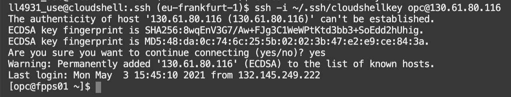
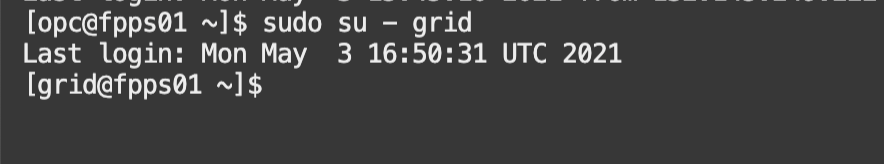
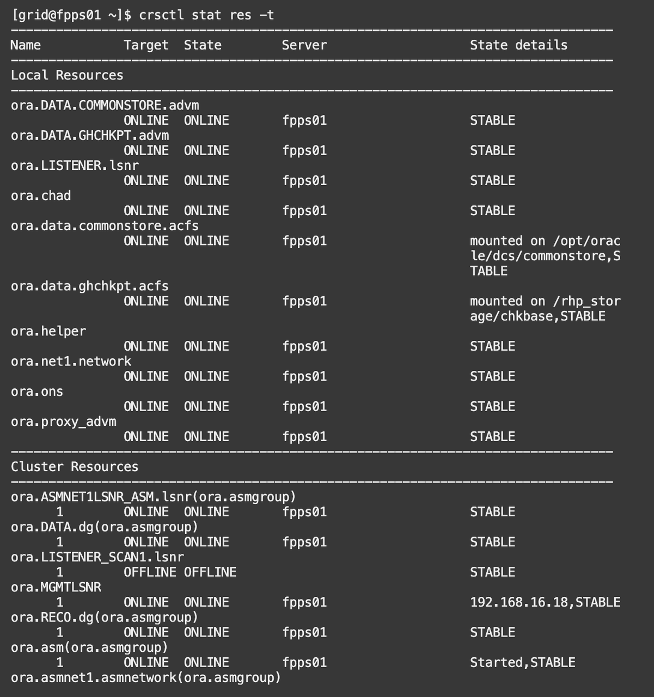
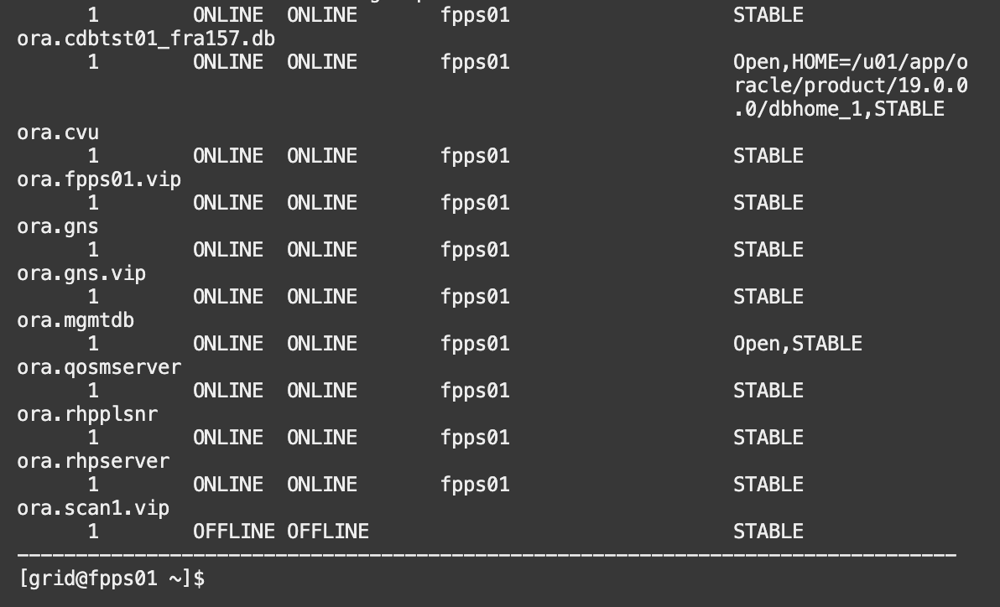
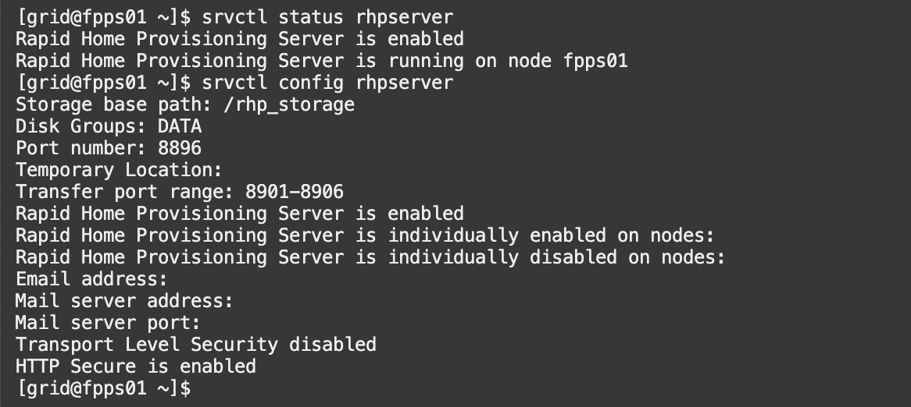
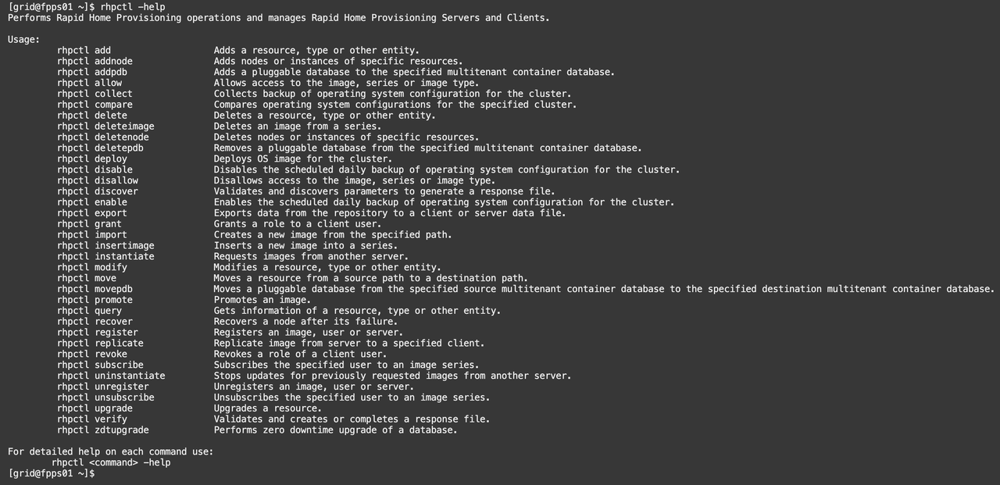
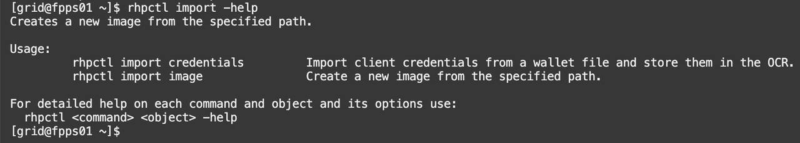
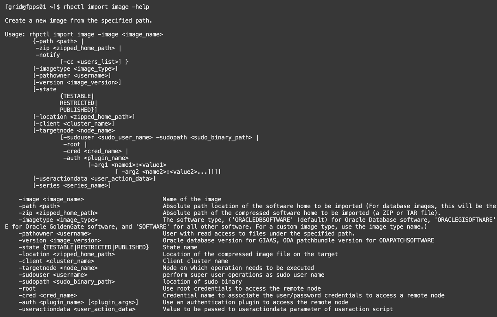
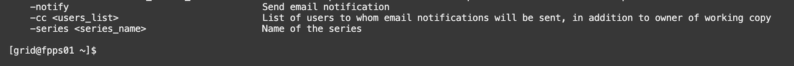
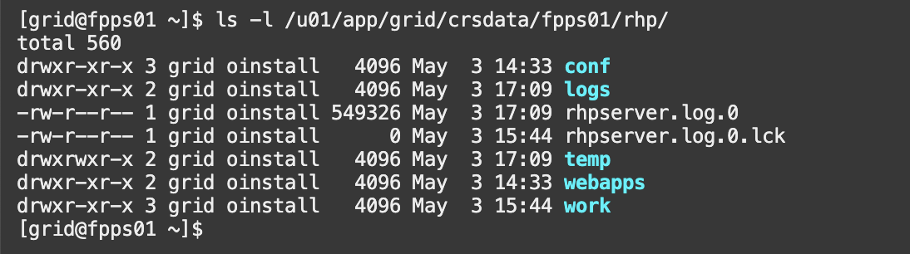

# Get Acquainted with the Environment and rhpctl Command line tool

## Introduction
Oracle Fleet Patching and Provisioning is part of the Oracle Grid Infrastructure stack. A full Grid Infrastructure environment is required. One node is enough, two are better for high availability. Oracle Restart cannot run the FPP Server component because of its ACFS requirement.
For this reason, you have to be familiar with the Grid Infrastructure stack.

Oracle Fleet Patching and Provisioning can be configured, stopped and started with `srvctl`. All the FPP operations are executed through its command line tool: `rhpctl`.

In this workshop, the FPP server is already configured, so besides checking the FPP Server status, you will use `rhpctl` most of the time.

### FPP or RHP?
When it has been released in 2013, the original name of the product was *Rapid Home Provisioning*, or *RHP*. All the commands, logs and component names have been named after the original name.
A few years later many features have been added and the name has been changed to *Fleet Patching and Provisioning*, or *FPP*. Now the name reflects better what the product does, but the underlying components and commands still use the old acronym. When talking about the product, both acronyms will show up. Most of the time, they are referring to the same thing.

For instance, the following names refer to the same thing:
* *FPP Server* and *rhpserver*
* *FPP Client* and *rhpclient*

You may also hear some Oracle employees referring to *FPP* as *RHP*. Again, they refers to the same product.

Estimated lab time: 10 minutes

### Objectives
In this lab, you will:
- Connect to the FPP Server
- Verify the Clusterware and rhpserver status
- Play with the rhpctl inline help
- Find the rhpserver.log

### Prerequisites
- A Free Tier, Paid or LiveLabs Oracle Cloud account
- SSH Private Key to access the host via SSH
- You have completed:
      - Lab: Generate SSH Keys (Free-tier and Paid Tenants only)
      - Lab: Create the environment with Resource Manager (Free-tier and Paid Tenants only)
      - Lab: Get the Public IP of the FPP Server (Livelabs Tenant only)

<if type="livelabs">
## Task 0: Upload Key to Cloud Shell and Connect

To create your LiveLabs reservation, you used a ssh key that you created on your desktop.  We recommend you run this workshop in Cloud Shell.  We will be uploading the private key you created to Cloud Shell to continue the workshop.  If you do not wish to run in cloud shell, you can connect using the terminal of your choice.

1.  Navigate from the Hamburger Menu (top-left corner) to **Oracle Database** -> **Bare Metal, VM, and Exadata**. 
2.  Under **List Scope**, verify that you select the **same compartment** that you received in the reservation confirmation. 
3.  To start the Oracle Cloud Shell, click the Cloud Shell icon at the top right of the page. *Note: Ensure before you click the console you have selected your assigned compartment or you will get an error.*

    

    

    

2.  Click on the Cloud Shell hamburger icon and select **Upload** to upload your private key
   
    

3.  To connect to the compute instance that was created for you, you will need to load your private key.  This is the key that does *not* have a .pub file at the end.  Locate that file on your machine and click **Upload** to process it.
   
    

4. Be patient while the key file uploads to your Cloud Shell directory
    

    

5. Once finished run the command below to check to see if your ssh key was uploaded.  Create a .ssh directory, and move the ssh key into your .ssh directory

    ````
    <copy>
    ls
    </copy>
    ````
    ````
    chmod 600 <<keyname>>
    mkdir .ssh
    mv <<keyname>> .ssh
    ls .ssh
    cd ~
    ````

    
</if>
## Task 1: Connect to the FPP Server via SSH
1. Connect to the FPP Server via SSH using the user `opc` and the private key that you have created during the LiveLab setup.
As IP address, specify the public address of the FPP Server.
E.g. if you have a terminal with ssh available:

      ````
      ssh -i ~/.ssh/<sshkeyname> opc@<Your Compute Instance Public IP Address>
      ````
      

      If you are using other clients (Putty, MobaXTerm) and you are unsure about how to use private keys, please refer to their respective documentation.

2. Unless specified, all the commands on the FPP Server must be run with the `grid` user, so do not forget to switch to it after you connect.

      ```
      sudo su - grid
      ```
      


## Task 2: Verify the Clusterware status and rhpserver status
1. Make sure that the Clusterware stack is in a healthy state:

      ```
      crsctl stat res -t
      ```
      
      

2. In the above output, you can already see that the FPP Server (rhpserver) is running, but you can double-check:

      ```
      srvctl status rhpserver
      ```
      

3. You can see how the FPP Server has been configured:

      ```
      srvctl config rhpserver
      ```
      

      In particular, the *Transfer port range* has been customized from the default so that is uses a fixed port range (by default it is dynamic and would require permissive firewall rules).

## Task 3: Play with the rhpctl inline help
1. `rhpctl` is the command line tool for all FPP Server operations. You can use the switch `-help` to get the available commands along with their syntax:

      ```
      rhpctl -help
      ```
      


      ```
      rhpctl import -help
      ```
      


      ```
      rhpctl import image -help
      ```
      
      


## Task 4: Find the rhpserver.log
1. All the FPP logfiles are stored in /u01/app/grid/crsdata/fpps01/rhp/:

      ```
      ls -l /u01/app/grid/crsdata/fpps01/rhp/
      ```
      

2. The main log file is `rhpserver.log.0`, you can use it during the workshop to verify what happens. It is verbose, but useful whenever you encounter any problems.

3. In real life, it is a good idea to have an environment variable for it.
E.g.:

      ```
      export RHPLOG=/u01/app/grid/crsdata/fpps01/rhp/rhpserver.log.0
      ```

You have now successfully connected and verified the environment. You may now [proceed to the next lab](#next).

## Acknowledgements

- **Author** - Ludovico Caldara
- **Contributors** - Kamryn Vinson - Philippe Fierens
- **Last Updated By/Date** -  Philippe Fierens, March 2023
