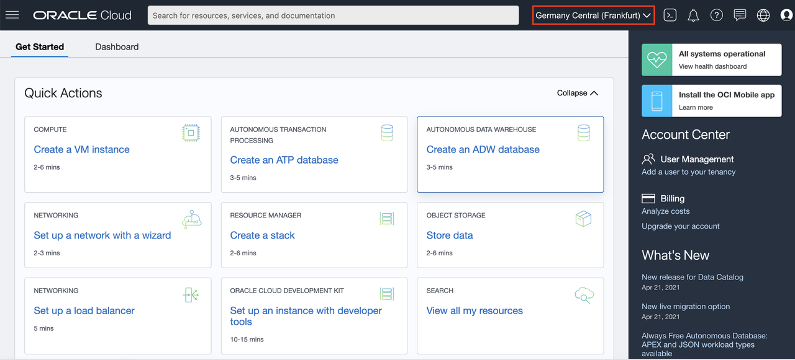
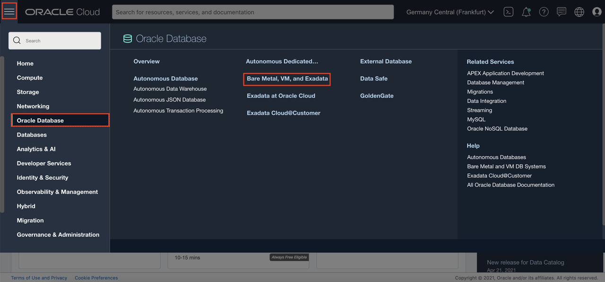
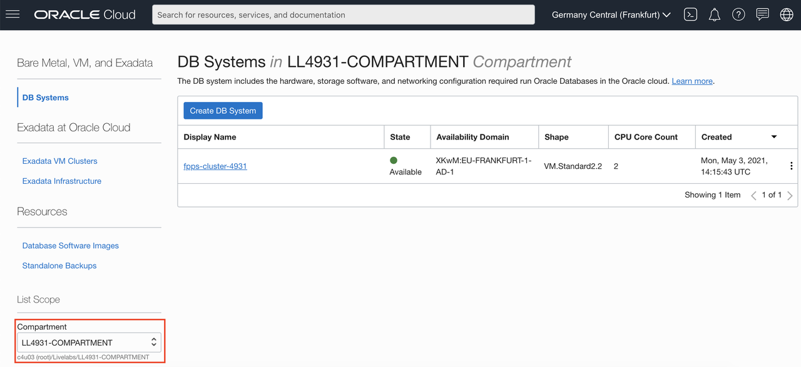
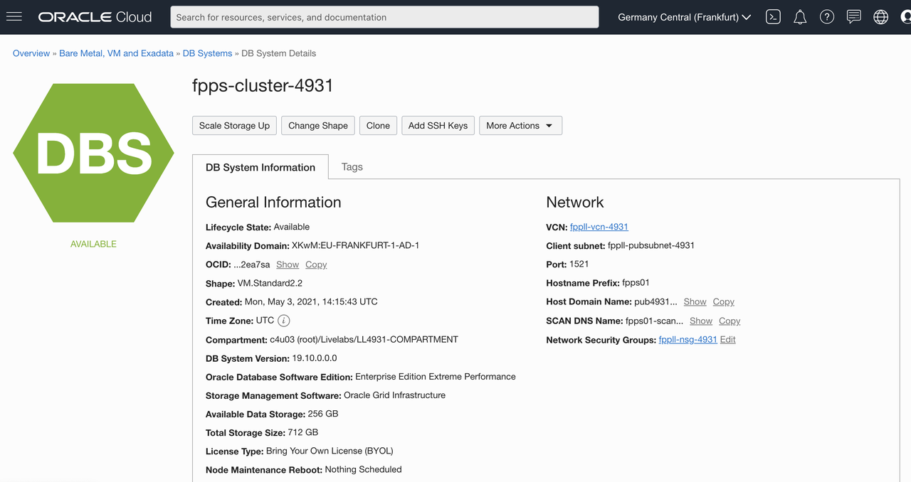
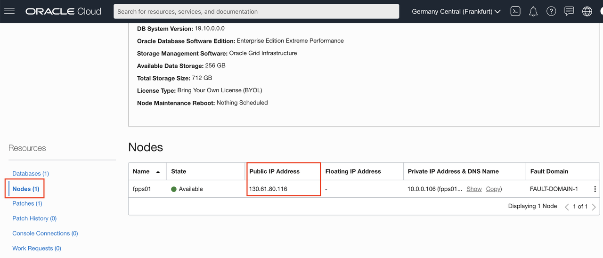

# Get the public IP of the FPP Server

It might sound obvious, but **please, don't use the values provided in the example images**, get the values that are proper to your reservation!

Estimated lab time: 5 minutes

## Objectives 
In this lab, you will:
- Access the OCI Console
- Verify your Region and Compartment
- Access your public IP

### Prerequisites
- An assigned Oracle LiveLabs Cloud account
- An assigned compartment

## Task 1: Access the OCI Console
1. Log in to the OCI console using login information provided. Check the "Get Started" lab on the left menu on how to log in to the OCI console.

2. Change the password as required.

## Task 2: Verify your Region and Compartment
1. Make sure that the **Region** (top-right corner) corresponds to the one you received in the reservation confirmation.
    

2. Navigate from the Hamburger Menu (top-left corner) to **Oracle Database** -> **Bare Metal, VM, and Exadata**.

3. **Important**: in the left menu, under **List Scope**, verify that you select the same compartment that you received in the reservation confirmation.
    

## Task 3: Get the Public IP of the FPP Server
1. Click on the DB System name **fpps-cluster-xxxx** (xxxx is your reservation number: the number that compose also your Compartment name, e.g. LLxxxx-COMPARTMENT).

    The DB System Details page appears:
    

2. Scroll down, at the end of the left pane click **Nodes(1)**, then note down the Public IP Address.
    

You may now [proceed to the next lab](#next) and connect to the server.

## Acknowledgements

- **Author** - Ludovico Caldara
- **Contributors** - Kamryn Vinson, Arabella Yao, Database Product Manager
- **Last Updated By/Date** -  Arabella Yao, September 2022