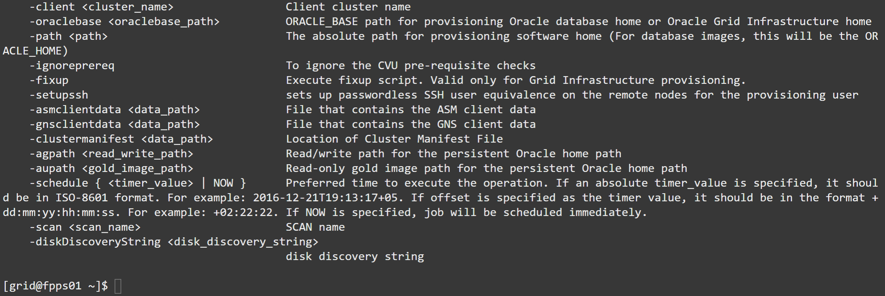
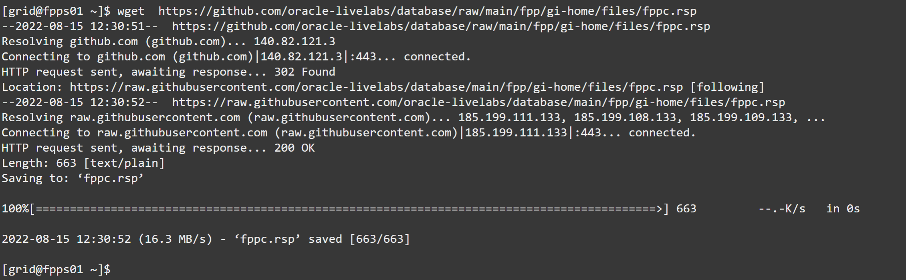
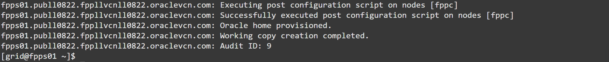
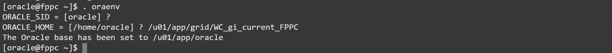

# Provision an Oracle Restart environment

## Introduction
Oracle Fleet Patching and provisioning can provision Grid Infrastructure software on remote targets using the command `rhpctl add workingcopy`.

Estimated lab time: 15 minutes

```
rhpctl add workingcopy -help GRIDHOMEPROV
```



### Software Only provisioning
If the target server already has a GI stack (either Oracle Restart or a full GI stack), then the new working copy is provisioned as Software Only: the existing stack is untouched.
In this case, once the new home is installed, the existing Grid Infrastructure stack can be patched or upgraded by using respectively `rhpctl move gihome` or `rhpctl upgrade gihome`. FPP automates all the steps, including the stop, move, rootupgrade and start of the Clusterware stack.

### New Cluster or Restart provisioning
If you need to provision the GI working copy on a brand new cluster, once the servers have been set up to host the cluster (this is a step that you need to take care of, either manually or using your favorite OS configuration management tool), all you need to do is to run `rhpctl add workingcopy` specifying the response file to be passed to gridSetup.sh.

### Objectives
In this lab, you will:
- Prepare the response file
- Provision the Restart environment on a new target using the response file
- Connect to the target and verify the restart environment


### Prerequisites
- A Free Tier, Paid or LiveLabs Oracle Cloud account
- SSH Private Key to access the host via SSH
- You have completed:
      - Lab: Generate SSH Keys (Free-tier and Paid Tenants only)
      - Lab: Create the environment with Resource Manager (Free-tier and Paid Tenants only)
      - Lab: Get the Public IP of the FPP Server (Livelabs Tenant only)
      - Lab: Get Acquainted with the Environment and the rhpctl Command line tool
      - Lab: Import Gold Images

## Task 1: Prepare the response file

1. On the FPP Server, prepare a response file containing the following content:

      ```
      # ~grid/fppc.rsp
      oracle.install.responseFileVersion=/oracle/install/rspfmt_crsinstall_response_schema_v19.0.0
      INVENTORY_LOCATION=/u01/app/oraInventory
      oracle.install.option=HA_CONFIG
      ORACLE_BASE=/u01/app/grid
      oracle.install.asm.OSDBA=dba
      oracle.install.asm.OSOPER=oper
      oracle.install.asm.OSASM=asmadmin
      oracle.install.asm.SYSASMPassword=WelcomeWelcome##123
      oracle.install.asm.diskGroup.name=DATA
      oracle.install.asm.diskGroup.redundancy=EXTERNAL
      oracle.install.asm.diskGroup.AUSize=4
      oracle.install.asm.diskGroup.disks=/dev/oracleasm/asm-disk1
      oracle.install.asm.diskGroup.diskDiscoveryString=/dev/oracleasm/*
      oracle.install.asm.monitorPassword=WelcomeWelcome##123
      ```

2. Alternatively, you can download it directly on the host:

      ```
      wget  https://github.com/oracle-livelabs/database/raw/main/fpp/gi-home/files/fppc.rsp
      ```
      

## Task 2: Provision the Restart environment on a new target using the response file
1. On the FPP Server, run the following command to provision and configure the GI home on the target. The password is `FPPll##123`. (Est. 8 minutes)

      ```
      rhpctl add workingcopy -workingcopy WC_gi_current_FPPC \
      -image gi_current_oci -responsefile ~/fppc.rsp \
      -path /u01/app/grid/WC_gi_current_FPPC -user oracle -oraclebase /u01/app/oracle \
      -targetnode fppc -sudouser opc -sudopath /bin/sudo -ignoreprereq
      ```
      
      
      

## Task 3: Connect to the target and verify the Restart Environment
1. From either the FPP Server or your SSH client, connect as `opc` to the FPP target public IP address and become `oracle`. The password is FPPll##123

      ```
      ssh opc@fppc
      ```

      ```
      sudo su - oracle
      ```
      

2. Set the environment.

      ```
      $ . oraenv
      ORACLE_SID = [oracle] ?
      ORACLE_HOME = [/home/oracle] ? /u01/app/grid/WC_gi_current_FPPC
      The Oracle base has been set to /u01/app/oracle
      ```
      

3. Verify that Restart is up and running:

      ```
      crsctl stat res -t
      ```
      

Congratulations! You have successfully configured an Oracle Restart environment with a single command. Easy, huh? You may now [proceed to the next lab](#next).

## Acknowledgements

- **Author** - Ludovico Caldara
- **Contributors** - Kamryn Vinson - Philippe Fierens
- **Last Updated By/Date** -  Philippe Fierens, March 2023