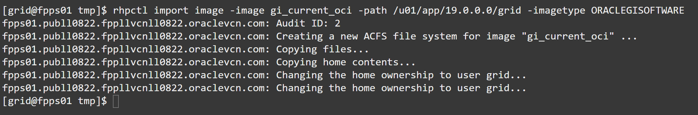
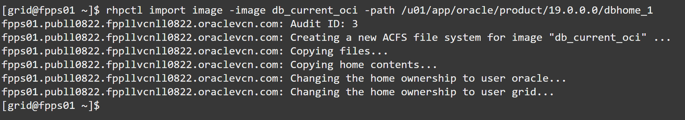
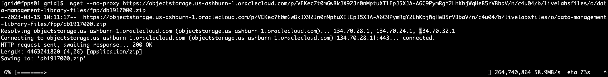
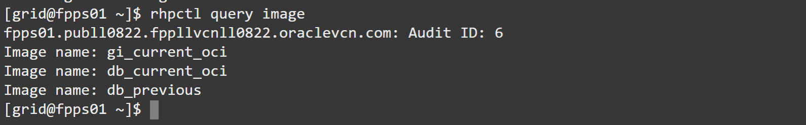

# Import Gold Images

## Introduction
Oracle Fleet Patching and Provisioning stores Oracle Home images into its ACFS filesystems.
You can build your images with the required release updates and one-off patches and import them into FPP. From there, you can provision the same image everywhere in your server fleet: this ensure that all your Oracle Homes are standard and compliant with your patching requirements.

Estimated lab time: 25 minutes

### Objectives
In this lab, you will:
- Import the local FPP Homes as Gold Images
- Import an additional DB Home from a zip file
- Query the Gold Images

### Prerequisites
- A Free Tier, Paid or LiveLabs Oracle Cloud account
- SSH Private Key to access the host via SSH
- You have completed:
      - Lab: Generate SSH Keys (Free-tier and Paid Tenants only)
      - Lab: Create the environment with Resource Manager (Free-tier and Paid Tenants only)
      - Lab: Get the Public IP of the FPP Server (Livelabs Tenant only)
      - Lab: Get Acquainted with the Environment and the rhpctl Command line tool


## Task 1: Import the local FPP Homes as Gold Images
1. Import the Oracle Homes that are already installed and configured on the FPP Server as new gold images. First, the Grid Infrastructure image: (Est.: 5 minutes)
        ```
        rhpctl import image -image gi_current_oci -path /u01/app/19.0.0.0/grid -imagetype ORACLEGISOFTWARE
        ```

        

Notice the `-imagetype ORACLEGISOFTWARE` that tells FPP which image it is about to import

2. Then, the Oracle Database image: (Est.: 4-5 minutes)
        ```
        rhpctl import image -image db_current_oci -path /u01/app/oracle/product/19.0.0.0/dbhome_1
        ```


The image type `ORACLEDBSOFTWARE` is the default, so you do not need to specify it.

## Task 2: Import an additional DB Home from a zip file
1. First, download the zip file from this location into a filesystem with enough space (e.g. /u01) (Est.: 3 minutes):
        ```
        cd /u01/app/grid/
        wget --no-proxy https://objectstorage.us-ashburn-1.oraclecloud.com/p/VEKec7t0mGwBkJX92Jn0nMptuXIlEpJ5XJA-A6C9PymRgY2LhKbjWqHeB5rVBbaV/n/c4u04/b/livelabsfiles/o/data-management-library-files/fpp/db1917000.zip
        ```


2. Then, import it: (Est.: 7-8 minutes)
        ```
        rhpctl import image -image db_previous -zip $PWD/db1917000.zip
        ```


We have already patched it for you with the DB 19.17.0 Release Update, so you do not have to do it yourself. However, in real life this is a task that you would have to do.

Because it comes from a non-verified source, FPP will uncompress the image and verify it by configuring it and relinking it.
This is an extra step to make sure that the image is usable and can be provisioned as working copy on the remote targets without problem. This, however, requires 2-3 additional minutes.

## Task 3: Query the Gold Images
1. Once the images have been imported into the FPP Server, you can query them:
        ```
        rhpctl query image
        ```


2. Get the detail of a specific image:
        ```
        rhpctl query image -image db_previous
        ```


3. Get the detail of the other one:
        ```
        rhpctl query image -image db_current_oci
        ```
      

4. Now, take a closer look at the groups:
        ```
        # first
        Groups configured in the image: OSDBA=dba,OSOPER=oper,OSBACKUP=backupdba,OSDG=dgdba,OSKM=kmdba,OSRAC=racdba
        ```
        ```
        # second
        Groups configured in the image: OSDBA=dba,OSOPER=dbaoper,OSBACKUP=dba,OSDG=dba,OSKM=dba,OSRAC=dba
        ```

This information is inherited from the original image, and at any subsequent provisioning of the same image, FPP will try to set the same groups **unless specific groups are specified**. This is something important to remind in general, because databases cannot be moved (patched) between working copies with different administrative groups.

You have successfully imported the gold images int the FPP Server. You may now [proceed to the next lab](#next).

## Acknowledgements

- **Author** - Ludovico Caldara
- **Contributors** - Kamryn Vinson - Philippe Fierens
- **Last Updated By/Date** -  Philippe Fierens, March 2023
