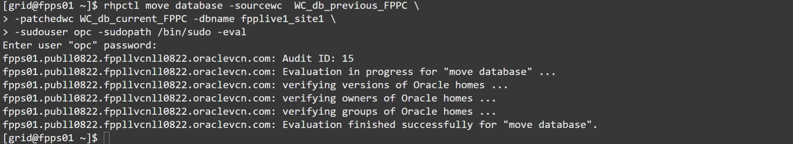
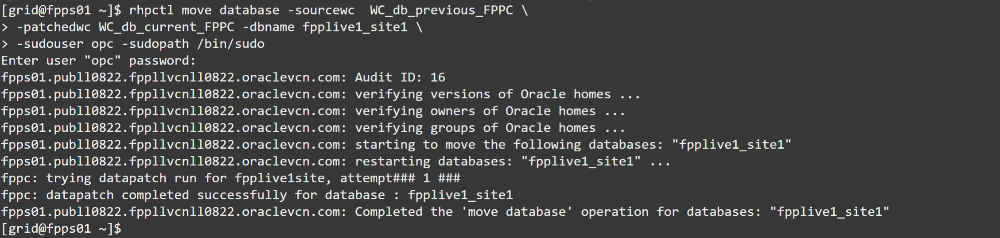
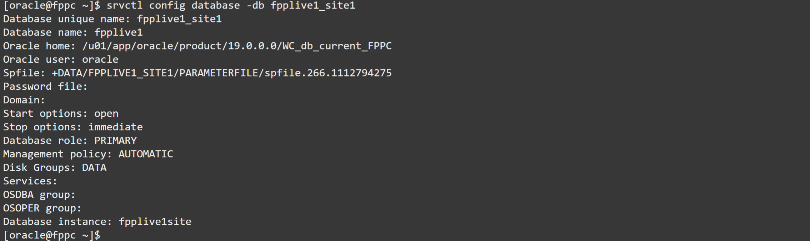

# Patch the database

## Introduction

As explained in the lab *Install the Oracle Database homes (working copies)* , FPP implements out-of-place patching.
From the command line point of view, this is achieved by passing the **source working copy** (the non-patched Oracle Home) and the **target working copy** (the patched Oracle Home). Again, FPP knows where these two working copies are, so there is no need to pass the target nodes.

Along with these two parameters, you can pass a **list of databases** (by default all the databases hosted in the source working copy are patched).

FPP detects automatically the type of deployment (cluster or single node), type of database (RAC, RAC One Node or Single Instance), missing patches on the target working copy, etc.

If the database is in RAC mode (it is not the case in this workshop), FPP relocates gracefully the services and move one instance at the time to the new home, then runs datapatch at the end.
Again, this is achieved with a single line of code.

Estimated lab time: 10 minutes

### Objectives
In this lab, you will:
- Run the patching evaluation
- Patch the database
- Verify that the DB is patched and running in the new Oracle Home

### Prerequisites
- A Free Tier, Paid or LiveLabs Oracle Cloud account
- SSH Private Key to access the host via SSH
- You have completed:
      - Lab: Generate SSH Keys (Free-tier and Paid Tenants only)
      - Lab: Create the environment with Resource Manager (Free-tier and Paid Tenants only)
      - Lab: Get the Public IP of the FPP Server (Livelabs Tenant only)
      - Lab: Get Acquainted with the Environment and the rhpctl Command line tool
      - Lab: Import Gold Images
      - Lab: Provision an Oracle Restart environment
      - Lab: Install the Oracle Database homes (working copies)
      - Lab: Provision a new database

## Task 1: Run the patching evaluation
Like all the disruptive FPP commands, `rhpctl move database` can be run with the `-eval` switch to evaluate the basic requirements before executing the actual patching.
It is recommended to use `-eval` whenever possible. For patching, it is a good idea to run it hours or days before the intervention, so that any errors or missing requirements can be fixed in time.

1. Run the following command: password is always FPPll##123 unless you have changed it

    ```
    rhpctl move database -sourcewc  WC_db_19_9_0_FPPC \
    -patchedwc WC_db_19_10_0_FPPC -dbname fpplive1_site1 \
    -sudouser opc -sudopath /bin/sudo -eval
    ```
    

  Because you have specified the correct groups when adding the working copy, this command succeeds.
  Otherwise, you might have seen an error similar to this:

    ```
    fpps01.pub.fpplivelab.oraclevcn.com: verifying groups of Oracle homes ...
    fpps01.pub.fpplivelab.oraclevcn.com: PRGO-1774 : The evaluation revealed potential failure for command "move database".
    PRGO-1619 : The groups "OSOPER=oper" of the source home are not configured in the patched working copy.\nPRGO-1618 : The groups "OSBACKUP=backupdba,OSDG=dgdba,OSKM=kmdba,OSRAC=racdba" of the source home do not match the groups "OSBACKUP=dba,OSDG=dba,OSKM=dba,OSRAC=dba" of the patched working copy.
    ```

## Task 2: Patch the database
1. The command is the same as before, but without the `-eval` switch:

    ```
    rhpctl move database -sourcewc  WC_db_19_9_0_FPPC \
    -patchedwc WC_db_19_10_0_FPPC -dbname fpplive1_site1 \
    -sudouser opc -sudopath /bin/sudo
    ```
  


## Task 3: Verify that the DB is patched and running in the new Oracle Home
1. Connect to the target node as `oracle`:

    ```
    ssh opc@fppc
    ```

    ```
    sudo su - oracle
    ```
  


2. Set the environment:

    ```
    [oracle@fppc ~]$ . oraenv
    ORACLE_SID = [oracle] ? fpplive1site
    The Oracle base has been set to /u01/app/oracle
    ```
  

3. Verify the Oracle Restart configuration for the database:

    ```
    srvctl config database -db fpplive1_site1
    ```
  

  It is running in the new Oracle Home, the `srvctl` configuration has been adapted as well!

4. Let's see the patching level:

    ```
    sqlplus / as sysdba
    ```
    

    ```
    set lines 220
    ```

    ```
    select PATCH_ID, PATCH_UID, STATUS, DESCRIPTION from DBA_REGISTRY_SQLPATCH;
    ```

   ```
    exit
    ```
    

From the output you can see that the Database has been patched correctly.

Congratulations! You have completed all the labs in this workshop. We hope you have liked it!

## Acknowledgements

- **Author** - Ludovico Caldara
- **Contributors** - Kamryn Vinson
- **Last Updated By/Date** -  Kamryn Vinson, May 2021