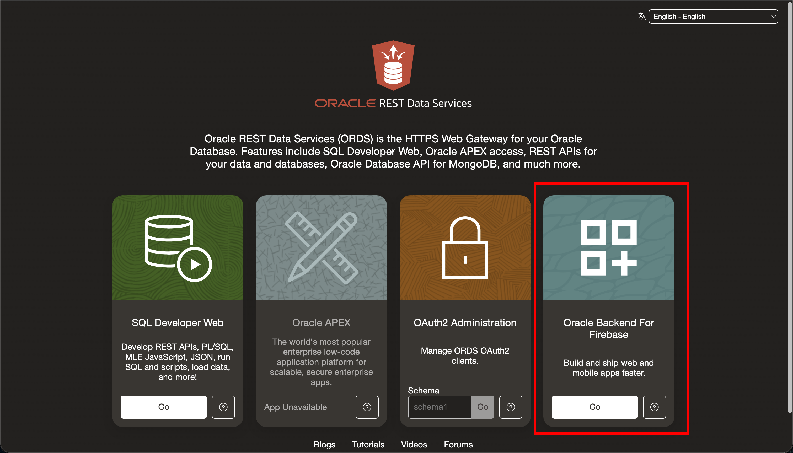

# Create Your First Project

## Introduction

This lab will walk you though the Oracle Backend for Firebase console and it will show you how to create your first project. In Oracle Backend for Firebase, a project is like a container for the different applications that you want to create.


### Objectives

In this lab, you will:

- Open Oracle Backend for Firebase Anywhere console
- Sign in to the console
- Create your first project
- Learn about the conosole

Estimated Time: 10 minutes

## Task 1: Create your first project

1. From the workshop page, click **Go** to open Oracle Backend for Firebase Anywhere.

    


2. Sign in to the Oracle Backend for Firebase Anywhere console with the workshop credentials.

    Use these workshop credentials:

    - Username: **`testuser`**
    - Password: **`testpwd`**

    

3. This is the Oracle Backend for Firebase landing page. Click **Create project** to create your first project.

    

4. In the **Create Project** dialog:

    - enter a project name such as `recipe-workshop`
    - select **Set up using quickstart**
    - leave **Set up authentication for me** and **Set up storage for me** selected
    - click **Create Project**

    

   > This step creates the Fusabase project. A project is like a container for the different applications that you want to create. To learn more about projects, read about them in the docs. [Update link to docs.]

5. This is the Oracle Backend for Firebase Anywhere project home page after the project is created. The left hand nav menu shows the different 'services' that Oracle Backend for Firebase supports. Those services are
    * Authentication
    * Database
    * Storage
    * App Trust

    This specific workshop covers the first three. If you are interested in reading the docs, see the links above to the lates docs

    

## Task 2: Set starter security rules

1. Now we're going to set some basic security rules for the start of the workshop. We will revisit this in Lab 7 and learn about the security rules in more detail.

2. Open the project that you created in Task 1, then click **Database** in the left navigation.

    This gets you to the Database workspace for your project.

    

3. Click the **Security rules** tab along the top and replace the current rule with this rule, then click **Publish changes**.

    ```text
    <copy>match /{document=**} { allow read, write: if true;}</copy>
    ```

    

4. Again, this rule will act as a placeholder. A detailed explination of security rules will happen in Lab 7.

5. Now do the same thing for Storage. Click **Storage** in the left navigation, click the **Security rules** tab, replace the current rule with this rule, then click **Publish changes**.

    ```text
    <copy>match /{document=**} { allow read, write: if true;}</copy>
    ```

    

6. Leave the Oracle Backend for Firebase Anywhere console open and proceed to the next lab.

## Appendix

1. Use these workshop credentials for this lab:

    - Username: **`testuser`**
    - Password: **`testpwd`**

## Acknowledgements

* **Author** - Killian Lynch, Senior Product Manager, Oracle AI Database
* **Contributors** -
* **Last Updated By/Date** - Killian Lynch, May 2026
