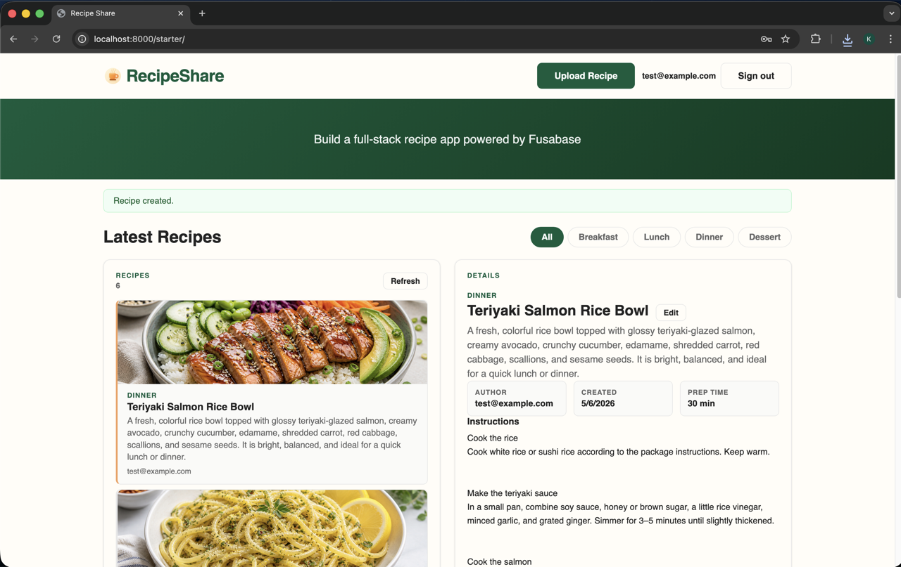

# Build a Recipe App with Fusabase

## Introduction

In this workshop, you will build a recipe sharing web app powered by Fusabase.

### Objectives

In this workshop, you will:

- Create a Project in the console
- Build a web app
- Read and Write Data Using the Fusabase JavaScript SDK
- Add Sign-Up and Sign-In with Fusabase Authentication
- Upload Photos with Fusabase File Storage
- Secure Your App Data with Fusabase Security Rules

Estimated Workshop Time: 75 minutes

## Task 1: Review the workshop overview

1. In this workshop, you will build a recipe sharing web app with three core services.

    - **Database** stores recipes and rating data.
    - **Authentication** manages sign-up, sign-in, and session state.
    - **File Storage** stores one image for each recipe.

2. Before you continue, you will need a code editor.

    The examples in this workshop use VS Code, but any code editor will work.

3. Keep these learning goals in mind as you move through the labs.

    - In Lab 1, you will set up the workshop environment, and create your first Fusabase project.
    - In Lab 2, you will connect the starter web app to your project.
    - In Lab 3, you will learn how to read data.
    - In Lab 4, you will learn how to add auth to your web app so users can sign up, sign in, and sign out.
    - In Lab 5, you will learn how to write data.
    - In Lab 6, you will learn how to use file storage.
    - In Lab 7, you will update security rules to protect your data.

## Acknowledgements

* **Author** - Killian Lynch, Senior Product Manager, Oracle AI Database
* **Contributors** - 
* **Last Updated By/Date** - Killian Lynch, April 2026
