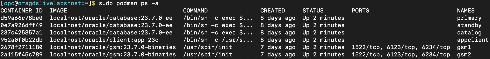
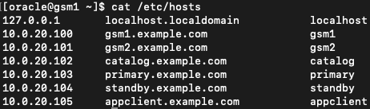
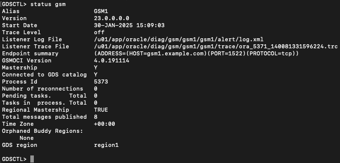
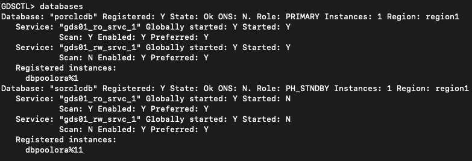
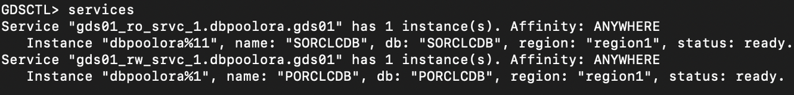
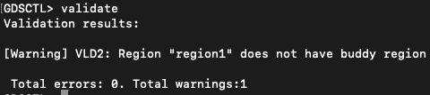
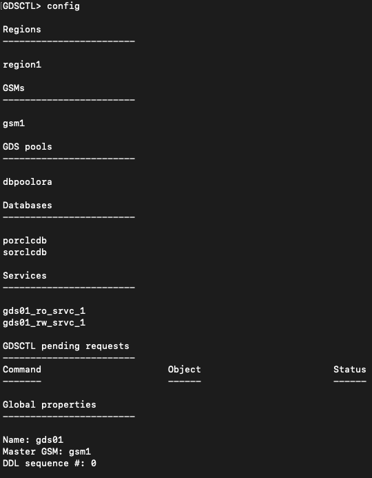
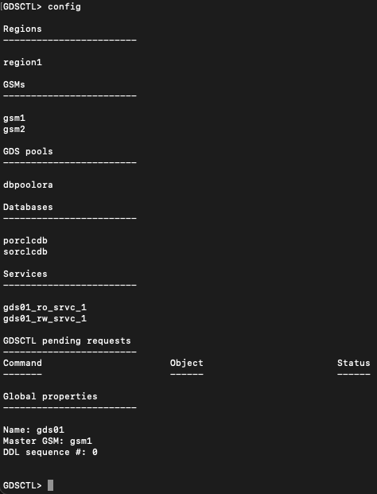

# Oracle GDS Configuration

## Introduction
Now that the databases have been prepared in the previous lab "Database Updates for Enabling GDS," it's time to configure Oracle GDS to enable Global Services using GDSCTL.

Estimated Time: 30 Minutes

**Objectives**

In this lab, you will:

* Use GDSCTL to configure databases and GSMs and create Global Services for application use.
* Test database connections using Global Services to verify the GDS configuration.

**Prerequisites**

Before starting this lab, ensure that you have:
* A Free Tier, Paid, or LiveLabs Oracle Cloud account.
* Successfully completed the following prerequisite labs::
    * Lab: Validate Workshop Environment
    * Lab: GDS Installation
    * Lab: Database Updates to Enable GDS

## Task 1: Verify Podman Container Status & Connect to gsm1

1.  Check the status of Podman containers (Ensure all required containers are running):

    ```nohighlighting
    <copy>
    sudo podman ps -a
    </copy>
    ```

    

2.  Access the gsm1 container from the terminal:

    ```nohighlighting
    <copy>
    sudo podman exec -i -t gsm1 /bin/bash
    </copy>
    ```

3.  Verify /etc/hosts file:
    ```nohighlighting
    <copy>
    cat /etc/hosts
    </copy>
    ```
    

## Task 2: Configure GDS with Databases, Create Global Services, and Validate

**Step 1: Configure GDS for the LiveLab Environment**
 
1.	Launch GDSCTL:
    ```nohighlighting
    <copy>
    gdsctl
    </copy>
    ```

2.	set gsm to gsm1:
    ```nohighlighting
    <copy>
    set gsm -gsm gsm1
    </copy>
    ```

3.	Verify connectivity to the databases:
    - GDS Catalog:
    ```nohighlighting
    <copy>
    connect gsmcatuser/Oracle_23ai@catalog.example.com:1521/CAT1PDB;
    </copy>
    ```

    - Primary Database:
    ```nohighlighting
    <copy>
     connect gsmuser/Oracle_23ai@primary.example.com:1521/ORCLPDB1;
     </copy>
    ```

    - Standby Database: 
    ```nohighlighting
    <copy>
    connect gsmuser/Oracle_23ai@standby.example.com:1521/ORCLPDB1;
    </copy>
    ```

4.	Reconnect to the catalog database (as all GDSCTL steps must be executed from the catalog):
    ```nohighlighting
    <copy>
    connect gsmcatuser/Oracle_23ai@catalog.example.com:1521/CAT1PDB;
    </copy>
    ```

5.	Configure the GDS Driver and Display Configuration:
    ```nohighlighting
    <copy>
    configure -driver oci
    configure -show
    </copy>
    ```


**Step 2: Create the GDS Catalog and Add GSM Instances**
 
1.	Create the GDS catalog:
    ```nohighlighting
    <copy>
    create gdscatalog -database "(DESCRIPTION=(CONNECT_TIMEOUT=90)(RETRY_COUNT=50)(RETRY_DELAY=3)(TRANSPORT_CONNECT_TIMEOUT=3)(ADDRESS_LIST=(LOAD_BALANCE=ON)(ADDRESS=(PROTOCOL=TCP)(HOST=catalog.example.com)(PORT=1521)))(CONNECT_DATA=(SERVICE_NAME=CAT1PDB)))" -user gsmcatuser/Oracle_23ai -region region1 -configname gds01 -autovncr off
    </copy>
    ```

2.	Add gsm1 to the GDS configuration:
    ```nohighlighting
    <copy>
    add gsm -gsm gsm1 -catalog "(DESCRIPTION=(CONNECT_TIMEOUT=90)(RETRY_COUNT=50)(RETRY_DELAY=3)(TRANSPORT_CONNECT_TIMEOUT=3)(ADDRESS_LIST=(LOAD_BALANCE=ON)(ADDRESS=(PROTOCOL=TCP)(HOST=catalog.example.com)(PORT=1521)))(CONNECT_DATA=(SERVICE_NAME=CAT1PDB)))" -region region1 -pwd Oracle_23ai
    </copy>
    ```

3.	Save and start the GSM configuration:
    ```nohighlighting
    <copy>
    configure -save_config
    start gsm
    </copy>
    ```
 
**Step 3: Add Database Hosts to the GDS Configuration**
1.  For each database get the ip address and add those to the GDS configuration:

    ```nohighlighting
    <copy>
    # For the Catalog Database:
    add invitednode 10.0.20.102

    # For the Primary Database:
    add invitednode 10.0.20.103

    # For the Standby Database:
    add invitednode 10.0.20.104
    </copy>
    ```

2. Verify the list of database hosts used in GDS:
    ```nohighlighting
    <copy>
    config vncr
     </copy>
    ```
Ensure that the three IP addresses listed above appear in the output.

3.	Verify the GSM configuration:
    ```nohighlighting
    <copy>
    config gsm
     </copy>
    ```

4.	Exit and restart GDSCTL:
    ```nohighlighting
    <copy>
    exit
    gdsctl
     </copy>
    ```

5.	Validate GSM status:
    ```nohighlighting
    <copy>
    status gsm
    validate
    </copy>
    ```
Expected output:
"Total errors: 0. Total warnings: 4"
6.	Display the current configuration:
    ```nohighlighting
    <copy>
    config
    </copy>
    ```

**Step 4: Register Databases with GDS**
 
**Note** that 23ai onwards, add database replaces add brokerconfig.
 
1.  Add the Primary Database:
    ```nohighlighting
    <copy>
    add database -connect 10.0.20.103:1521/PORCLCDB -region region1 -gdspool dbpoolora -pwd Oracle_23ai -savename
    </copy>
    ```

2.  Add the Standby Database:
    ```nohighlighting
    <copy>
    add database -connect 10.0.20.104:1521/SORCLCDB -region region1 -gdspool dbpoolora -pwd Oracle_23ai -savename
    </copy>
    ```
 
**Step 5: Create and Start Global Services**
 
1.	Create a Read-Write Service for the Primary Database:
    ```nohighlighting
    <copy>
    add service -gdspool dbpoolora -service gds01_rw_srvc_1 -preferred_all -role primary -pdbname ORCLPDB1
    </copy>
    ```
2.	Start the Read-Write Service:
    ```nohighlighting
    <copy>
    start service -service gds01_rw_srvc_1
    </copy>
    ```
3.	Create a Read-Only Service for the Standby Database:
    ```nohighlighting
    <copy>
    add service -gdspool dbpoolora -service gds01_ro_srvc_1 -preferred_all -role physical_standby -pdbname ORCLPDB1
    </copy>
    ```
4.	Start the Read-Only Service:
    ```nohighlighting
    <copy>
    start service -service gds01_ro_srvc_1
    </copy>
    ```

**Step 6: Verify the GDS Configuration**
 
1.	Check GSM status:
    ```nohighlighting
    <copy>
    status gsm
    </copy>
    ```
    

 
 
2.	Check databases status:
    ```nohighlighting
    <copy>
    databases
    </copy>
    ```
    
 
3.	Check services status:
    ```nohighlighting
    <copy>
    services
    </copy>
    ```
    
 
4.	Use validate command to validate GDS configuration:
    ```nohighlighting
    <copy>
    validate
    </copy>
    ```
    
 
 
5.	Check overall configuration
    ```nohighlighting
    <copy>
    config
    </copy>
    ```
    
 
6.	Use the “gdsctl” command to display help
    ```nohighlighting
    <copy>
    help
    </copy>
    ```

    Use “gdsctl <command> -help” to obtain detailed help on GDSCTL commands
 

##  Task 3: Verify Database Connections Using GDS Services
 
**Step 1: Connect to the Read-Write Global Service Using gsm1**
 
1.	Access the gsm1 container:
    ```nohighlighting
    <copy>
    sudo podman exec -it gsm1 /bin/bash
    </copy>
    ```
2.	Connect to the Read-Write Global Service using sqlplus (Global service connections can be used by the application):
    ```nohighlighting
    <copy>
    sqlplus gsmuser/Oracle_23ai@gsm1.example.com:1522/gds01_rw_srvc_1.dbpoolora.gds01;
    </copy>
    ```
3.	Exit the gsm1 container:
    ```nohighlighting
    <copy>
    exit
    </copy>
    ```


**Step 2: Connect to the Read-Only Global Service Using gsm1**
 
1.	Access the gsm1 container:
    ```nohighlighting
    <copy>
    sudo podman exec -it gsm1 /bin/bash
    </copy>
    ```
2.	Connect to the Read-Only Global Service using sqlplus (Global service connections can be used by the application):
    ```nohighlighting
    <copy>
    sqlplus gsmuser/Oracle_23ai@gsm1.example.com:1522/gds01_ro_srvc_1.dbpoolora.gds01;
    </copy>
    ```
3.	Exit the gsm1 container:
    ```nohighlighting
    <copy>
    exit
    </copy>
    ```

**Step 3: Connect to a Local Service on the Catalog Database Using gsm1**
 
1.	Access the gsm1 container:
    ```nohighlighting
    <copy>
    sudo podman exec -it gsm1 /bin/bash
    </copy>
    ```
2.	Connect to the catalog's local service (GSM services can also be accessed from other Podman containers, such as appclient):
    ```nohighlighting
    <copy>
    sqlplus gsmcatuser/Oracle_23ai@gsm1.example.com:1522/GDS\$CATALOG.gds01;
    </copy>
    ```
3.	Exit the gsm1 container:
    ```nohighlighting
    <copy>
    exit
    </copy>
    ```
Note: GSM services can be accessed from any Podman container, such as the appclient container, for testing and application integration.
 
 
## Task 4: Add gsm2 to the GDS Configuration (Optional)
 
If you have already installed GDS on gsm2 (as described in Task 5 of the "GDS Install" Lab), you can now add gsm2 to the GDS configuration.
 
1.	Access the gsm2 Podman container:
    ```nohighlighting
    <copy>
    sudo podman exec -it gsm2 /bin/bash
    </copy>
    ```
2.	Launch GDSCTL and set GSM to gsm2:
    ```nohighlighting
    <copy>
    gdsctl
    set gsm -gsm gsm2
    </copy>
    ```
3.	Add gsm2 to the GDS configuration:
    ```nohighlighting
    <copy>
    add gsm -gsm gsm2 -catalog "(DESCRIPTION=(CONNECT_TIMEOUT=90)(RETRY_COUNT=50)(RETRY_DELAY=3)(TRANSPORT_CONNECT_TIMEOUT=3)(ADDRESS_LIST=(LOAD_BALANCE=ON)(ADDRESS=(PROTOCOL=TCP)(HOST=catalog.example.com)(PORT=1521)))(CONNECT_DATA=(SERVICE_NAME=CAT1PDB)))" -region region1 -pwd Oracle_23ai
    </copy>
    ```
4.	Save the configuration and start gsm2:
    ```nohighlighting
    <copy>
    configure -save_config
    start gsm
    </copy>
    ```
5.	Verify that both gsm1 and gsm2 are now part of the GDS configuration:
    ```nohighlighting
    <copy>
    config gsm
    config
    </copy>
    ```
6.	Exit the gsm2 container:
    ```nohighlighting
    <copy>
    exit
     </copy>
    ```
    
 
This completes GDS configuration and validation tasks.

You may now **proceed to the next lab**.


## Acknowledgements
* **Authors** - Ajay Joshi, Ravi Sharma, Distributed Database Product Management
* **Contributors** - Vibhor Sharma, Jyoti Verma, Param Saini, Distributed Database Product Management
* **Last Updated By/Date** - Ajay Joshi, March 2025