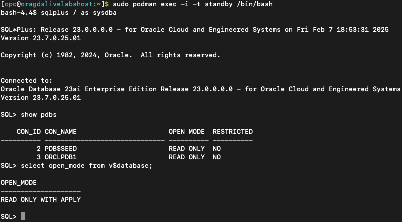

# Database Updates for Enabling GDS

##  Introduction

Before configuring GDS using GDSCTL, each database must be GDS-enabled. In this lab, we will execute shell scripts containing the necessary SQL commands for database configuration.

Estimated Time: 15 Minutes

**Objectives**

In this lab, you will:

* Configure each database by executing the required commands as SYSDBA.
* Verify that the databases are ready for GDS configuration, which will be performed using GDSCTL in the next lab.

**Prerequisites**

Before starting this lab, ensure that you have:
* A Free Tier, Paid, or LiveLabs Oracle Cloud account.
* Successfully completed the following prerequisite labs:
    * Lab: Validate Workshop Environment
    * Lab: GDS Installation

## Task 1: Configure the Catalog Database
Before proceeding with GDS configuration, the GDS Catalog Database must be prepared. The GDS Catalog database can be a standalone or shared database and will contain the GDS catalog (a repository of metadata about the GDS configuration such as regions, database pools, global services, etc.).

This task ensures that the database is properly configured before running the CREATE GDSCATALOG command, which will be executed later from gsm1.


**What This Configuration Does**

You will run the script configure_catalog.sh. This script performs the following tasks on the GDS Catalog database:
*   Unlocks GSMCATUSER on both CDB and PDB of the catalog database.
*   Enables ARCHIVELOG, FLASHBACK, and FORCE LOGGING if not enabled.
*   Restarts database in READ WRITE mode.


**Steps to Configure the Catalog Database**

1.	Access the Catalog Database container:
    ```nohighlighting
    <copy>
    sudo podman exec -it catalog /bin/bash
    </copy>
    ```
2.	View the contents of configure_catalog.sh (No modifications are required for this LiveLab task):
    ```nohighlighting
    <copy>
    cat configure_catalog.sh
    </copy>
    ```
3.	Execute the script to apply the necessary configurations:
    ```nohighlighting
    <copy>
    ./configure_catalog.sh
    </copy>
    ```
4.	Exit the container session:
    ```nohighlighting
    <copy>
    exit
    </copy>
    ```

## Task 2: Configure the Primary Database for the Application
Before proceeding with GDS configuration, the Primary Database must be prepared. This task ensures that the database is properly configured before the ADD DATABASE command is executed later from gsm1.


**What This Configuration Does**
 
You will run the script configure_primary.sh, which performs the following tasks:

*   Unlocks GSMUSER in both the CDB and PDB of the primary database.
*   Unlocks GSMROOTUSER in the CDB only of the primary database.
*   Enables ARCHIVELOG, FLASHBACK, and FORCE LOGGING (if not already enabled).
*   Restarts the database in READ WRITE mode.


**Steps to Configure the Primary Database**
 
1.	Access the Primary Database container:
    ```nohighlighting
    <copy>
    sudo podman exec -it primary /bin/bash
    </copy>
    ```
2.	View the contents of configure_primary.sh (No modifications are required for this LiveLab task):
    ```nohighlighting
    <copy>
    cat configure_primary.sh
    </copy>
    ```
3.	Execute the script to apply the necessary configurations:
    ```nohighlighting
    <copy>
    ./configure_primary.sh
    </copy>
    ```
4.	Exit the container session:
    ```nohighlighting
    <copy>
    exit
    </copy>
    ```

## Task 3: Verify the Standby Database for Application Data

Although no updates are required for the standby database at this stage, you can verify that its PDB is in READ ONLY mode.

**Steps to Verify the Standby Database**
 
1.	Access the Standby Database container:
    ```nohighlighting
    <copy>
    sudo podman exec -it standby /bin/bash
    </copy>
    ```
2.	Log in as SYSDBA and verify the PDB open mode:
    ```nohighlighting
    <copy>
    sqlplus / as sysdba
    </copy>
    ```
3.	Check the status of all PDBs:
    ```nohighlighting
    <copy>
    show pdbs
    </copy>
    ```
4.	Confirm that the database is in READ ONLY mode:
    ```nohighlighting
    <copy>
    select name, open_mode from v$database;
    </copy>
    ```
5.	Exit the SQL session and container:
    ```nohighlighting
    <copy>
    exit
    </copy>
    ```
    

## Conclusion
 
Database Configuration Completed.

This concludes the database configuration tasks.

**Note**: It is recommended to review the contents of each database script to understand the key configuration elements required before proceeding with GDSCTL setup. Now that GSM is installed, you are ready to move on to the next lab: Oracle GDS Configuration

You may now **proceed to the next lab**


## Acknowledgements
* **Authors** - Ajay Joshi, Ravi Sharma, Distributed Database Product Management
* **Contributors** - Vibhor Sharma, Jyoti Verma, Param Saini, Distributed Database Product Management
* **Last Updated By/Date** - Ajay Joshi, March 2025