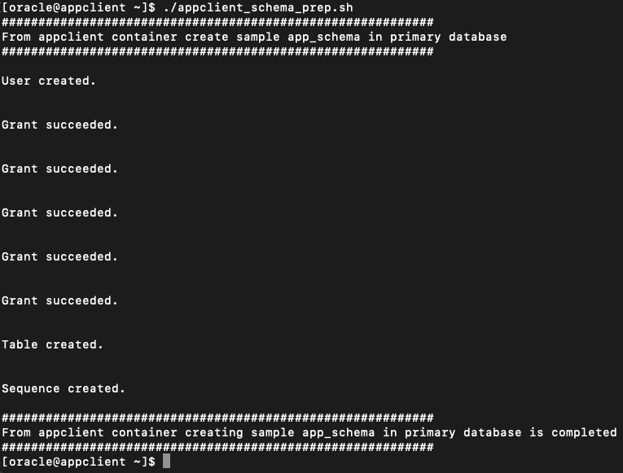
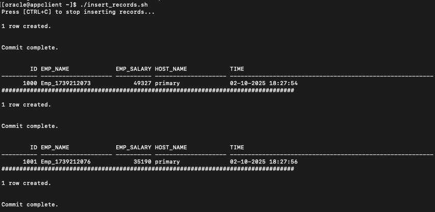

# Prepare a Sample Schema and Test Global Service

## Introduction

Now that GDS Global Services are configured, they can be used in database connection strings. These connection strings can be utilized from various client applications, including SQL, PL/SQL, Java, Python, and more.

Estimated Lab Time: 15 Minutes

**Objectives**

In this lab, you will:

* Use a Global Services connection for database access.
* Create a sample schema for testing.
* Execute a sample shell script from the appclient container to insert records.
* Prepare a JDBC connection string using a Global Service for Java-based applications.

**Prerequisites**

Before starting this lab, ensure that you have:
* A Free Tier, Paid, or LiveLabs Oracle Cloud account.
* Successfully completed the following prerequisite labs:
    * Lab: Validate Workshop Environment
    * Lab: GDS Installation
    * Lab: Database Updates to Enable GDS
    * Lab: GDS Configuration Using GDSCTL

## Task 1: Create a Schema from the appclient Podman Container

**Step 1: Access the appclient Container**
 
1.  Open a new terminal window and ensure you are logged in as the oracle user.
2.  Run the following command to access the appclient container:
    ```nohighlighting
    <copy>
    sudo podman exec -i -t appclient /bin/bash
    </copy>
    ```

3.  Switch to the oracle user inside the container:
    ```nohighlighting
    <copy>
    su - oracle
    </copy>
    ```

**Step 2: Prepare app_schema Using a Global Service**
 
1.  View the contents of the schema preparation script:
    ```nohighlighting
    <copy>
    cat appclient_schema_prep.sh
    </copy>
    ```
2.  Execute the script to create app_schema:
    ```nohighlighting
    <copy>
    ./appclient_schema_prep.sh
    </copy>
    ```

**Step 3: Verify Schema Creation Output**
 
-   Review the output to confirm that app_schema has been successfully created.

    

## Task 2: Insert Records into app_schema.emp Table from the appclient Podman Container

**Step 1: View the Script Contents**

We are using a Global Service connection in the script insert\_records.sh, which continuously inserts records into the app\_schema.emp table.

1.  To review the script contents, run:

    ```nohighlighting
    <copy>
    cat insert_records.sh
    </copy>
    ```

**Step 2: Run the Script**

1.  Execute the script to start inserting records:

    ```nohighlighting
    <copy>
    ./insert_records.sh
    </copy>
    ```

**Step 3: Verify the Inserted Records**

*   Review the script output to confirm that records are successfully inserted into the app_schema.emp table.
*   The "HOST_NAME" value in the result should indicate the primary database in the Data Guard configuration, which is currently set to primary.
*   The Global Service automatically connects to the current primary database.
    

This result shows the "HOST_NAME" value as primary database in Data-Guard configuration which is currently set to "primary". Global service connects with the current primary database.


## Task 3. Test Global Service Connection String with Both GSMs (For Load Balancing & Disaster Recovery)
**Step 1: Connect to app_schema Using the Global Service Connection String**
 
1.  To enable load balancing and disaster recovery, connect to app_schema using the Global Service connection string that includes both gsm1 and gsm2:

    ```nohighlighting
    <copy>
    sqlplus app_schema/Oracle_23ai@'
    (DESCRIPTION=
        (FAILOVER=ON)
        (CONNECT_TIMEOUT=5)
        (TRANSPORT_CONNECT_TIMEOUT=3)
        (RETRY_COUNT=3)
        (ADDRESS_LIST=
            (ADDRESS=(HOST=gsm1.example.com)(PORT=1522)(PROTOCOL=tcp))
            (ADDRESS=(HOST=gsm2.example.com)(PORT=1522)(PROTOCOL=tcp))
        )
        (CONNECT_DATA=(SERVICE_NAME=gds01_rw_srvc_1.dbpoolora.gds01))
    )';
    </copy>
    ```

**Step 2: (Optional) Connect an Application Using a JDBC URL for Global Service**
1.  For **Java-based applications**, you can use the following **JDBC connection URL** to connect via the Global Service gds01\_rw_srvc\_1.dbpoolora\.gds01:

    ```nohighlighting
    <copy>
    jdbc:oracle:thin:@(
        (DESCRIPTION=
            (FAILOVER=ON)
            (CONNECT_TIMEOUT=5)
            (TRANSPORT_CONNECT_TIMEOUT=3)
            (RETRY_COUNT=3)
            (ADDRESS_LIST=
                (ADDRESS=(HOST=gsm1.example.com)(PORT=1522)(PROTOCOL=tcp))
                (ADDRESS=(HOST=gsm2.example.com)(PORT=1522)(PROTOCOL=tcp))
            )
            (CONNECT_DATA=(SERVICE_NAME=gds01_rw_srvc_1.dbpoolora.gds01))
        )
    )
    </copy>
    ```

**Note:** This Global Service JDBC URL allows applications to connect to the Oracle database via the Global Service, ensuring high availability and failover support.
 
##  Conclusion

Successfully tested the Global Service connection with both GSMs for load balancing and disaster recovery.

Verified database access using a Global Service connection from SQL.

This completes the Global Service usage and verification. You may now proceed to the next lab.

You may now **proceed to the next lab**.

## Acknowledgements
* **Authors** - Ajay Joshi, Ravi Sharma, Distributed Database Product Management
* **Contributors** - Vibhor Sharma, Jyoti Verma, Param Saini, Distributed Database Product Management
* **Last Updated By/Date** - Ajay Joshi, March 2025
