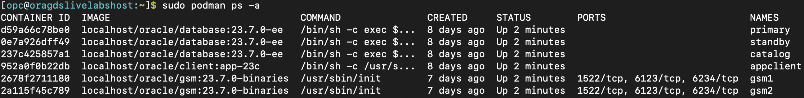
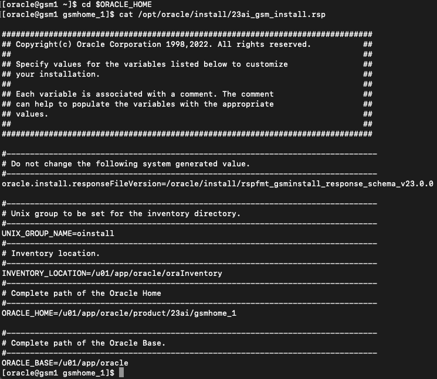
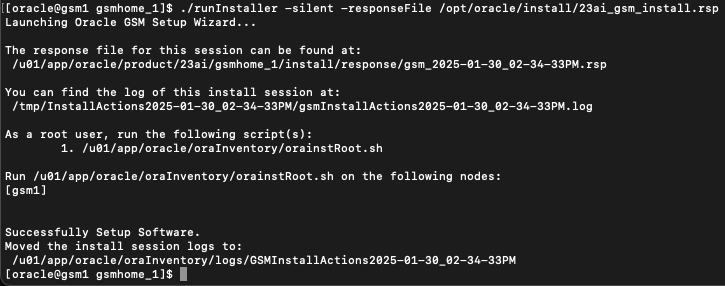
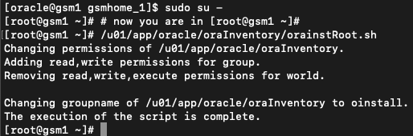
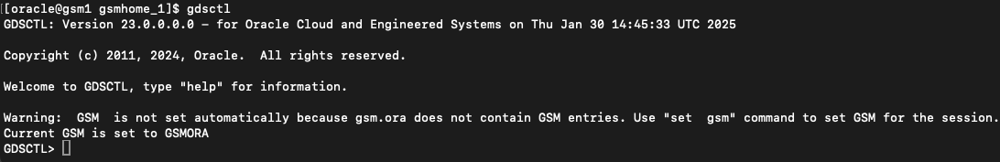

# Oracle GDS Installation

## Introduction

To manage the GDS environment, the Global Data Services Control Utility (GDSCTL) is used for setup, configuration, and administration.

Installing Oracle Global Data Services (GDS) involves two key steps:
1. Installing the Global Service Manager (GSM) software.
2. Creating a GDS catalog in either a new or an existing database.

Once installed, global services are configured within a target database pool, which typically consists of a primary database and one or more standby or replica databases.

Estimated Time: 15 Minutes

**Objectives**

In this section, you will:

* Prepare the GDS container(s) before install.
* Execute the GDS installation process.
* Verify the successful installation of GDS.

**Prerequisites**

Before starting this lab, ensure that you have:
* A Free Tier, Paid or LiveLabs Oracle Cloud account
* Completed the following prerequisite lab:
    * Lab: Validate Workshop Environment

**Additional Pre-requisites**

These prerequisites are already configured in this LiveLabs environment but may be required for non-LiveLabs GDS environments.

1. GDS requires the following ports to be open

    - Listener port:   Default 1522
    - Local ONS port:  Default 6123
    - Remote ONS port: Default 6234

2. Ensure consistent time zone settings across all machines/containers used for GDS and databases.

    - Example: If databases use UTC, but the Global Service Managers (GSMs) run on machines set to GMT, update the GSM machines to UTC to maintain synchronization. Note that the LiveLabs environment is already set to UTC, so no changes are needed.

3. All databases must have the same version and character set.
    
    - LiveLabs Configuration: The databases in this LiveLabs environment already meet this requirement, so no further action is required.

## Task 1: Verify Running Containers in Your VM
1. Open a terminal window and ensure you are logged in as the **oracle** user.
2. Execute the following command to list all containers:

    ```nohighlighting
    <copy>
    sudo podman ps -a
    </copy>
    ```

    
    
3. From the terminal connect to the **gsm1** container:

    ```nohighlighting
    <copy>
    sudo podman exec -i -t gsm1 /bin/bash
    </copy>
    ```
    This command opens an interactive bash session inside the gsm1 container.

## Task 2: GSM Pre-Installation Steps

1.  Verify ORACLE_HOME

    - The ORACLE\_HOME environment variable is already set to /u01/app/oracle/product/23ai/gsmhome_1
    ```nohighlighting
    <copy>
      echo $ORACLE_HOME
    </copy>
    ```
    - For GDS-related operations, this directory is referred to as gsmhome.

2.  Extract the GSM software
    
    - Run the following command to extract the GSM software zip file into the Oracle Home directory:
    ```nohighlighting
    <copy>
      unzip /opt/oracle/install/LINUX.X64_237000_gsm.zip -d $ORACLE_HOME
    </copy>
    ```

3.  Use the Default GDS Response File for Installation
    - The GDS installation utilizes the pre-configured response file 23ai\_gsm\_install.rsp without any modifications.
    - To review the response file, run:
    ```nohighlighting
    <copy>
    cd $ORACLE_HOME
    cat /opt/oracle/install/23ai_gsm_install.rsp
    </copy>
    ```
    


## Task 3: Install GSM Software

1. Access the gsm1 container (if not already inside):
    ```nohighlighting
    <copy>
    sudo podman exec -it gsm1 /bin/bash
    </copy>
    ```
2. Navigate to the Oracle Home Directory (if not already inside):
    ```nohighlighting
    <copy>
    cd $ORACLE_HOME
    </copy>
    ```
3.	Run the GSM Installation Command:
    ```nohighlighting
    <copy>
    ./runInstaller -silent -responseFile /opt/oracle/install/23ai_gsm_install.rsp
    </copy>
    ```

4.	Wait for the installation to complete (approximately 20 seconds)

    


## Task 4: Post-Installation Steps

1.  Run orainstRoot.sh as the root user:
    - Switch to the root user:
    ```nohighlighting
    <copy>
    sudo su -
    # now you are in [root@gsm1 ~]#
    </copy>
    ```
    - Execute the following script: 
    ```nohighlighting
    <copy>
    /u01/app/oracle/oraInventory/orainstRoot.sh
    </copy>
    ```
    - Verify the script output
    
    
2.  Modify /etc/oratab as the root user:

    - Append the following line to /etc/oratab: 
    ```nohighlighting
    <copy>
    echo 'gsm:/u01/app/oracle/product/23ai/gsmhome_1:N'  >> /etc/oratab
    </copy>
    ```
    - Verify that the line has been added by running:
    ```nohighlighting
    <copy>
    cat /etc/oratab
    </copy>
    ```
    - Exit the root session:
    ```nohighlighting
    <copy>
    exit
    </copy>
    ```
3.  Verify the output
    

## Task 5: Verify GDSCTL Installation

1.  Access the gsm1 container (if not already inside):

    ```nohighlighting
    <copy>
    sudo podman exec -it gsm1 /bin/bash
    </copy>
    ```

2.	Launch GDSCTL to confirm the installation:
    ```nohighlighting
    <copy>
    gdsctl
    </copy>
    ```

3.	Verify the GDSCTL prompt appears, then exit:
    ```nohighlighting
    <copy>
    exit
    </copy>
    ```

4.  The output would like as below:

    


## Task 6: (Optional) Install GDS on gsm2 for High Availability
For high availability, you can install GDS on "gsm2" container. To do so:

1.  Access the gsm2 container:
    ```nohighlighting
    <copy>
    sudo podman exec -it gsm2 /bin/bash
    </copy>
    ```

2.  Follow the same installation steps as gsm1:

    - Repeat Task 2, Task 3, and Task 4 inside the gsm2 container.

    
**Note:** Why Install GDS on Multiple GSM Containers?
    
If gsm1 becomes unavailable due to patching, maintenance, or an unplanned event, gsm2 will automatically take over as the primary GSM, ensuring continuous service availability. Multiple Global Service Managers (GSMs) enhance redundancy and fault tolerance. Once gsm2 is installed, it can be included in the database connection string for seamless failover.

## Conclusion

This completes the GDS installation tasks.

The next lab focuses on database updates required for enabling GDS.

You may now **proceed to the next lab**


## Acknowledgements
* **Authors** - Ajay Joshi, Ravi Sharma, Distributed Database Product Management
* **Contributors** - Vibhor Sharma, Jyoti Verma, Param Saini, Distributed Database Product Management
* **Last Updated By/Date** - Ajay Joshi, March 2025
