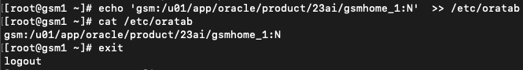

# GDS Installation


## GDS Installation Overview

A Global Data Services (GDS) installation can be done either before or after preparing the databases. We use terms GSM (Global Services Manager) to manage via setup involves the installation of Global Service Manager software and the creation of a GDS catalog in a new or existing database. Global services are configured on target database pools which consist of primary and standby or replica databases. Global Data Services Control Utility (GDSCTL) manages the GDS setup.

*Estimated Time*:  20 minutes

### Objectives

In this lab, you will:

* Prepare the GDS container(s) before install.
* Run GDS install.
* Verify GDS install.

### Prerequisites

This lab assumes you have:
* A Free Tier, Paid or LiveLabs Oracle Cloud account
* You have completed:
    * Lab: Validate workshop environment

*Additional Pre-requisites already taken care in this Live lab env* but those may be needed for non-Live-lab GDS env as below:

### 1. GDS uses three Ports and those must be opened

```nohighlighting
    a. The listener port   (default 1522)
    b. The local ons port  (default 6123)
    c. The remote ons port (default 6234)
```

### 2. Make sure that same Time Zone is used in all machines/containers for GDS and/or Databases

```nohighlighting
    e.g., If UTC is used for Databases, but machines for GSM(s) is using GMT. In such cases, set timezone to UTC on GSM machine(s) as well.
    This Live-Lab already set to use UTC, so no update needed.
```

### 3.  All Databases with same version and same character-set to be used. No update needed for this Live-Lab


## Task 1: Check for containers in your VM

1. Run the below command on terminal window that is logged in as **oracle** user.

```
<copy>
sudo podman ps -a
</copy>
```


2. From a terminal connect to **gsm1** container as below:

```
<copy>
sudo podman exec -i -t gsm1 /bin/bash
</copy>
```

## Task 2: GSM Pre-install steps

```
<copy>
# ORACLE_HOME is already set to /u01/app/oracle/product/23ai/gsmhome_1. It's also referred as *gsmhome* for GDS purposes.
unzip /opt/oracle/install/LINUX.X64_237000_gsm.zip -d $ORACLE_HOME
# For GDS install use its response file: 23ai_gsm_install.rsp without any updates.
cd $ORACLE_HOME
cat /opt/oracle/install/23ai_gsm_install.rsp
</copy>
```


## Task 3: Install GSM software

```
<copy>
# If you are not in [oracle@gsm1 gsmhome_1]$
sudo podman exec -it gsm1 /bin/bash
cd $ORACLE_HOME
# run install command
./runInstaller -silent -responseFile /opt/oracle/install/23ai_gsm_install.rsp
</copy>
```

Wait (for approx 20 seconds) till installation completes.


## Task 4: Post Install steps

1. Run orainstRoot.sh as a root user
```
<copy>
sudo su -
# now you are in [root@gsm1 ~]#
/u01/app/oracle/oraInventory/orainstRoot.sh
</copy>
```

2. Verify the output as below:


3. As a root user, edit /etc/oratab to add one line as below:

```
<copy>
# To log-in as a root user:
sudo su -
# now you are in [root@gsm1 ~]#
echo 'gsm:/u01/app/oracle/product/23ai/gsmhome_1:N'  >> /etc/oratab
# cat /etc/oratab to verify a new line has been added
cat /etc/oratab
exit
</copy>
```

4. Verify the output as below:



5. Run GDSCTL to confirm the successful installation.

```
<copy>
#If you are not in [oracle@gsm1 gsmhome_1]$ run below:
sudo podman exec -it gsm1 /bin/bash

# To see GDSCTL prompt
gdsctl
# after verify exit for now.
exit
</copy>
```

6. Verify the output as below:


## Task 5: From gsm2 container install GDS (optional)

Similarly, you can install GDS on "gsm2" container for high availability.
For that you can switch container to gsm2 as below:

```
<copy>
sudo podman exec -it gsm2 /bin/bash
</copy>
```

Follow the tasks 2, 3 and 4 as performed for gsm1.

Note: When gsm1 goes down for some reasons e.g. patching or for disaster recovery etc. scenarios, gsm2 will become master gsm to serve the application without any disruptions. Therefore, we can use more than one Global Service Managers (GSMs).
When gsm2 is installed, it can also be added to connect string which will test after database and GSM configurations are done.

This completes GDS installation tasks.  **Database updates for enabling GDS** is the next lab.

You may now **proceed to the next lab**
