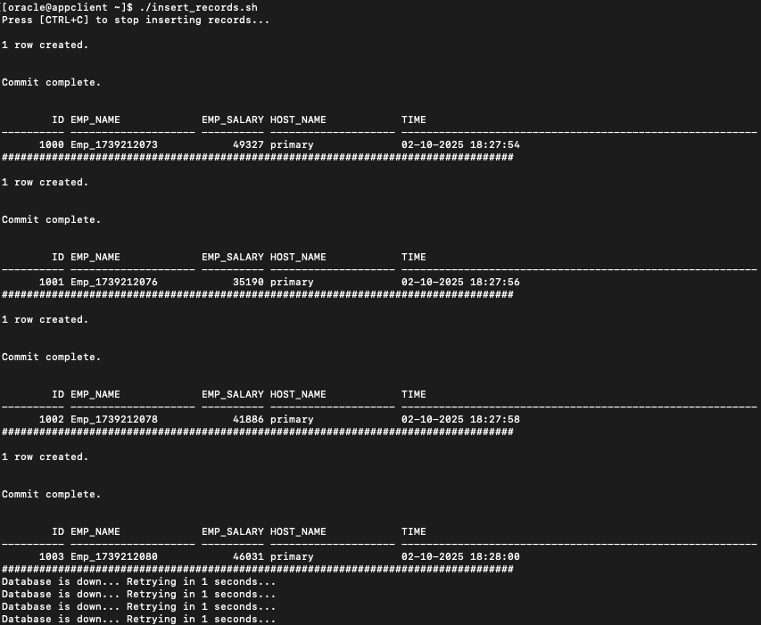
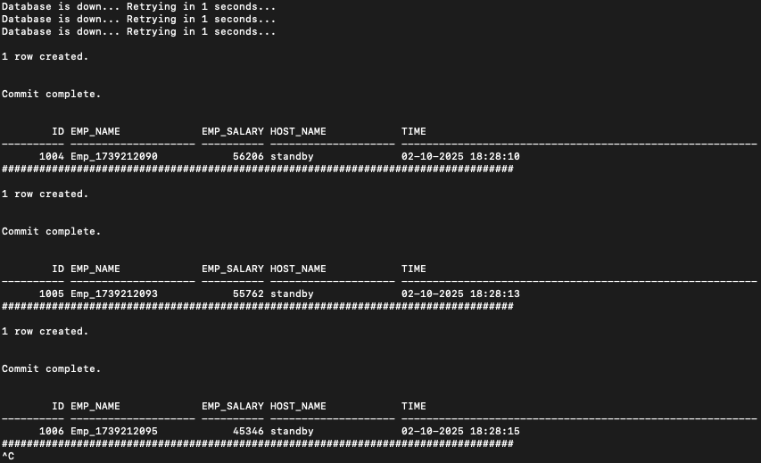
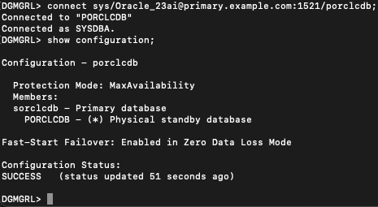
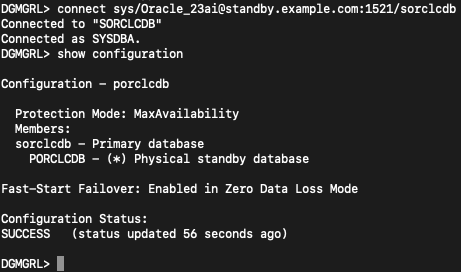
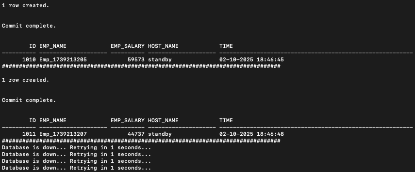
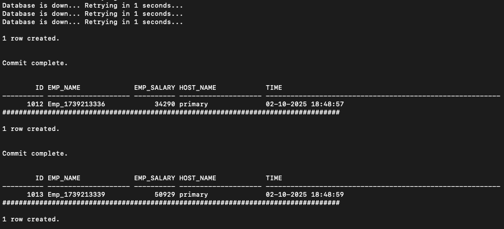
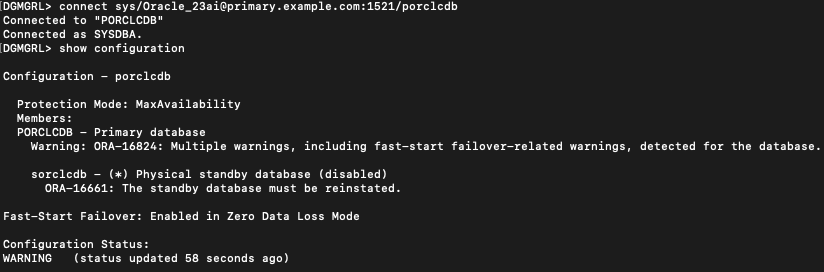
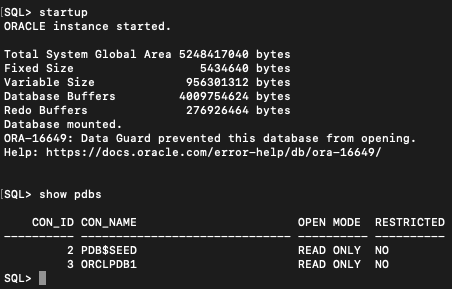
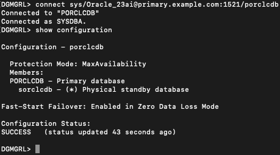

# Switchover and Failover Tests Using Global Services

## Introduction
Now that Global Services and Data Guard are configured (as per the previous lab), it’s time to test Switchover and Failover scenarios.
During these tests, application continuity should be maintained with zero data loss for connections using Global Services.

Estimated Time: 30 Minutes

**Objectives**

In this lab, you will:

* Use DGMGRL to perform and verify Switchover and Failover tests.
* Ensure the "insert record" script runs continuously without data loss during Switchover and Failover operations.

**Prerequisites**

Before starting this lab, ensure that you have:

* A Free Tier, Paid, or LiveLabs Oracle Cloud account.
* Successfully completed the following prerequisite labs:
    * Lab: Validate Workshop Environment
    * Lab: GDS Installation
    * Lab: Database Updates to Enable GDS
    * Lab: GDS Configuration Using GDSCTL
    * Lab: Prepare a Sample Schema and Test Global Service

## Task 1: Ensure insert_records.sh is Running Before Switchover

Before performing a Switchover from Primary to Standby, ensure that the insert\_records.sh script is running on the appclient container. This verifies that data insertion continues seamlessly during the transition.

**Steps to Start insert_records.sh on appclient**
 
1. Open another terminal window and access the appclient container:
    ```nohighlighting
    <copy>
    sudo podman exec -i -t appclient /bin/bash
    </copy>
    ```
2.  Switch to the oracle user inside the container:
    ```nohighlighting
    <copy>
    su - oracle
    </copy>
    ```
3.  Run the script to start continuous record insertion:
    ```nohighlighting
    <copy>
    ./insert_records.sh
    </copy>
    ```

## Task 2: Perform Switchover from Primary to Standby (sorclcdb)

**Step 1: Initiate the Switchover from Primary to Standby**
 
1.  Open a new terminal and connect to the primary container:
    ```nohighlighting
    <copy>
    sudo podman exec -it primary /bin/bash
    </copy>
    ```
2.  Launch Data Guard Manager (DGMGRL) and connect to the primary database:
    ```nohighlighting
    <copy>
    dgmgrl
    connect sys/Oracle_23ai@primary.example.com:1521/porclcdb
    </copy>
    ```
3.  Check the current Data Guard configuration:
    ```nohighlighting
    <copy>
    show configuration
    </copy>
    ```
4.  Perform the Switchover to Standby (sorclcdb):
    ```nohighlighting
    <copy>
    switchover to sorclcdb
    </copy>
    ```

**Step 2: Monitor Connection Errors During Switchover (From appclient)**
 
1.  Switch to the appclient container (where insert_records.sh is running):
    -   As the Switchover process begins, connection errors may briefly appear.
    -   The process typically completes within a few minutes but may take up to 3 minutes in this LiveLab environment.
2.  Wait for the Switchover to complete and observe that records begin inserting again, now using the new primary (sorclpdb).
3.  After the Switchover completes, verify that HOST_NAME now reflects the new primary database.
    

**Step 3: Verify the Switchover Completion**
 
1.  Confirm that records are being inserted again using the new primary database (sorclpdb).
2.  Check the value of ID before and after the Switchover:
    - The ID sequence should not skip, confirming a successful Switchover with zero data loss.

    


**Step 4: Validate Switchover to Standby (sorclcdb)**
 
1.  Ensure that the Switchover to sorclcdb (previously Standby) is complete.
    

**Step 5: (Optional) Verify from the Standby Container**
 
1. Access the standby container:
    ```nohighlighting
    <copy>
    sudo podman exec -it standby /bin/bash
    </copy>
    ```
2. Launch DGMGRL and connect to the standby database:
    ```nohighlighting
    <copy>
    dgmgrl
    connect sys/Oracle_23ai@standby.example.com:1521/sorclcdb
    </copy>
    ```
3. Check the Data Guard configuration:
    ```nohighlighting
    <copy>
    show configuration
    </copy>
    ```


**Task Completion**
 
Successfully performed and validated a Switchover from Primary to Standby.

Ensured continuous data insertion without data loss.

Verified the new primary database (sorclpdb) is active.

Proceed to the next task to test Failover scenarios.


## Task 3: Perform Failover to the Current Standby Database (porclcdb)

**Step 1: Ensure insert\_records.sh is Running on appclient**
 
Before initiating the Failover, ensure that the insert\_records.sh script is running.
 
1.  Access the appclient container:
    ```nohighlighting
    <copy>
    sudo podman exec -it appclient /bin/bash
    </copy>
    ```

2.  Start the insert script (if not already running):
    ```nohighlighting
    <copy>
    ./insert_records.sh
    </copy>
    ```

**Step 2: Initiate Failover to the Current Standby (porclcdb)**
 
1.  Open a new terminal and connect to the primary container:
    ```nohighlighting
    <copy>
    sudo podman exec -it primary /bin/bash
    </copy>
    ```
2.  Launch Data Guard Manager (DGMGRL) and connect to the primary database:
    ```nohighlighting
    <copy>
    dgmgrl
    connect sys/Oracle_23ai@primary.example.com:1521/porclcdb
    </copy>
    ```
3.  Check the current Data Guard configuration:
    ```nohighlighting
    <copy>
    show configuration
    </copy>
    ```
4.  Perform the Failover to PORCLCDB:
    ```nohighlighting
    <copy>
    failover to PORCLCDB
    </copy>
    ```
 
**Step 3: Monitor the insert_records.sh Output from appclient**
 
- Observe the output from the appclient terminal while Failover is in progress.
- Before Failover completes, HOST_NAME will be "standby".



**Step 4: Wait for Failover Completion**
 
-   The Failover process may complete quickly, but in some cases, it might take up to 3 minutes in this LiveLab environment.
-   Once complete, records will begin inserting again, now using the new primary (sorclpdb).
-   After Failover, verify that HOST_NAME is now "primary"` as expected.

    

**Step 5: Confirm That porclcdb is the New Primary Database**
 
1.  Access the primary container:
    ```nohighlighting
    <copy>
    sudo podman exec -it primary /bin/bash
    </copy>
    ```
2.  Launch DGMGRL and reconnect to the database:
    ```nohighlighting
    <copy>
    dgmgrl
    connect sys/Oracle_23ai@primary.example.com:1521/porclcdb
    </copy>
    ```
3.  Check the updated Data Guard configuration:
    ```nohighlighting
    <copy>
    show configuration
    </copy>
    ```


Note: Application continues to run on the new primary database.
 
**Step 6: Reinstate the Standby Database (sorclcdb)**
 
1.  While insert\_records.sh continues running, you may see an error indicating that
"The standby database must be reinstated."
2.  Start the standby database and verify its state:
    ```nohighlighting
    <copy>
    sudo podman exec -it standby /bin/bash
    sqlplus / as sysdba
    startup
    show pdbs
    </copy>
    ```
3.  Confirm that OPEN_MODE is now READ ONLY, which indicates that the standby database is in the desired state.
    


**Step 7: Verify the Final Configuration from the Primary Container**
 
1.  Access the primary container:
    ```nohighlighting
    <copy>
    sudo podman exec -it primary /bin/bash
    </copy>
    ```
2.  Launch DGMGRL and reconnect to the database:
    ```nohighlighting
    <copy>
    dgmgrl
    </copy>
    ```
connect sys/Oracle_23ai@primary.example.com:1521/porclcdb
3.  Check the final Data Guard configuration:
    ```nohighlighting
    <copy>
    show configuration
    </copy>
    ```
    


**Task Completion**

Successfully performed and validated a Failover from Primary to Standby.

Ensured continuous data insertion with zero data loss.

Reinstated the standby database after Failover.

This confirms that the insert_records test runs successfully with zero data loss during Switchover and Failover.

Similarly, any other application using Global Service connections can be verified under Switchover and Failover conditions.

## Conclusion

This completes the Oracle GDS Introduction LiveLabs.


## Acknowledgements
* **Authors** - Ajay Joshi, Ravi Sharma, Distributed Database Product Management
* **Contributors** - Vibhor Sharma, Jyoti Verma, Param Saini, Distributed Database Product Management
* **Last Updated By/Date** - Ajay Joshi, March 2025