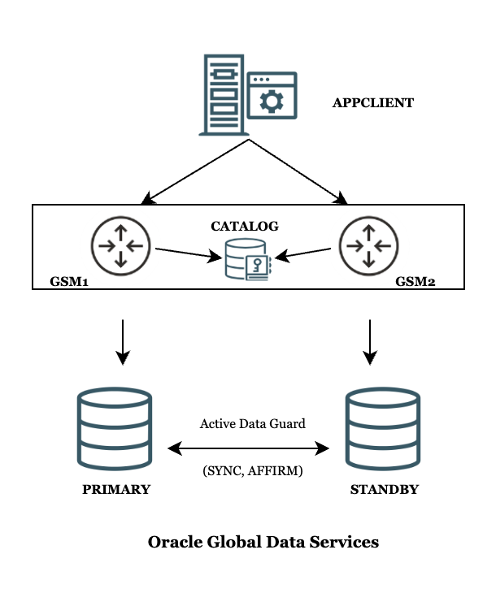

# Introduction to Oracle Global Data Services (GDS)

## About Oracle Database Global Data Services (GDS)

Oracle Database provides a powerful workload management feature called database services. Database services are named representations of one or more database instances. Database services allow you to group database workloads, ensure client requests are routed to the optimal instance that offers a service, and provide high availability by transparently failing client connections over to surviving instances when a planned or unplanned instance outage occurs.

Oracle Global Data Services (GDS) extends the Oracle Database service model to a set of replicated and distributed databases.

A Global Data Services configuration looks like a virtual multi-instance database to database clients. It provides client access through global services, which are functionally similar to the local database services provided by single-instance or Oracle Real Application Clusters (Oracle RAC) databases. Local and global services both provide load balancing, high availability, and resource management. The essential difference between global services and local services is that global services span the instances of multiple databases, whereas local services span the instances of a single database.

A Global Data Services configuration and its global services are created and managed using the GDS Control Utility (GDSCTL) command-line interface (CLI). The GDSCTL CLI is similar to the SRVCTL CLI that is used to manage an Oracle RAC Database and its services.

**Total Estimated Workshop Time: 2 hours**

**Global Service Manager (GSM)**:

A global service manager (GSM) is the central software component of Global Data Services (GDS). It orchestrates GDS operations and provides service-level load balancing, failover, and centralized management of services in GDS setups. A global service manager is analogous to the remote listener in an Oracle RAC database, except that a Global Service Manager is more powerful, has additional capabilities, and serves multiple databases.

**Global Services**

For database clients, a Global Data Services configuration is presented by a set of global services. A global service manager serving a Global Data Services configuration is aware of all global services that the configuration provides and acts as a mediator for the database clients and databases in the configuration. A client program connects to a regional global service manager and requests a connection to a global service. The client does not need to specify which database or instance it should connect to. The global service manager forwards the client's request to the optimal instance in the configuration that offers target the global service.

**Figure 1. Workshop topology**

**Objectives**

- This workshop will give you first-hand experience with Global Data Services (GDS) setup, configuration, and basic usage.

This includes:

- GSM software installation and GDS Catalog creation
- Primary and Standby database setup (in an Active Data Guard configuration)
- Creating global services for RW and RO workloads
- Application setup
- Testing and validating global services in action using the GDS Control Utility (GDSCTL)
- Switchover and Failover tests using Global services

**Note:** This workshop uses Podman containers for simplicity.

**Prerequisites**

- An Oracle Cloud Account - Please view this workshop's LiveLabs landing page to see which environments are supported.
- Basic understanding of an Oracle Database, Oracle Data Guard, and Database Services.

You may now **proceed to the next lab**

## Learn More

- [Introduction to Global Data Services](https://docs.oracle.com/en/database/oracle/oracle-database/23/gsmug/intro-global-data-services.html#GUID-415B8BB5-5C8D-4C78-8E76-43DB1648E467)

## Acknowledgements
* **Authors** - Ajay Joshi, Ravi Sharma, Distributed Database Product Management
* **Contributors** - Vibhor Sharma, Jyoti Verma, Param Saini, Distributed Database Product Management
* **Last Updated By/Date** - Ajay Joshi, March 2025
