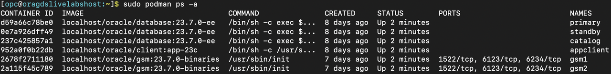

# Validate Workshop Environment

## Introduction

In this lab, you will review the status of the Podman containers required to successfully run this workshop.

Estimated Time: 5 Minutes

**Objectives**

- Validate the workshop environment by ensuring all required containers are running.

## Task 1: Verify Required Podman Containers

This workshop utilizes Podman containers to host:

   - GSM Servers
   - GDS Catalog Database Server
   - Primary and Standby Database Servers
   - Application Client Host

**Steps to Validate Podman Containers**

1. Open a terminal session.
2. Check the status of all Podman containers by executing:

    ```
    <copy>
    sudo podman ps -a
    </copy>
    ```

   

## Task 2: Verify Running Podman Containers
Ensure that the following Podman containers are actively running:
   - gsm1 – Global Service Manager (GSM) Container #1
   - gsm2 – Global Service Manager (GSM) Container #2 (for HA)
   - catalog – Container hosting the GDS Catalog Database
   - primary – Container hosting the Primary Database
   - standby – Container hosting the Standby Database
   - appclient – Container hosting the Application Client

## Task 3. Restarting Podman Containers (If Required)
   If any Podman container is stopped and not running, restart it using the following commands:

### Restarting a Single Container
    
   To stop or start individual Podman container, use:
   ```nohighlighting
   sudo podman stop <container ID/NAME>
   sudo podman start <container ID/NAME>
   ```

### Example:
   ```nohighlighting
      sudo podman stop gsm1
      sudo podman start gsm1
   ```

### Restarting Multiple Containers at Once

      To stop and start all containers simultaneously, use:

   ```nohighlighting
   sudo podman container stop $(sudo podman container list -qa)
   sudo podman container start $(sudo podman container list -qa)
   ```

## Conclusion
 
   Workshop validation complete.

   You have successfully validated the workshop environment.

   You can stop/start Podman containers as needed throughout this workshop.


You may now **proceed to the next lab**


## Acknowledgements
* **Authors** - Ajay Joshi, Ravi Sharma, Distributed Database Product Management
* **Contributors** - Vibhor Sharma, Jyoti Verma, Param Saini, Distributed Database Product Management
* **Last Updated By/Date** - Ajay Joshi, March 2025
