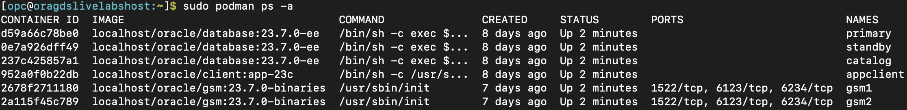

# Validate workshop environment

## Introduction

In this lab we will review status of podman containers required to successfully run this workshop.

*Estimated Lab Time:* 5 Minutes.

### Objectives
- Validate the workshop environment.


## Task 1: Validate that required podman containers are Up and Running

1. Open a terminal session to review the Oracle GDS LiveLab's Podman processes by running the command as below:

```
<copy>
sudo podman ps -a
</copy>
```



2. We are using Podman containers for this workshop. The following Podman containers should be up and running:

    - Oracle GSM1 Container
    - Oracle GSM2 Container
    - Oracle Catalog Primary Database container
    - Oracle Application Primary Database container
    - Oracle Application StandBy Database container
    - Appclient Container

3. If any of the podmain container is stopped and not in running state then try to restart it by using below podman commands:

    a. stop or start one podman container at a time
    ```
    <copy>
    sudo podman stop <container ID/NAME>
    </copy>
    <copy>
    sudo podman start <container ID/NAME>
    </copy>
    ```

    e.g.,
    ```nohighlighting
    sudo podman stop gsm1
    sudo podman start gsm1
    ```

    b. For multiple containers, run the following to restart all at once:

    ```
    <copy>
    sudo podman container stop $(sudo podman container list -qa)
    </copy>
    <copy>
    sudo podman container start $(sudo podman container list -qa)
    </copy>
    ```

This completes the validating the workshop environment and stop/start podman containers as and when needed during this workshop.

You may now **proceed to the next lab**
