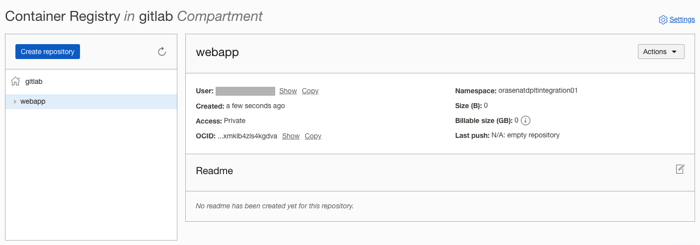
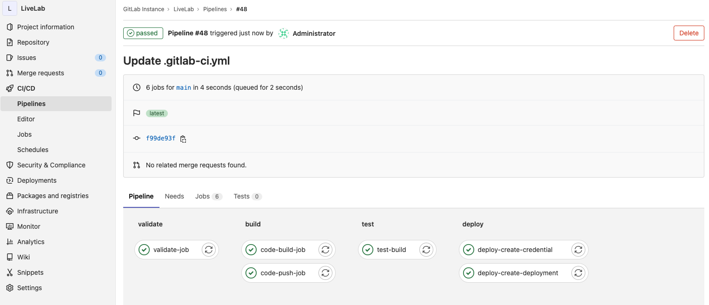
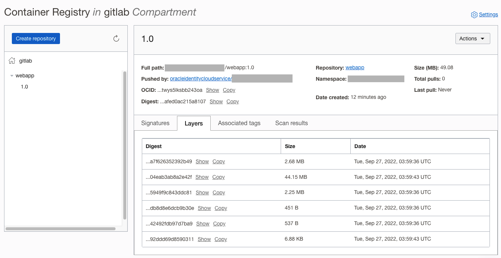
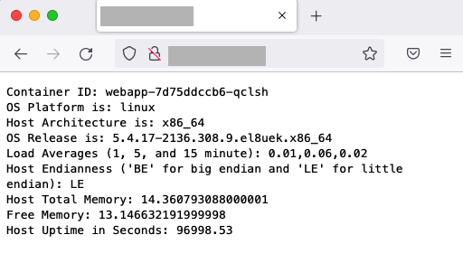

# Implement GitLab CI/CD Pipeline

## Introduction

In this Lab we will deploy the GitLab CI/CD pipeline. The pipeline will use the application source code to build a docker image and push the image in the Oracle Container Registry. Then a Kubernetes deployment will be created based on the container image. The application deployment will be exposed using the Ingress and should be visible through the web browser.

Estimated Time: 45 minutes


### Objectives

In this lab, you will:
* Create an OCI Container Registry
* Specify project specific CI/CD variables
* Register Oracle OKE cluster with GitLab
* Create project Files
* Check the CI/CD job Status

### Prerequisites 


This lab assumes you have:
* Completed all the previous Labs successfully


## Task 1: Create an OCIR Repository
1. To create a repository in Container Registry:
    - In the Console, open the **navigation menu** and click **Developer Services**. Under **Containers and Artifacts**, click **Container Registry**
    - Choose a Compartment you have permission to work in
    - Specify a Name of your choice for the new repository
    - Specify the Access type as Private
    - Click Create Repository


  

2. Container Registry is created with the specified name


  

3. Create an Auth token to access the OCIR

* Before you can push and pull Docker images to and from Oracle Cloud Infrastructure Registry (also known as Container Registry), you must already have an Oracle Cloud Infrastructure username and an auth token. To create a new auth token:

    - In the top-right corner of the Console, open the **Profile** menu (User menu icon) and then click **User Settings** to view the details.
    - On the **Auth Tokens** page, click Generate Token.
    - Enter a friendly description for the auth token. Avoid entering confidential information.
    - Click Generate Token. The new auth token is displayed.


  

    - Copy the auth token immediately to a secure location from where you can retrieve it later, because you won't see the auth token again in the Console.
    - Close the Generate Token dialog.

  


## Task 2 Register OKE Cluster

1. In your GitLab project, navigate to **Repository** > **Files** and create a new file

  

2. Create an agent configuration file. The file must be named as *.gitlab/agents/&lt;agent-name&gt;/config.yaml*. Ensure the filename ends in .yaml, not .yml. The agent-name chosen will be used in next step while creating the CI/CD variables. The value for the parameter **id** can be copied from the URL

    ```
    <copy>.gitlab/agents/oke-cluster/config.yaml</copy>
    ```

  

3. You must register an agent before you can install the agent in your cluster. To register an agent:
    -   On the top bar, select **Main menu** > **Projects** and find your project. If you have an agent configuration file, it must be in this project. Your cluster manifest files should also be in this project.
    -   From the left sidebar, select **Infrastructure** > **Kubernetes clusters**
    -   Select **Connect a cluster** (agent)
        -   Select the configuration file from the drop-down list
    -   Select **Register** an agent

  

4. GitLab generates an access token for the agent. You need this token to install the agent in your cluster and to update the agent to another version.

  

5. Login to the *runner* server and execute the commands obtained from the previous step

    ```
    helm repo add gitlab https://charts.gitlab.io
    "gitlab" has been added to your repositories
    
    helm repo update
      Hang tight while we grab the latest from your chart repositories...
    ...Successfully got an update from the "gitlab" chart repository
    Update Complete. ⎈Happy Helming!⎈
    
    helm upgrade --install oke-cluster gitlab/gitlab-agent \
    >     --namespace gitlab-agent \
    >     --create-namespace \
    >     --set image.tag=v15.4.0 \
    >     --set config.token=FtSFmc4MLHQu-1r5Vx_iygy8iThXEGr9TNFwLS1JxfX1LxBCxQ \
    >     --set config.kasAddress=wss://gitlab.cloudlab.site/-/kubernetes-agent/
      Release "oke-cluster" does not exist. Installing it now.
    NAME: oke-cluster
    LAST DEPLOYED: Sun Sep 25 22:46:16 2022
    NAMESPACE: gitlab-agent
    STATUS: deployed
    REVISION: 1
    TEST SUITE: None
    ```

6. Refresh the webpage, and the OKE cluster should be connected to GitLab
  


## Task 3: Create Project specific CI/CD variables

1. Next, we need to add CI/CD variables to a project’s settings. Variables are commonly used to configure third-party services that are repeatedly used throughout the pipeline. 
The variables will be available to all the stages within a Pipeline.


 To add or update variables in the project settings:

    - Go to your project’s **Settings** > **CI/CD** and expand the **Variables** section
    - Select the Add Variable button and fill in the details:
        - Key: Must be one line, with no spaces, using only letters, numbers, or _.
        - Value: No limitations.
        - Type: File or Variable.
        - Environment scope: Optional. All, or specific environments.
        - Protect variable Optional. If selected, the variable is only available in pipelines that run on protected branches or protected tags.
        - Mask variable Optional. If selected, the variable’s Value is masked in job logs. The variable fails to save if the value does not meet the masking requirements.


2. Below is an example of a variable creation
  

3. In the similar way create the following variables, with appropriate values specific to your tenancy and region


    * **IMAGE_NAME**: **webserver**
    * **IMAGE_VERSION**: **1.0**
    * **OCIR_PASSWORD**: **&lt;auth-token&gt;**
    * **OCIR_REGISTRY**: **https://fra.ocir.io** [Find the region specific OCIR Endpoint here](https://docs.oracle.com/en-us/iaas/Content/Registry/Concepts/registryprerequisites.htm#regional-availability)
    * **OCIR_REPOSITORY**: **fra.ocir.io/orasenatdpltintegration01/webapp** (OCI OCIR region URL followed by tenancy name and the OCIR repo created earlier)
    * **OCIR_USER**: enter your username in the format &lt;tenancy-namespace&gt;/&lt;username&gt;, where &lt;tenancy-namespace&gt; is the auto-generated Object Storage namespace string of your tenancy (as shown on the Tenancy Information page). For example, ansh81vru1zp/jdoe@acme.com. If your tenancy is federated with Oracle Identity Cloud Service, use the format &lt;tenancy-namespace&gt;/oracleidentitycloudservice/&lt;username&gt;
    * **OKE_AGENT**: **gitlab-instance-c00de01e/LiveLab:oke-cluster** (copy namespace from the URL, followed by the Project name, and Kubernetes agent name)
    
    
    
    


4. Once done, you should have the following variables defined in the project

  


## Task 4 Create Project Files

Finally, it's time to create a few project files and put the CI/CD pipeline to test. The following four files need to be created in the project's root repository.

1. Download the [Dockerfile](files/Dockerfile) and upload it to the project's file repository

    ```
    <copy>FROM node:18.9.0-alpine
    ADD app.js /app.js
    ENTRYPOINT ["node", "app.js"]</copy>
    ```

2. Create an [app.js](files/app.js) application file and upload it to the project's file repository

    ```
    <copy>const http = require('http');
    const os = require('os');
    const dns = require('dns');

    console.log("Web Application starting and listening on 8080...");

    var handler = function(request, response) {
      console.log("Received request from " + request.connection.remoteAddress);
      response.writeHead(200);
      response.end( "Container ID: " + os.hostname() + "\n"
        + "OS Platform is: " + os.platform() +  "\n"
        + "Host Architecture is: " + os.machine() + "\n"
        + "OS Release is: "+ os.release() + "\n"
        + "Load Averages (1, 5, and 15 minute): " + os.loadavg() + "\n"
        + "Host Endianness ('BE' for big endian and 'LE' for little endian): " + os.endianness() + "\n"
        + "Host Total Memory: " + os.totalmem()/1000/1000/1000 + "\n"
        + "Free Memory: " + os.freemem()/1000/1000/1000 + "\n"
        + "Host Uptime in Seconds: "+ os.uptime() + "\n");
    };
    var www = http.createServer(handler);
    www.listen(8080);</copy>
    ```


3. Create a Kubernetes deployment file [deployment.tmpl](files/deployment.tmpl) in the template format and upload it to the project's file repository. The deployment file requires the use of CI/CD variables, and therefore cannot be in .yml or .yaml format.

    ```
    <copy>apiVersion: apps/v1
    kind: Deployment
    metadata:
      name: webapp
      labels:
        app: webapp
    spec:
      selector:
        matchLabels:
          app: webapp
      replicas: 2
      template:
        metadata:
          labels:
            app: webapp
        spec:
          containers:
          - name: webapp
            image: ${OCIR_REPOSITORY}:${IMAGE_VERSION}
            ports:
            - containerPort: 8080
          imagePullSecrets:
          - name: ocir-cred

    ---
    apiVersion: v1
    kind: Service
    metadata:
      name: webapp-svc
    spec:
      selector:
        app: webapp
      ports:
        - port: 8088
          targetPort: 8080
      type: ClusterIP

    ---
    apiVersion: networking.k8s.io/v1
    kind: Ingress
    metadata:
      name: webapp-ingress
      annotations:
        kubernetes.io/ingress.class: "nginx"
    spec:
      rules:
      - http:
          paths:
            - path: /
              pathType: Prefix
              backend:
                service:
                  name: webapp-svc
                  port:
                    number: 8088</copy>
    ```


4. Finally create a file named [**.gitlab-ci.yml**](files/gitlab-ci.yml) in the root of your repository, which contains the CI/CD configuration. The moment the file is created, a CI/CD pipeline would get triggered.  

  **Don't forget to rename the file to .gitlab-ci.yml before uploading to the project repository**

    ```
    <copy>stages:
      - validate
      - build
      - test
      - deploy

    # Login to OCIR
    variables:
      KUBE_CONTEXT: "$OKE_AGENT"

    validate-job:
      stage: validate
      script:
        - docker info
        - docker login -u "$OCIR_USER" -p "$OCIR_PASSWORD" "$OCIR_REGISTRY"
      allow_failure: false

    # Build Image and Push to OCIR
    code-build-job:
      stage: build
      script:
        - docker build -t "$IMAGE_NAME":"$IMAGE_VERSION" .
      dependencies:
        - validate-job

    code-push-job:
      stage: build
      script:
        - docker tag  "$IMAGE_NAME":"$IMAGE_VERSION" "$OCIR_REPOSITORY":"$IMAGE_VERSION"
        - docker push "$OCIR_REPOSITORY":"$IMAGE_VERSION"
      dependencies:
        - code-build-job
      allow_failure: false

    test-build:
      stage: test
      script:
        - docker inspect "$OCIR_REPOSITORY":"$IMAGE_VERSION"
      dependencies:
        - code-push-job


    .kube-context:
      before_script:
        - if [ -n "$KUBE_CONTEXT" ]; then kubectl config use-context "$KUBE_CONTEXT"; fi

    deploy-create-credential:
      stage: deploy
      allow_failure: true
      image:
        name: bitnami/kubectl:latest
        entrypoint: ['']
      extends: [.kube-context]
      script:
        - kubectl config get-contexts
        - kubectl config use-context "$OKE_AGENT"
        - kubectl get secret ocir-cred || exit_code=$?
        - echo $exit_code
        - >
            if [ "$exit_code" == 1 ]; then
                kubectl create secret docker-registry ocir-cred --docker-username="$OCIR_USER" --docker-password="$OCIR_PASSWORD" --docker-server="$OCIR_REGISTRY"
            else
                echo "Skipping secret Creation"
            fi
      dependencies:
        - test-build


    deploy-create-deployment:
      stage: deploy
      image:
        name: bitnami/kubectl:latest
        entrypoint: ['']
      extends: [.kube-context]
      script:
        - kubectl config get-contexts
        - kubectl config use-context "$OKE_AGENT"
        - envsubst < deployment.tmpl > deployment.yaml
        - kubectl apply -f deployment.yaml
      dependencies:
        - deploy-create-credential</copy>
    ```

5. Once all the files are uploaded / created, the repository should have the following content

  


## Task 5: Check the CI/CD Job Status

1. Navigate to project's **CI/CD** > **Pipelines**. Since the Auto DevOps option is enabled by default, any updates to any file would automatically trigger a pipeline execution

  

2. Click on the job, and see the status of the individual stages and jobs

  

## Task 6: Verify the Deployment Status

1. Navigate to OCI's Container Registry and verify that the container image with the tag (as specified in the IMAGE_VERSION variable) has been created and pushed to the registry 

  


2. As a part of the deployment, a secret is created on the OKE that will be used to pull an image from a private container image registry or repository.

    ```
    <copy>kubectl describe secrets ocir-cred</copy>
    Name:         ocir-cred
    Namespace:    default
    Labels:       <none>
    Annotations:  <none>

    Type:  kubernetes.io/dockerconfigjson

    Data
    ====
    .dockerconfigjson:  301 bytes
    ```


3. Check the Kubernetes Deployment status

    ```
    <copy>kubectl get pods</copy>
    NAME                      READY   STATUS    RESTARTS   AGE
    webapp-7d75ddccb6-pzsct   1/1     Running   1          91s
    webapp-7d75ddccb6-qclsh   1/1     Running   1          89s
    ```

4. Verify that Ingress is deployed along with the Kubernetes deployment

    ```
    <copy>kubectl describe ingress webapp-ingress</copy>
    Name:             webapp-ingress
    Labels:           &lt;none&gt;
    Namespace:        default
    Address:          &lt;load-balancer-pulic-ip&gt;
    Ingress Class:    <none>
    Default backend:  &lt;default&gt;
    Rules:
      Host        Path  Backends
      ----        ----  --------
      *
                  /   webapp-svc:8088 (10.244.0.132:8080,10.244.0.3:8080)
    Annotations:  kubernetes.io/ingress.class: nginx
    Events:       &lt;none&gt;
    ```


5. On the Web Browser, type the IP address of the Public Load Balancer that was deployed in the previous lab, and it should point to the application just deployed

  

6. Refresh the webpage a few times, and it should cycle through the available pods in the deployment

  


## Task 7: Import GitLab's Demo Projects from Oracle CloudWorld 2022 

The [GitLab's Demo projects](https://gitlab.com/gitlab-com/alliances/oracle/sandbox-projects/cloudworld-2022) used at CloudWorld 2022 are publicly available and can be imported into the customer's account. Please use the process below to import the projects and play around for further hands-on experience.

1. Browse to the project link and choose the project that needs to be imported

  

2. In the project's main page click on the **Clone** link on the left side of the screen. Copy the URL from **Clone with HTTPS** option

  

3. In your GitLab account click on **New project** to create a new project

  

4. Create a new project by importing an existing project

  

5. Import a project by selecting **Repository by URL** option. Paste the URL copied earlier and hit **Create project**

  

6. The project is now successfully imported. Feel free to explore and deploy the project into OCI

  


 
## Learn More

* [Install GitLab agent for Kubernetes](https://docs.gitlab.com/ee/user/clusters/agent/install/)
* [Projects from GitLab's Demo at Oracle CloudWorld 2022](https://gitlab.com/gitlab-com/alliances/oracle/sandbox-projects/cloudworld-2022)


## Acknowledgements
- **Created By/Date** - Farooq Nafey, Principal Cloud Architect, August 2022
* **Last Updated By/Date** - Farooq Nafey, September 2022
