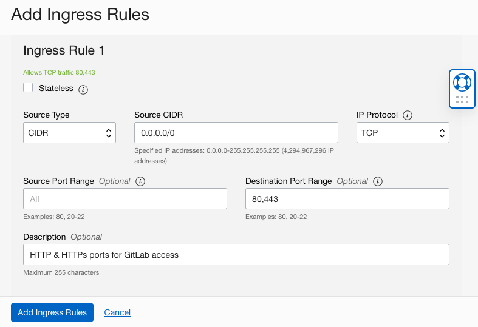
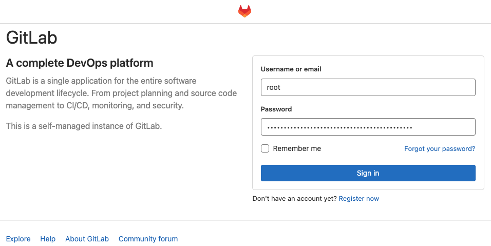
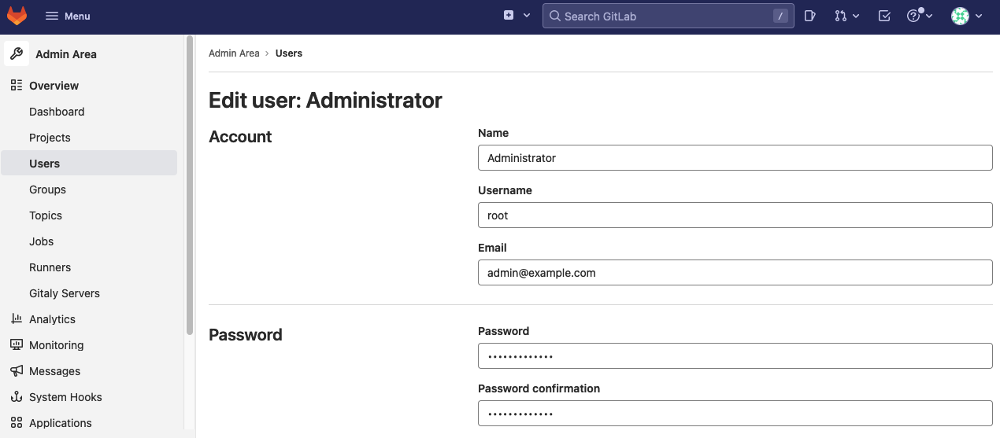

# Install GitLab on Compute Instance running Oracle Enterprise Linux 8.x

## Introduction

This Lab will walk you through the step-by-step instructions of installing GitLab via official Linux packages on virtual machine running Oracle Enterprise Linux 8.x.

Estimated Time: 30 minutes


### Objectives


In this lab, you will:
* Install and configure the necessary dependencies 
* Add the GitLab package repository and install the package
* Login to GitLab Console

### Prerequisites

This lab assumes you have:
* Configured OCI Networking
* Provisioned a Virtual Machine on OCI
* Ability to SSH into to server via a Public IP


## Task 1: Install and Configure the Necessary Dependencies

The dependency requirements mentioned below are tailored for OEL 8.x. For installation dependency requirements for OEL 7.x refer to [documentation](https://about.gitlab.com/install/#centos-7) 

1. Install and configure the necessary dependencies


    ```
    <copy>sudo yum install -y curl policycoreutils-python-utils openssh-server perl</copy>   
    ```


2.  Enable OpenSSH server daemon (won't be required for Oracle Cloud provided images)

    ```
    <copy>sudo systemctl enable sshd</copy>
    <copy>sudo systemctl start sshd</copy>
    ```


3. Enable the Firewall rules 
    ```
    <copy>sudo firewall-cmd --permanent --add-service=http</copy>
    <copy>sudo firewall-cmd --permanent --add-service=https</copy>
    <copy>sudo systemctl reload firewalld</copy>
    ```

4. Install Postfix to send notification emails
    ```
    <copy>sudo yum -y install postfix</copy>
    <copy>sudo systemctl enable postfix --now</copy>
    <copy>sudo systemctl status postfix</copy>
    ```

> **Note:** During Postfix installation a configuration screen may appear. Select 'Internet Site' and press enter. Use your server's external DNS for 'mail name' and press enter. If additional screens appear, continue to press enter to accept the defaults.


5. Configure OCI Network Security List

Enable the Ingress rules on port 80 & 443 in the security list of the **Public Subnet**.  Port 443 is used to access the GitLab application console securely, whereas port 80 is used to configure encryption during the installation and configuration process.



## Task 2: Add the GitLab package repository and install the package

1. Add GitLab package repository to the instance
    ```
    <copy>curl https://packages.gitlab.com/install/repositories/gitlab/gitlab-ee/script.rpm.sh | sudo bash</copy>
    ```


2. Install GitLab Packages and substitute the domain name for EXTERNAL_URL to your gitlab domain name
    ```
    <copy>sudo EXTERNAL_URL="https://<domain-name>" yum install -y gitlab-ee</copy>
    ```
    > **Note:** *Make sure to provide a Fully Qualified Domain Name (FQDN) for your GitLab server and use https for the configuration. For https:// URLs, GitLab will automatically request a certificate with Let's Encrypt, which requires inbound HTTP access (on port 80) and a valid hostname. You can also use your own certificate or just use http:// (without the s ). If you would like to specify a custom password for the initial administrator user ( root ), check the documentation. If a password is not specified, a random password will be automatically generated.*

3. Abridged output of the installation process:
    ```
    Notes:
    Default admin account has been configured with following details:
    Username: root
    Password: You didn't opt-in to print initial root password to STDOUT.
    Password stored to /etc/gitlab/initial_root_password. This file will be cleaned up in first reconfigure run after 24 hours.

    NOTE: Because these credentials might be present in your log files in plain text, it is highly recommended to reset the password following https://docs.gitlab.com/ee/security/reset_user_password.html#reset-your-root-password.

    gitlab Reconfigured!

        *.                  *.
        ***                 ***
        *****               *****
        .******             *******
        ********            ********
    ,,,,,,,,,***********,,,,,,,,,
    ,,,,,,,,,,,*********,,,,,,,,,,,
    .,,,,,,,,,,,*******,,,,,,,,,,,,
        ,,,,,,,,,*****,,,,,,,,,.
            ,,,,,,,****,,,,,,
                .,,,***,,,,
                    ,*,.


        _______ __  __          __
        / ____(_) /_/ /   ____ _/ /_
    / / __/ / __/ /   / __ `/ __ \
    / /_/ / / /_/ /___/ /_/ / /_/ /
    \____/_/\__/_____/\__,_/_.___/


    Thank you for installing GitLab!
    GitLab should be available at https://<domain-name>

    For a comprehensive list of configuration options please see the Omnibus GitLab readme
    https://gitlab.com/gitlab-org/omnibus-gitlab/blob/master/README.md

    Help us improve the installation experience, let us know how we did with a 1 minute survey:
    https://gitlab.fra1.qualtrics.com/jfe/form/SV_6kVqZANThUQ1bZb?installation=omnibus&release=15-4


    Verifying        : gitlab-ee-15.4.0-ee.0.el8.x86_64                                                                                                                                                                                   1/1

    Installed:
    gitlab-ee-15.4.0-ee.0.el8.x86_64

    Complete!
    ```


4. Get the default password for the root user
    ```
    <copy>sudo cat /etc/gitlab/initial_root_password</copy>
    # WARNING: This value is valid only in the following conditions
    #          1. If provided manually (either via `GITLAB_ROOT_PASSWORD` environment variable or via `gitlab_rails['initial_root_password']` setting in `gitlab.rb`, it was provided before database was seeded for the first time (usually, the first reconfigure run).
    #          2. Password hasn't been changed manually, either via UI or via command line.
    #
    #          If the password shown here doesn't work, you must reset the admin password following https://docs.gitlab.com/ee/security/reset_user_password.html#reset-your-root-password.

    Password: XBU47oQGcw3PMSh+vNTD3ZcfsGpc00TNZvsA2VzO5fo=

    # NOTE: This file will be automatically deleted in the first reconfigure run after 24 hours.
    ```

## Task 3: Browse to the domain address and login

1. Point the URL to the **https://``<domain-name>``** configured for the compute instance and login, using the *root* username and the *default password* generated by the installation 



2. To change the password of the root user, navigate to the **Menu** in the upper Left, navigate to **Admin** and select **Users**, and click on the user *Administrator* and then click **Edit**. Specify the new password and log back in using the new password. 




## Learn More

* [Gitlab: Installation system requirements](https://docs.gitlab.com/ee/install/requirements.html)
* [Deploy GitLab to enable CI/CD pipelines on OCI](https://docs.oracle.com/en/solutions/deploy-gitlab-ci-cd-oci/index.html)
* [GitLab with OCI ARM-based compute instances](https://about.gitlab.com/blog/2021/05/25/gitlab-oracle-cloud-arm-based/)
* [Quick Start: Deploy to Oracle Cloud](https://github.com/oracle-quickstart/oci-gitlab-ce)
* [GitLab Environment Toolkit](https://gitlab.com/gitlab-org/gitlab-environment-toolkit)

## Acknowledgements
- **Created By/Date** - Farooq Nafey, Principal Cloud Architect, August 2022
* **Last Updated By/Date** - Farooq Nafey, September 2022